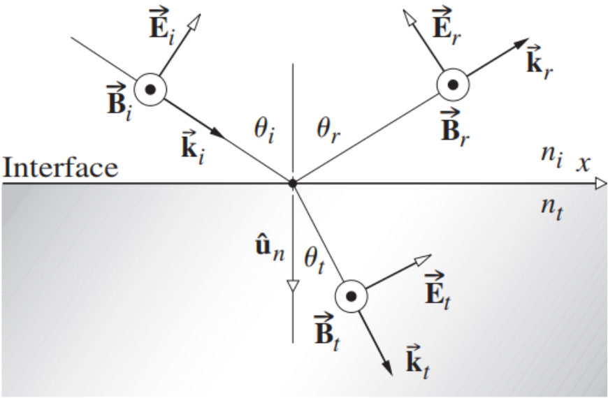

# Chapter 4 The Propagation of Light

## 4.1 Introduction

透射、反射和折射的过程是发生在亚微观层面上的散射的宏观表现。
The processes of transmission, reflection, and refraction are macroscopic manifestations of scattering occurring on a submicroscopic level.

## 4.2 Rayleigh Scattering

## 4.3 Reflection

### Internal and External Reflection

**external reflection**: light travels from a less to a more optically dense medium.

**internal reflection**: light travels from a more to a less optically dense medium.

内部和外部反射光之间相对相移 $180^{\circ}$ 。
$180^{\circ}$ relative phase shift between internally and externally reflected light.

### 4.3.1 The Law of Reflection

由于波长远远大于分子之间的间隔，发射回入射介质的小波一起前进，并且只在一个方向上有建设性的增加，有一个明确的反射光束。如果入射辐射是短波长的 X 射线，那就不是这样了，在这种情况下，会有几个反射光束。
Because the wavelength is so much greater than the separation between the molecules, the wavelets emitted back into the incident medium advance together and add constructively in only one direction, and there is one well-defined reflected beam. That would not be true if the incident radiation was short-wavelength X-rays, in which circumstance there would be several reflected beams.

1. 入射角等于反射角。
    The angle-of-incidence equals the angle-of-reflection.
    $$
    \theta_i=\theta_r\tag{4.3}
    $$

2. 入射光线、与表面垂直的光线和反射光线都位于一个平面内。
    The incident ray, the perpendicular to the surface, and the reflected ray all lie in a plane.

只要波峰和波谷与 $\lambda$ 相比很小，当 $\theta_i=\theta_r$ 时，散射的小波仍将或多或少地同相到达。
Provided the ridges and valleys are small compared to $\lambda$, the scattered wavelets will still arrive more or less in-phase when $\theta_i=\theta_r$.

这两种情况都是极端的；大多数表面的反射行为介于（漫反射和镜面反射）之间。
Both of these conditions are extremes; the reflecting behavior of most surfaces lies somewhere between them.

#### Rays

光线是空间中的直线，对应于辐射能量的流动方向。
A ray is a line drawn in space corresponding to the direction of flow of radiant energy.

如果介质在每个方向上的表现都相同（各向同性），那么射线就会与波面垂直。
If the medium behaves in the same manner in every direction (isotropic), the rays are perpendicular to the wavefronts.

## 4.4 Refraction

### 4.4.1 The Law of Refraction

Snell's Law:
$$
n_i\sin\theta_i=n_t\sin\theta_t\tag{4.4}
$$
入射光线、反射光线和折射光线都位于入射平面内。
The incident, reflected, and refracted raysn all lie in the plane-of-incidence.

进入高折射率的光线偏向法线弯曲，而进入低折射率的光线则偏离法线弯曲。
The ray entering a higher-index medium bends toward the normal on entering a medium having a lower index, the ray will bend away from the normal.

**relative index of refraction**
$$
\frac{\sin\theta_i}{\sin\theta_t}=\frac{n_t}{n_i}=n_{ti}
$$

#### Refraction of Light from a Point Source

波长减少是因为频率不变而速度减少。
The wavelength decreases because the frequency is unchanged while the speed decreases.
$$
\lambda=\lambda_0/n\tag{4.8}
$$

#### Negative Refraction

### 4.4.2 Huygens's Principle

惠更斯原理：传播中的波前上的每一个点都是球形次生波的源头，这样一来，以后的波前就是这些小波的包络。
Huygens's Principle: every point on a propagating wavefront serves as the source of spherical secondary wavelets, such that the wavefront at some later time is the envelope of these wavelets.

如果传播波的频率为 $\nu$，并以 $v_t$ 的速度在介质中传播，那么次生波就有相同的频率和速度。
If the propagating wave has a frequency $\nu$, and is transmitted through the medium at a speed $v_t$, then the secondary wavelets have that same frequency and speed.

#### Huygens's Ray Construction

### 4.4.3 Light Rays and Normal Congruence

**法向全等**：如果对于一组光线，我们可以找到一个与每一条光线都正交的曲面。
**normal congruence**: If a group of rays is such that we can find a surface that is orthogonal to each and every one of them.

一组光线在经过任何次数的反射和折射后都会保持其法向的全等性。
Theorem of Malus and Dupin: a group of rays will preserve its normal congruence after any number of reflections and refractions.

## 4.5 Fermat's Principle

**费马原理：一束光在两点之间的实际路径是在最少的时间内穿过的路径**。
**Fermat's principle: The actual path between two points taken by a beam of light is the one that is traversed in the least time.**

假设我们有一个由 $m$ 层不同的折射率组成的分层材料。那么从 $S$ 到 $P$ 的传播时间将是
Suppose that we have a stratified material composed of $m$ layers, each having a different index of refraction. The transit time from $S$​ to P will then be
$$
t=\sum_{i=1}^{m}\frac{s_i}{v_i}
$$
其中 $s_i$ 和 $v_i$ 是路径长度和速度。因此
where $s_i$ and $v_i$ are the path length and speed. Thus
$$
t=\frac{1}{c}\sum_{i=1}^{m}n_is_i\tag{4.9}
$$
optical path length: $\sum_{i=1}^mn_is_i$.

光路长度对应于真空中的距离，相当于在折射率为 $n$ 的介质中穿越的距离（$s$）。
The optical path length corresponds to the distance in vacuum equivalent to the distance traversed ($s$) in the medium of index $n$.
$$
OPL=\int_{S}^{P}n(s)\mathrm{d}s\tag{4.10}
$$

#### Fermat and Mirages

#### The Modern Formulation of Fermat's Principle  

#### Stationary Paths

## 4.6 The Eletromagnetic Approch

### 4.6.1 Waves at an Interfacce

Incident monochromatic, plane polarized light wave has the form
$$
\mathbf{E}_i=\mathbf{E}_{0i}\exp[i(\mathbf{k}_i\cdot\mathbf{r}-\omega_it)]\tag{4.11}
$$
Then the reflected wave:
$$
\mathbf{E}_r=\mathbf{E}_{0r}\exp[i(\mathbf{k}_r\cdot\mathbf{r}-\omega_rt+\epsilon_r)]\tag{4.13}
$$
and the transmitted wave:
$$
\mathbf{E}_t=\mathbf{E}_{0t}\exp[i(\mathbf{k}_t\cdot\mathbf{r}-\omega_tt+\epsilon_t)]\tag{4.14}
$$
这里 $\epsilon_r$ 和 $\epsilon_t$ 是相对于 $\mathbf{E}_i$ 的相位常数，由于原点的位置不是唯一的，所以引入了相位常数。
Here $\epsilon_r$ and $\epsilon_t$ are phase constants relative to $\mathbf{E}_i$ and are introduced because the position of the origin is not unique.

由法拉第电磁感应定律：**电场 $\mathbf{E}$ 与界面相切的分量必须连续穿过界面。**
By Faraday's induction law: **The component of the electric field $\mathbf{E}$ that is tangent to the interface must be continuous across it.**

$$
\hat{\mathbf{u}}_n\times\mathbf{E}_i+\hat{\mathbf{u}}_n\times\mathbf{E}_r=\hat{\mathbf{u}}_n\times\mathbf{E}_t\tag{4.15}
$$
这种关系必须在任何时间和界面上的任何一点成立 $(y=b)$。首先考虑相位：
This relationship must obtain at any instant in time and at any point on the interface $(y = b)$​.
$$
\color{red}\begin{align*}
&\quad\ (\mathbf{k}_i\cdot\mathbf{r}-\omega_it)|_{y=b}\\
&=(\mathbf{k}_r\cdot\mathbf{r}-\omega_rt+\epsilon_r)|_{y=b}\\
&=(\mathbf{k}_t\cdot\mathbf{r}-\omega_tt+\epsilon_t)|_{y=b}
\end{align*}\tag{4.17}
$$
由于这对所有的时间值都必须成立，所以 $t$ 的系数必须相等，即
Inasmuch as this has to be true for all values of time, the coefficients of $t$ must be equal, to wit
$$
\omega_i=\omega_r=\omega_t\tag{4.18}
$$
Furthermore
$$
(\mathbf{k}_i\cdot\mathbf{r})|_{y=b}=(\mathbf{k}_r\cdot\mathbf{r}+\epsilon_r)|_{y=b}=(\mathbf{k}_t\cdot\mathbf{r}+\epsilon_t)|_{y=b}
\tag{4.19}
$$
From the first two terms we obtain
$$
[(\mathbf{k}_i-\mathbf{k}_r)\cdot\mathbf{r}]_{y=b}=\epsilon_r\tag{4.20}
$$
which is an equation of a plane, which is of course the interface. To phrase it slightly differently, $\mathbf{k}_i-\mathbf{k}_r$ is parallel to $\hat{\mathbf{u}}_n$, that is $\hat{\mathbf{u}}_n\times(\mathbf{k}_i-\mathbf{k}_r)=\mathbf{0}$. We can conclude that
$$
|\mathbf{k}_i|\sin\theta_i=|\mathbf{k}_r|\sin\theta_r
$$
Since the incident and reflected waves are in the same medium, $|\mathbf{k}_i|=|\mathbf{k}_r|$. Here we have the Law of Reflection: $\theta_i=\theta_r$.

From the first and third terms we obtain
$$
[(\mathbf{k}_i-\mathbf{k}_t)\cdot\mathbf{r}]_{y=b}=\epsilon_t\tag{4.21}
$$
which is an equation of a plane, which is of course the interface. We have  $\hat{\mathbf{u}}_n\times(\mathbf{k}_i-\mathbf{k}_t)=\mathbf{0}$​ and can conclude that
$$
|\mathbf{k}_i|\sin\theta_i=|\mathbf{k}_t|\sin\theta_t
$$
Since $\omega_i=\omega_t$, we have
$$
n_i\sin\theta_i=n_t\sin\theta_t
$$
which is Snell's Law.

### 4.6.2 The Fresnel Equations

We have just found the relationship that exists among the phases of $\mathbf{E}_i$, $\mathbf{E}_r$ and $\mathbf{E}_t$ at the boundary.

#### Case 1: $\mathbf{E}$ perpendicular to the plane-of-incidence

We have $\mathbf{B}$ is parallel to the plane-of-incidence and
$$
\mathbf{k}\times\mathbf{E}=v\mathbf{B}\tag{4.23}
$$
and
$$
\mathbf{k}\cdot\mathbf{E}=0\tag{4.24}
$$
Using the boundary condition and phases we have analysised before:
$$
\mathbf{E}_{i0}+\mathbf{E}_{r0}=\mathbf{E}_{t0}\tag{4.25}
$$

被电波极化的物质的存在，对场的配置有一定的影响。因此，尽管 $\mathbf{E}$ 的切向分量（即与界面的切线）在边界上是连续的，但其法向分量却不是。
The presence of material substances that become electrically polarized by the wave has a definite effect on the field configuration. Thus, although the tangential component of $\mathbf{E}$ (i.e., tangent to the interface) is continuous across the boundary, its normal component is not.

$\mathbf{B}$ 的法向分量是连续的，$\mu^{-1}\mathbf{B}$ 的切向分量也是如此。因为两种介质的磁导率可能不同，所以方程的两边都要除以 $\mu$。
The normal component of $\mathbf{B}$ is continuous, as is the tangential component of $\mu^{-1}\mathbf{B}$. Because the permeability may be different in the two media, divide both sides of the equation by $\mu$.
$$
-\frac{|\mathbf{B}_i|}{\mu_i}\cos\theta_i+\frac{|\mathbf{B}_r|}{\mu_i}\cos\theta_r=-\frac{|\mathbf{B}_t|}{\mu_t}\cos\theta_t\tag{4.26}
$$
By $(4.23)$​ and other equivalent relationships:
$$
\frac{1}{\mu_iv_i}(|\mathbf{E}_i|-|\mathbf{E}_r|)\cos\theta_i=\frac{1}{\mu_tv_t}|\mathbf{E}_t|\cos\theta_t\tag{4.30}
$$
Making use of $(4.12)$ and remembering that the cosine therein equal one another at $y=0$, we obtain
$$
\frac{n_i}{\mu_i}(|\mathbf{E}_{0i}|-|\mathbf{E}_{0r}|)\cos\theta_i=\frac{n_t}{\mu_t}|\mathbf{E}_{0t}|\cos\theta_t\tag{4.31}
$$
Combined with $(4.25)$

$$
\left(\frac{|\mathbf{E}_{0r}|}{|\mathbf{E}_{0i}|}\right)_{\perp}=\frac{\dfrac{n_i}{\mu_i}\cos\theta_i-\dfrac{n_t}{\mu_t}\cos\theta_t}{\dfrac{n_i}{\mu_i}\cos\theta_i+\dfrac{n_t}{\mu_t}\cos\theta_t}\tag{4.32}
$$
and
$$
\left(\frac{|\mathbf{E}_{0t}|}{|\mathbf{E}_{0i}|}\right)_{\perp}=\frac{2\dfrac{n_i}{\mu_i}\cos\theta_i}{\dfrac{n_i}{\mu_i}\cos\theta_i+\dfrac{n_t}{\mu_t}\cos\theta_t}\tag{4.33}
$$
If $\mu_i\approx\mu_t\approx\mu_0$, we have
$$
\color{red}r_{\perp}\equiv\left(\frac{|\mathbf{E}_{0r}|}{|\mathbf{E}_{0i}|}\right)_{\perp}=\frac{n_i\cos\theta_i-n_t\cos\theta_t}{n_i\cos\theta_i+n_t\cos\theta_t}\tag{4.34}
$$
and
$$
\color{red}t_{\perp}\equiv\left(\frac{|\mathbf{E}_{0t}|}{|\mathbf{E}_{0i}|}\right)_{\perp}=\frac{2n_i\cos\theta_i}{n_i\cos\theta_i+n_t\cos\theta_t}\tag{4.35}
$$

#### Case 2: $\mathbf{E}$ parallel to the plane-of-incidence

$$
|\mathbf{E}_{0i}|\cos\theta_i-|\mathbf{E}_{0r}|\cos\theta_r=|\mathbf{E}_{0t}|\cos\theta_t\tag{4.36}
$$
Continuity of the tangential components of $\mathbf{B}/\mu$ yields
$$
\frac{1}{\mu_iv_i}|\mathbf{E}_{0i}|+\frac{1}{\mu_rv_r}|\mathbf{E}_{0r}|=\frac{1}{\mu_tv_t}|\mathbf{E}_{0t}|\tag{4.37}
$$
By $(4.23)$ and other equivalent relationships:
$$
\left(\frac{|\mathbf{E}_{0r}|}{|\mathbf{E}_{0i}|}\right)_{\parallel}=\frac{\dfrac{n_t}{\mu_t}\cos\theta_i-\dfrac{n_i}{\mu_i}\cos\theta_t}{\dfrac{n_t}{\mu_t}\cos\theta_i+\dfrac{n_i}{\mu_i}\cos\theta_t}\tag{4.38}
$$
and
$$
\left(\frac{|\mathbf{E}_{0t}|}{|\mathbf{E}_{0i}|}\right)_{\parallel}=\frac{2\dfrac{n_i}{\mu_i}\cos\theta_i}{\dfrac{n_t}{\mu_t}\cos\theta_i+\dfrac{n_i}{\mu_i}\cos\theta_t}\tag{4.39}
$$
If $\mu_i\approx\mu_t\approx\mu_0$, we have
$$
\color{red}r_{\parallel}\equiv\left(\frac{|\mathbf{E}_{0r}|}{|\mathbf{E}_{0i}|}\right)_{\parallel}=\frac{n_t\cos\theta_i-n_i\cos\theta_t}{n_i\cos\theta_t+n_t\cos\theta_i}\tag{4.40}
$$
and
$$
\color{red}t_{\parallel}\equiv\left(\frac{|\mathbf{E}_{0t}|}{|\mathbf{E}_{0i}|}\right)_{\parallel}=\frac{2n_i\cos\theta_i}{n_i\cos\theta_t+n_t\cos\theta_i}\tag{4.41}
$$
One further notational simplification can be made using Snell's Law
$$
\cos\theta_t=\cos\arcsin\left(\frac{n_i}{n_t}\sin\theta_i\right)=\sqrt{1-\frac{n_i^2}{n_t^2}\sin^2\theta_i}
$$
where
$$
\color{red}r_{\perp}=\frac{n_i\cos\theta_i-n_t\cos\theta_t}{n_i\cos\theta_i+n_t\cos\theta_t}=\frac{n_i\cos\theta_i-\sqrt{n_t^2-n_i^2\sin^2\theta_i}}{n_i\cos\theta_i+\sqrt{n_t^2-n_i^2\sin^2\theta_i}}=-\frac{\sin(\theta_i-\theta_t)}{\sin(\theta_i+\theta_t)}\tag{4.42}
$$

$$
\color{red}r_{\parallel}=\frac{n_t\cos\theta_i-n_i\cos\theta_t}{n_t\cos\theta_i+n_i\cos\theta_t}=+\frac{\tan(\theta_i-\theta_t)}{\tan(\theta_i+\theta_t)}\tag{4.43}
$$

$$
\color{red}t_{\perp}=\frac{2n_i\cos\theta_i}{n_i\cos\theta_i+n_t\cos\theta_t}=+\frac{2\sin\theta_t\cos\theta_i}{\sin(\theta_i+\theta_t)}\tag{4.44}
$$

$$
\color{red}t_{\parallel}=\frac{2n_i\cos\theta_i}{n_i\cos\theta_t+n_t\cos\theta_i}=+\frac{2\sin\theta_t\cos\theta_i}{\sin(\theta_i+\theta_t)\cos(\theta_i-\theta_t)}\tag{4.45}
$$

---

$$
r_{\perp}=\frac{n_i\cos\theta_i-n_t\cos\theta_t}{n_i\cos\theta_i+n_t\cos\theta_t}=\frac{\sin\theta_t\cos\theta_i-\sin\theta_i\cos\theta_t}{\sin\theta_t\cos\theta_i+\sin\theta_i\cos\theta_t}=-\frac{\sin(\theta_i-\theta_t)}{\sin(\theta_i+\theta_t)}
$$

$$
\begin{align*}
r_{\parallel}&=\frac{n_t\cos\theta_i-n_i\cos\theta_t}{n_i\cos\theta_t+n_t\cos\theta_i}=\frac{\sin\theta_i\cos\theta_i-\sin\theta_t\cos\theta_t}{\sin\theta_t\cos\theta_t+\sin\theta_i\cos\theta_i}\\
&=\frac{\sin(\theta_i-\theta_t)\cos(\theta_i+\theta_t)}{\sin(\theta_i+\theta_t)\cos(\theta_i-\theta_t)}=+\frac{\tan(\theta_i-\theta_t)}{\tan(\theta_i+\theta_t)}
\end{align*}
$$

$$
t_{\perp}=\frac{2\sin\theta_t\cos\theta_i}{\sin\theta_t\cos\theta_i+\sin\theta_i\cos\theta_t}=+\frac{2\sin\theta_t\cos\theta_i}{\sin(\theta_i+\theta_t)}
$$

$$
t_{\parallel}=\frac{2\sin\theta_t\cos\theta_i}{\sin\theta_t\cos\theta_t+\sin\theta_i\cos\theta_i}=+\frac{2\sin\theta_t\cos\theta_i}{\sin(\theta_i+\theta_t)\cos(\theta_i-\theta_t)}
$$

---

### 4.6.3 Interpretation of the Fresnel Equations

#### Amplitude Coefficients

**external reflection**: *For $n_t>n_i$, we have $\theta_i>\theta_t$, and $r_{\perp}<0$, $r_{\parallel}$ decreases gradually until it equals zero when reaching polarization angle, then it become more negative, reaching $-1$ at $\pi/2$.*

**internal reflection**: *For $n_t<n_i$, we have $\theta_i<\theta_t$, and $r_{\perp}>0$, $r_{\perp}$ increase until reaches $+1$ at critial angle. $r_{\parallel}$ start off negatively and increases reaching $0$ at polarization angle and $+1$ at critical angle.*

**polarization angle**: $\theta_p$, the value of $\theta_i$ such that $\theta_i+\theta_t=\pi/2$.

**critial angle**: $\theta_c$, the value of $\theta_i$ such that $\theta_t=\pi/2$.

For all $\theta_i$:
$$
t_{\perp}+(-r_{\perp})=1\tag{4.49}
$$
But only at normal incidence:
$$
t_{\parallel}+r_{\parallel}=1\tag{4.50}
$$

#### Phase Shifts

## 4.7 Total Internal Reflection

## 4.8 Optical Properties of Metals

施加场 $\mathbf{E}$ 所产生的单位面积的电流通过公式（A1.15）与介质的电导率 $\sigma$ 相关。对于没有自由电子或传导电子的电介质来说，$\sigma=0$，而对于金属来说，$\sigma$ 是非零且有限的。
The current per unit area resulting from the application of a field $\mathbf{E}$ is related by means of Eq. (A1.15) to the conductivity of the medium $\sigma$. For a dielectric there are no free or conduction electrons and $\sigma=0$, whereas for metals $\sigma$ is nonzero and finite.

电介质 = 绝缘体

#### Waves in a Metal

$$
\nabla^2\mathbf{E}=\mu\epsilon\frac{\partial^2\mathbf{E}}{\partial{t}^2}+\mu\sigma\frac{\partial\mathbf{E}}{\partial{t}}\tag{4.74}
$$

---

$$
\begin{align*}
\nabla\times(\nabla\times\mathbf{E})&=\nabla\times\left(-\frac{\partial\mathbf{B}}{\partial{t}}\right)\\
\nabla(\nabla\cdot\mathbf{E})-\nabla^2\mathbf{E}&=-\frac{\partial}{\partial{t}}(\nabla\times\mathbf{B})\\
-\nabla^2\mathbf{E}&=-\mu\frac{\partial}{\partial{t}}\left(\sigma\mathbf{E}+\epsilon\frac{\partial\mathbf{E}}{\partial{t}}\right)\\
\nabla^2\mathbf{E}&=\mu\epsilon\frac{\partial^2\mathbf{E}}{\partial{t}^2}+\mu\sigma\frac{\partial\mathbf{E}}{\partial{t}}
\end{align*}
$$

---

如果电导率被表述为一个复数，这个表达式可以被简化为未衰减的波方程。这又导致了一个复数折射率，这相当于吸收。然后，我们只需要将复数折射率代入非导电介质的相应解。
This expression can be reduced to the unattenuated wave equation, if the permittivity is reformulated as a complex quantity. This in turn leads to a complex index of refraction, which is tantamount to absorption. We then need only substitute the complex index into the corresponding solution for a nonconducting medium.
$$
\tilde{n}=n_R-in_I\tag{4.75}
$$

Suppose we have a wave:
$$
\mathbf{E}=\mathbf{E}_0\exp[i(\omega t-ky)]=\mathbf{E}_0\exp[i\omega (t-\tilde{n}y/c)]
$$
Take the complex index, we have
$$
\begin{align*}
\mathbf{E}&=\mathbf{E}_0\exp[i\omega (t-\tilde{n}y/c)]\\
&=\mathbf{E}_0\exp[i(\omega t-\omega (n_R-in_I)y/c)]\\
&=\mathbf{E}_0\exp[i(\omega t-\omega n_Ry/c+i\omega n_Iy/c)]\\
&=\mathbf{E}_0\exp[i\omega (t-n_Ry/c)]\exp(-\omega n_Iy/c)
\end{align*}\tag{4.76}
$$
因此波速为 $c/n_R$。考虑辐射量：
$$
I(y)=c\epsilon\frac{\mathbf{E}^2(y)}{2}\propto\exp[2i\omega (t-n_Ry/c)]\exp(-2\omega n_Iy/c)=I(0)\exp(-\alpha y)\tag{4.78}
$$
令 $\alpha=2\omega n_I/c$ 为吸收系数（absorption coefficient）。$y=1/\alpha$ 为趋肤深度（penetration depth）。

For a material to be transparent, the penetration depth must be large in comparison to its thickness.

#### The Dispersion Equation

From $(3.72)$, we have
$$
n^2(\omega)=1+\frac{q_e^2N}{\epsilon_0m_e}\sum_{j}\left(\frac{f_j}{\omega^2_{0j}-\omega^2+i\gamma_j\omega}\right)\tag{3.72}
$$
Assuming that the average field experienced by an electron moving about within a conductor is just the applied field $\mathbb{E}(t)$, we can extend the dispersion equation of a rare medium
$$
n^2(\omega)=1+\frac{q_e^2N}{\epsilon_0m_e}\left[\frac{f_e}{-\omega^2+i\gamma_e\omega}+\sum_{j}\frac{f_j}{\omega^2_{0j}-\omega^2+i\gamma_j\omega}\right]\tag{4.79}
$$
The natural frequency of free electrons is $0$, and $f_e$ is the number of conduction electrons per unit volume.

因此，忽略束缚电子的贡献，并假设 $\gamma_e$ 对于非常大的 $\omega$ 来说也是可以忽略的，这样一来
Accordingly, neglect the bound electron contribution and assume that $\gamma_e$ is also negligible for very large $\omega$, whereupon
$$
n^2(\omega)=1-\frac{q_e^2N}{\epsilon_0m_e\omega^2}\tag{4.80}
$$
金属内的自由电子和正离子可以被认为是一种等离子体，其密度以自然频率 $\omega_p$ 振荡，即等离子体频率。
Free electrons and positive ions within a metal may be thought of as a plasma whose density oscillates at a natural frequency $\omega_p$, the plasma frequency.
$$
\omega_p=\sqrt{\frac{Nq_e^2}{\epsilon_0m_e}}
$$
在频率高于 $\omega_p$ 时，$n$ 是实数，吸收很小，导体是透明的。否则是复数，表现的类似金属。
At frequencies above $\omega_p$, $n$ is real, absorption is small, and the conductor is transparent.

#### Reflection from a Metal

与法线呈一定角度前进的透射波将是不均匀的。但如果介质的导电性增加，波面将变得与恒定振幅的表面对齐，这时 $\mathbf{k}_t$ 和 $\hat{\mathbf{u}}_n$ 将接近平行状态。换句话说，在一个良好的导体中，无论 $\theta_i$ 如何，透射波都会在界面的法线方向传播。
The transmitted wave advancing at some angle to the normal will be inhomogeneous. But if the conductivity of the medium is increased, the wavefronts will become aligned with the surfaces of constant amplitude, whereupon $\mathbf{k}_t$ and $\hat{\mathbf{u}}_n$ will approach parallelism. In other words, in a good conductor the transmitted wave propagates in a direction normal to the interface regardless of $\theta_i$.

Consider $\theta_i=0$, $n_i=1$, $n_t=\tilde{n}$:
$$
R=\frac{I_r}{I_i}=\left(\frac{\tilde{n}-1}{\tilde{n}+1}\right)\left(\frac{\tilde{n}-1}{\tilde{n}+1}\right)^*\tag{4.82}
$$
let $\tilde{n}=n_R-in_I$
$$
R=\frac{(n_R-1)^2+n_I^2}{(n_R+1)^2+n_I^2}\tag{4.83}
$$
