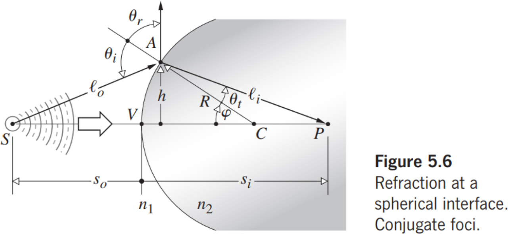
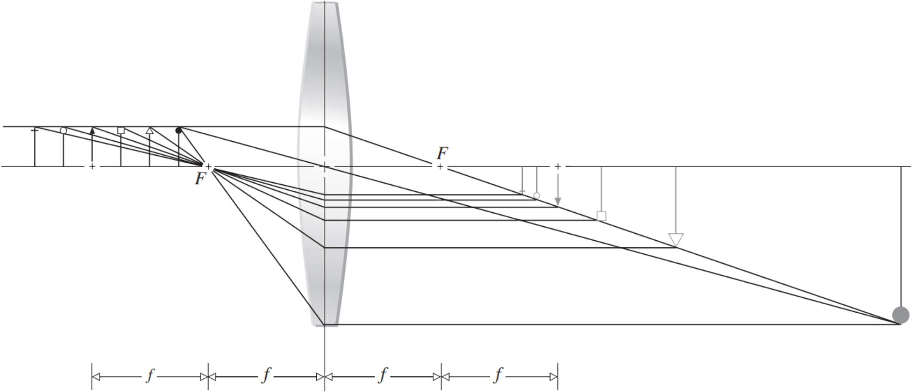
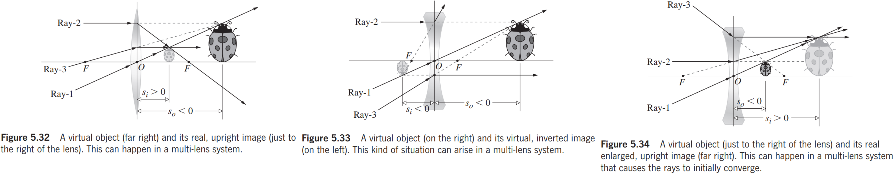
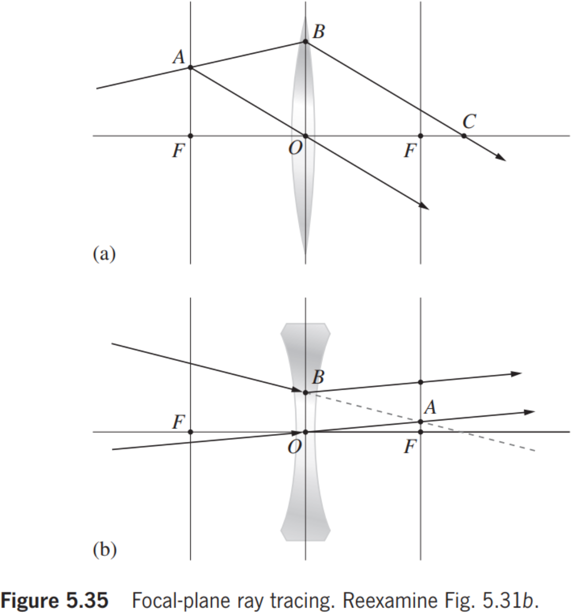
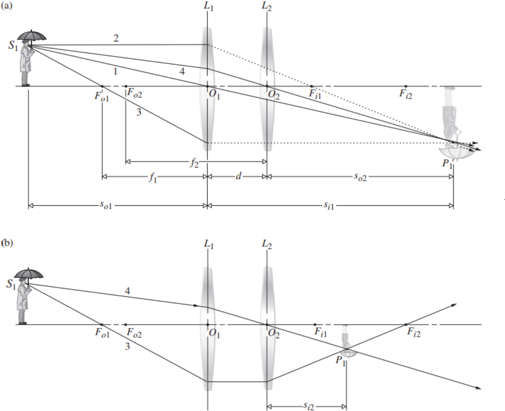

# Chapter 5 Geometrical Optics

## 5.1 Introductory Remarks

球形波的一部分发散的点，或波段向其收敛的点，被称为光线束的一个焦点。
A point from which a portion of a spherical wave diverges, or one toward which the wave segment converges, is known as a focus of the bundle of rays.

如果对于来自 $S$ 的光线锥，存在穿过 $P$ 的相应光线锥，则称该系统对于这两点是**散光**的。锥体中的能量（除了由于反射、散射和吸收引起的一些无意损失外）达到 $P$，然后称为 $S$ 的完美成像。
If for a cone of rays coming from $S$ there is a corresponding cone of rays passing through $P$, the system is said to be **stigmatic** for these two points. The energy in the cone (apart from some inadvertent losses due to reflection, scattering, and absorption) reaches $P$, which is then referred to as a perfect image of $S$.

在一个理想的光学系统中，三维区域的每个点都将在另一个区域中完美（或像散）成像，前者是**物空间**，后者是**像空间**。
In an ideal optical system, every point of a three-dimensional region will be perfectly (or stigmatically) imaged in another region, the former being the **object space**, the latter the **image space**.

## 5.2 Lenses

透镜是一种折射装置（即主流介质中的不连续点），可重新配置透射能量分布。
A lens is a refracting device (i.e., a discontinuity in the prevailing medium) that reconfigures a transmitted energy distribution.

### 5.2.1 Aspherical Surfaces

**Convex: converging lenses.**

**Concave: diverging lenses.**

光源的发光图像将出现在焦点处的屏幕上，因此是**实像**。否则是**虚像**。
A luminous image of the source would appear on a screen placed at focal point, an image that is therefore said to be **real**. Otherwise, it is **virtual**.

### 5.2.2 Refraction at Spherical Surfaces

**从介质 1 到介质 2 的透射关系。**

|  Symbols  |           Sign           |
| :-------: | :----------------------: |
| $s_o,f_o$ |      + left of $V$       |
|   $x_o$   |     + left of $F_o$      |
| $s_i,f_i$ |      + right of $V$      |
|   $x_i$   |     + right of $F_i$     |
|    $R$    | + if $C$ is right of $V$ |
| $y_o,y_i$ |   + above optical axis   |

The optical path length
$$
n_1\ell_o+n_2\ell_i=\mathrm{OPL}\tag{5.3}
$$
By law of cosines, we have
$$
\begin{align*}
\ell_o&=\sqrt{R^2+(s_o+R)^2-2R(s_o+R)\cos\varphi}\\
\ell_i&=\sqrt{R^2+(s_i-R)^2+2R(s_i-R)\cos\varphi}
\end{align*}
$$
Then
$$
n_1\sqrt{R^2+(s_o+R)^2-2R(s_o+R)\cos\varphi}+n_2\sqrt{R^2+(s_i-R)^2+2R(s_i-R)\cos\varphi}=\mathrm{Constant}
$$
which is a function of $\varphi$. By Fermat's Principle
$$
\frac{n_1R(s_o+R)\sin\varphi}{2\ell_o}-\frac{n_2R(s_i-R)\sin\varphi}{2\ell_i}=0\tag{5.4}
$$
Simplified
$$
\frac{n_1}{\ell_o}+\frac{n_2}{\ell_i}=\frac{1}{R}\left(\frac{n_2s_i}{\ell_i}-\frac{n_1s_o}{\ell_o}\right)\tag{5.5}
$$
**傍轴光线（The paraxial rays）**If $\varphi\approx0$, we have $\ell_o\approx s_o$, $\ell_i\approx s_i$, so
$$
\frac{n_1}{s_o}+\frac{n_2}{s_i}=\frac{n_2-n_1}{R}\tag{5.8}
$$
**第一焦距（first focal length）、物方焦距（object focal length）**
$$
f_o=\frac{n_1}{n_2-n_1}R\quad s_i=f_i=\infty\tag{5.9}
$$
**第二焦距（second focal length）、像方焦距（image focal length）**
$$
s_o=f_o=\infty\quad f_i=\frac{n_2}{n_2-n_1}R\tag{5.10}
$$

### 5.2.3 Thin Lenses

#### Thin-Lens Equations

$$
\frac{n_1}{s_o}+\frac{n_2}{s_i}=\frac{n_2-n_1}{R}\tag{5.8}
$$

$s_o$ 较大时候，$s_i$ 在右侧；$s_o=f_o$，$s_i=\infty$；$s_o$ 较小时候，$s_i<0$ 在左侧，产生虚像。

**从介质 1 到介质 2 再回到介质 1 的透射关系。**

$S$ 处出射的光线在像空间的在物空间中的对称点 $P'$ 满足
$$
\frac{n_m}{s_{o1}}+\frac{n_l}{s_{i1}}=\frac{n_l-n_m}{R_1}\tag{5.11}
$$
$P$ 处接收的光线在物空间的点也是 $P'$ 满足
$$
\frac{n_l}{s_{o2}}+\frac{n_m}{s_{i2}}=\frac{n_m-n_l}{R_2}\tag{5.13}
$$
我们有
$$
s_{o2}=-s_{i1}+d,R_2<0\tag{5.12}
$$
因此
$$
\begin{align*}
\frac{n_m}{s_{o1}}+\frac{n_l}{s_{i1}}+\frac{n_l}{s_{o2}}+\frac{n_m}{s_{i2}}&=(n_l-n_m)\left(\frac{1}{R_1}-\frac{1}{R_2}\right)\\
\frac{n_m}{s_{o1}}+\frac{n_l}{s_{i1}}-\frac{n_l}{s_{i1}-d}+\frac{n_m}{s_{i2}}&=(n_l-n_m)\left(\frac{1}{R_1}-\frac{1}{R_2}\right)\\
\frac{n_m}{s_{o1}}+\frac{n_m}{s_{i2}}&=(n_l-n_m)\left(\frac{1}{R_1}-\frac{1}{R_2}\right)+\frac{n_ld}{s_{i1}(s_{i1}-d)}
\end{align*}\tag{5.14}
$$
当 $d\to0$，可以得到 **Thin-Lens Equation**

$$
\frac{n_m}{s_{o}}+\frac{n_m}{s_{i}}=(n_l-n_m)\left(\frac{1}{R_1}-\frac{1}{R_2}\right)\tag{5.15}
$$
由于
$$
\lim_{s_o\to\infty}s_i=f_i\quad\lim_{s_i\to\infty}s_o=f_o
$$
并且显然 $f_i=f_o$，因此令 $f=f_i=f_o$，且
$$
\frac{n_m}{f}=(n_l-n_m)\left(\frac{1}{R_1}-\frac{1}{R_2}\right)\tag{5.16}
$$
而且得到 **Gaussian Lens Formula**
$$
\frac{1}{s_{o}}+\frac{1}{s_{i}}=\frac{1}{f}\tag{5.17}
$$

#### Focal Points and Planes

当 $\left(\frac{1}{R_1}-\frac{1}{R_2}\right)>0$ 时，是凸透镜；当 $\left(\frac{1}{R_1}-\frac{1}{R_2}\right)<0$ 时，是凹透镜。

当 $n_l>n_m$ 时，凸透镜有正焦距，凹透镜有负焦距；当 $n_l<n_m$ 时，凸透镜有负焦距，凹透镜有正焦距。

一条偏离轴的傍轴光线平行于其入射方向从透镜中出现。我们认为，所有这些光线都将通过定义为透镜光学中心 $O$ 的点。
An off-axis paraxial ray emerges from the lens parallel to its incident direction. We maintain that all such rays will pass through the point defined as the optical center $O$ of the lens.
$$
\frac{1}{f}=(n_{lm}-1)\left(\frac{1}{R_1}-\frac{1}{R_2}\right)\tag{5.18}
$$
近乎平坦的镜头将具有较长的焦距，而小球体（几乎不是“薄透镜”）将具有很小的焦距。
A nearly flat lens will have a long focal length, whereas a small sphere (hardly a "thin lens") will have a tiny focal length.

#### Finite Imagery

若物是垂直平面，则像是也是垂直平面，并且它们与光轴的交点满足点光源物像共轭关系。
The final image formed by a lens of a small planar object normal to the optical axis will itself be a small plane normal to that axis.

有三条光线特别容易应用。第一条（光线-1）是通过透镜中心 $O$ 的不偏移的光线。另外两条（光线-2和光线-3）利用了这样一个事实：通过焦点的光线将从透镜中出现，平行于中心轴，反之亦然。
There are three rays that are especially easy to apply. The first (ray-1) is the undeviated ray through the center of the lens $O$. The other two (ray-2 and ray-3) make use of the fact that a ray passing through the focal point will emerge from the lens parallel to the central axis and vice versa.

如果 $y_o>0$ 且 $y_i>0$，则表示图像是倒置的，而如果 $y_i>0$ 时 $y_o>0$，则是右旋或直立的。
If $y_o>0$ and $y_i>0$, the image is said to be inverted, whereas if $y_i>0$ when $y_o>0$, it is right-side-up or erect.

由三角形 $AOF_i$ 和 $P_2P_1F_i$ 相似可得
$$
\frac{y_o}{|y_i|}=\frac{f}{s_i-f}\tag{5.19}
$$
由三角形 $S_2S_1O$ 和 $P_2P_1O$ 相似可得
$$
\frac{y_o}{|y_i|}=\frac{s_o}{s_i}\tag{5.20}
$$
因此
$$
\frac{s_o}{s_i}=\frac{f}{s_i-f}\tag{5.21}
$$
即
$$
\frac{1}{s_{o}}+\frac{1}{s_{i}}=\frac{1}{f}\tag{5.17}
$$
由三角形 $S_2S_1F_o$ 和 $BOF_o$ 相似可得
$$
\frac{y_o}{|y_i|}=\frac{s_o-f}{f}\tag{5.22}
$$
因此得到 **Newtonian form**
$$
f^2=x_ox_i\tag{5.23}
$$
其中 $x_o=s_o-f,x_i=s_i-f$.

**横向放大率（transverse magnification）$M_T$**
$$
M_T\equiv\frac{y_i}{y_o}\tag{5.24}
$$
从 $5.19,5.20,5.22$ 可得
$$
M_T=-\frac{s_i}{s_o}=-\frac{x_i}{f}=-\frac{f}{x_o}\tag{5.25}
$$
正的 $M_T$ 意味着一个直立的图像，而负值意味着图像是倒置的。
A positive $M_T$ connotes an erect image, while a negative value means the image is inverted.

| Symbols |      Sign       |      Sign       |
| :-----: | :-------------: | :-------------: |
|         |        +        |        -        |
|  $s_o$  |   Real object   | Virtual object  |
|  $s_i$  |   Real image    |  Virtual image  |
|   $f$   | Converging lens | Diverging lens  |
|  $y_o$  |  Erect object   | Inverted object |
|  $y_i$  |   Erect image   | Inverted object |
|  $M_T$  |   Erect image   | Inverted image  |

如果光源在无穷远处，从它进入透镜的光线基本上是平行的。如果光源点 $S_1$ 更近，但仍然相当远，则进入透镜的光线锥很窄，光线进入镜头表面的角度很小。因为光线发散不大，所以透镜将每条光线都弯曲成会聚状态，然后它们到达点 $P_1$。随着光源越来越近，进入的光线发散得越来越远，所产生的图像点向右移动得越来越远。最后，当光源点位于 $F_o$ 时，光线发散得非常强烈，以至于透镜无法再将它们收敛，并且它们平行于中心轴出射。将源点移近会导致光线在进入镜头时发散得太多，以至于在离开时仍然发散。图像点现在是虚的 - 没有位于或在 $f$ 内的物体的实像。
If the source is at infinity rays coming from it entering the lens are essentially parallel. If the source point-$S_1$ is closer, but still fairly far away, the cone of rays entering the lens is narrow, and the rays come in at shallow angles to the surface of the lens. Because the rays do not diverge greatly, the lens bends each one into convergence, and they arrive at point-$P_1$. As the source moves closer, the entering rays diverge more, and the resulting image point moves farther to the right. Finally, when the source point is at $F_o$, the rays are diverging so strongly that the lens can no longer bring them into convergence, and they emerge parallel to the central axis. Moving the source point closer results in rays that diverge so much on entering the lens that they still diverge on leaving. The image point is now virtual -- there are no real images of objects that are at or closer in than $f$.

请注意，当物体靠近镜头时，图像会缩小，尽管放大倍数仍大于 1。当物体和镜头重合时，图像是原来大小的。
Notice that as the objects approach the lens the images shrink, although the magnification is still greater than 1. When the object is smack up against the lens the image is life-sized.

#### Longitudinal Magnification

光学系统显然可以影响图像的横向和纵向尺寸。纵向放大率，$M_L$，与轴向有关，被定义为
The optical system can apparently affect both the transverse and longitudinal dimensions of the image. The longitudinal magnification, $M_L$, which relates to the axial direction, is defined as
$$
M_L\equiv\frac{\mathrm{d}x_i}{\mathrm{d}x_o}\tag{5.27}
$$
对 $5.23$ 求微分得到
$$
M_L=-\frac{f^2}{x_o^2}=-M_T^2\tag{5.28}
$$
显然，$M_L<0$，这意味着正 $\mathrm{d}x_o$ 对应于负 $\mathrm{d}x_i$，反之亦然。换句话说，指向镜头的手指是指向镜头以外的地方成像的。
Evidently, $M_L<0$, which implies that a positive $\mathrm{d}(s_o-f)$ corresponds to a negative $\mathrm{d}(s_i-f)$ and vice versa. In other words, a finger pointing toward the lens is imaged pointing away from it.

#### Virtual Objects

**虚物可以理解为前面光学组件所形成的即将汇聚的光线所形成的。**

对于正透镜，物体是虚的（$s_o < 0$），图像是正立、缩小、实的（$s_i > 0$）。可以在 $s_i$ 处放置一个屏幕，上面会出现一个图像。顺便说一句，当物体和图像都出现在镜头的同一侧时，必须是一个实的，一个虚的。
For positive lens, the object is virtual ($s_o < 0$) and the image is upright, minified, real ($s_i > 0$). One could place a screen at $s_i$ and an image would appear on it. Incidentally, when both object and image appear on the same side of a lens, one of them must be real and the other virtual.

对于负透镜，物体是虚的（$s_o < 0$），图像是倒置的，缩小的，虚的（$s_i > 0$）；物体是虚拟的（$s_o < 0$），图像是直立的、放大的、真实的（$s_i > 0$）。
For negative lens, the object is virtual ($s_o < 0$) and the image is inverted, minified, virtual ($s_i > 0$); the object is virtual ($s_o < 0$) and the image is upright, enlarged, real ($s_i > 0$). 

#### Focal-Plane Ray Tracing

从 B 开始的折射光线必须平行于从 A 到 O 的光线，因此在 C 处穿过轴。
The refracted ray starting at B must be parallel to the ray from A to O and hence crosses the axis at C.

我们关心的光线在 B 处折射并向上和向外发散，因此它平行于从 O 到 A 的直线。
The ray we are concerned with refracts at B and gaining divergence heads up and away such that it is parallel to the line from O to A.

#### Thin-Lens Combination

暂时忽视 $L_2$，使用 ray-2 和 3 构造由 $L_1$ 单独形成的图像。像往常一样，它们分别通过镜头物体和图像焦点 $F_{o1}$ 和 $F_{i1}$。物体位于法平面内，因此两条光线确定图像的顶部，垂直于光轴的光线找到其底部。然后构建从 $P_1'$ 到 $O_2$ 反向运行的 Ray-4。插入 $L_2$ 对射线 4 没有影响，而射线 3 通过 $L_2$ 的图像焦点 $F_{i2}$ 折射。 rays-4 和 3 的交点固定图像，在这种特殊情况下是实的、缩小的和倒置的。当两个透镜靠得很近时，就像它们在这里一样，$L_2$ 的存在本质上增加了从 $L_1$ 发出的光束的会聚（$f_2 > 0$）或发散（$f_2 < 0$）。
Overlooking $L_2$ for a moment, construct the image formed exclusively by $L_1$ using rays-2 and -3. As usual, these pass through the lens object and image foci, $F_{o1}$ and $F_{i1}$, respectively. The object is in a normal plane, so that two rays determine the top of the image, and a perpendicular to the optical axis finds its bottom. Ray-4 is then constructed running backward from $P_1'$ through $O_2$. Insertion of $L_2$ has no effect on ray-4, whereas ray-3 is refracted through the image focus $F_{i2}$ of $L_2$. The intersection of rays-4 and -3 fixes the image, which in this particular case is real, minified, and inverted. When the two lenses are close together, as they are here, the presence of $L_2$ essentially adds convergence ($f_2 > 0$) or divergence ($f_2 < 0$) to the bundle of rays emerging from $L_1$.
$$
\frac{1}{s_{i1}}+\frac{1}{s_{o1}}=\frac{1}{f_1}\tag{5.29}
$$
or
$$
s_{i1}=\frac{s_{o1}f_1}{s_{o1}-f_1}\tag{5.30}
$$

$$
s_{o2}=d-s_{i1}\tag{5.31}
$$

$d>s_{i1}$, object for $L_2$ is real.
$d<s_{i1}$, object for $L_2$ is virtual.
$$
s_{i2}=\frac{s_{o2}f_2}{s_{o2}-f_2}
$$
we have
$$
s_{i2}=\frac{(d-s_{i1})f_2}{d-s_{i1}-f_2}\tag{5.32}
$$
and
$$
s_{i2}=\frac{\left(d-\frac{s_{o1}f_1}{s_{o1}-f_1}\right)f_2}{d-\frac{s_{o1}f_1}{s_{o1}-f_1}-f_2}\tag{5.33}
$$
We have
$$
M_T=M_{T1}M_{T2}=\frac{s_{i1}s_{i2}}{s_{o1}s_{o2}}=\frac{\frac{s_{o1}f_1}{s_{o1}-f_1}s_{i2}}{s_{o1}(d-s_{i1})}=\frac{f_1s_{i2}}{(s_{o1}-f_1)d-s_{o1}f_1}\tag{5.34}
$$

#### Back and Front Focal Lengths

从光学系统的最后一个表面到整个系统的第二个焦点的距离称为后焦距，或 b.f.l。类似地，从第一个表面的顶点到第一个或物体焦点的距离是前焦距，或 f.f.l。
The distance from the last surface of an optical system to the second focal point of that system as a whole is known as the back focal length, or b.f.l. Similarly, the distance from the vertex of the first surface to the first or object focus is the front focal length, or f.f.l.

$s_{i2}\to\infty$, by $(5.32)$, $s_{i1}\to d-f_2$, by $(5.30)$,
$$
\mathrm{f.f.l}=\frac{(d-f_2)f_1}{d-(f_1+f_2)}\tag{5.35}
$$
$s_{o1}\to\infty$, by $(5.29)$, $s_{i1}\to f_1$, by $(5.32)$
$$
\mathrm{b.f.l}=\frac{(d-f_1)f_2}{d-(f_1+f_2)}\tag{5.36}
$$
顺便提一下，注意到如果 $d=f_1+f_2$，从任一侧进入复合透镜的平面波将以平面波的形式出现，就像在望远镜系统中一样。
Incidentally, notice that if $d=f_1+f_2$, plane waves entering the compound lens from either side will emerge as plane waves, as in telescopic systems.

Observe that if $d\to0$, that is, the lenses are brought into contact, as in the case of some achromatic doublets, the effective focal length $f$ is
$$
\frac{1}{f}=\frac{1}{f_1}+\frac{1}{f_2}\tag{5.38}
$$

## 5.3 Stops

### 5.3.1 Aperture and Field Stops

一个光学系统的孔径光阑是一个特殊的物理实体，它限制了从一个轴向物体点射出的光束在通过系统时的宽度。
The aperture stop of an optical system is the particular physical entity that limits the breadth of the beam of light coming from an axial object point as it passes through the system.

限制系统所能成像的物体的大小或角度宽度的元素被称为视场光阑，或F.S.--它决定了仪器的视场。
The element limiting the size or angular breadth of the object that can be imaged by the system is called the field stop, or F.S.-it determines the field of view of the instrument.

打开圆形孔径光阑会使系统接受更大的能量锥，这样就会增加每个图像点的辐照度。与此相反，打开视场光阑将允许对物体边缘以外的区域进行成像，这些区域之前被阻挡了。
Opening the circular aperture stop would cause the system to accept a larger energy cone and in so doing increase the irradiance at each image point. In contrast, opening the field stop would allow the regions beyond the extremities of the object, which were previously blocked, to be imaged.

### 5.3.2 Entrance and Exit Pupils

另一个概念是瞳孔，在确定一条给定的光线是否会穿越整个光学系统时非常有用。这只是光圈挡的一个像。
Another concept, useful in determining whether or not a given ray will traverse the entire optical system, is the pupil. This is simply an image of the aperture stop.

一个系统的**入瞳**是指从物体上的一个轴向点看去，*通过光阑之前的那些元件所看到的孔径光阑的像*。
The **entrance pupil** of a system is *the image of the aperture stop as seen from an axial point on the object looking through those elements preceding the stop*.

**出瞳**是指从像上的一个轴向点看去，如果有的话，就是 A.S. 的像。
The **exit pupil** is the image of the A.S. as seen from an axial point on the image looking through the interposed lenses, if there are any.

入瞳：孔径光阑被其**前面**镜组在**物空间**中所成的像。

出瞳：孔径光阑被其**后面**镜组在**像空间**中所成的像。

