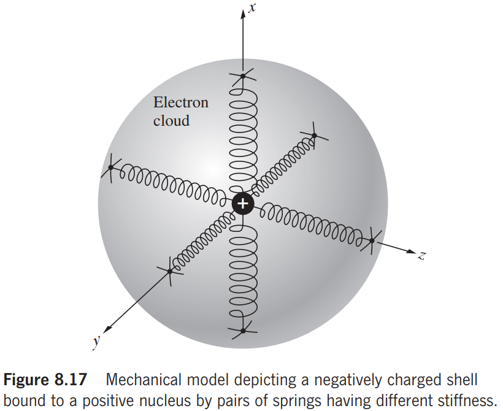

# Chapter 8 Polarization

## 8.1 The Nature of Polarized Light

### 8.1.1 Linear Polarization

The two orthogonal optical disturbances
$$
\mathbf{E}_x(z,t)=\hat\imath E_{0x}\cos(kz-\omega t)\tag{8.1}
$$
and
$$
\mathbf{E}_y(z,t)=\hat\jmath E_{0y}\cos(kz-\omega t+\epsilon)\tag{8.1}
$$
where $\epsilon$ is the relative phase difference between the waves. **$\mathbf{E}_y$ lags $\mathbf{E}_x$ by $\epsilon>0$.** The result is
$$
\mathbf{E}=\mathbf{E}_x+\mathbf{E}_y\tag{8.3}
$$
If $\epsilon$ is an integral multiple of $\pm2\pi$, then they are in-phase and
$$
\mathbf{E}=(\hat\imath E_{0x}+\hat\jmath E_{0y})\cos(kz-\omega t)\tag{8.4}
$$
The tilt angle $\theta$ is
$$
\theta=\arctan\frac{E_{0y}}{E_{0x}}
$$
If $\epsilon$ is an odd integer multiple of $\pm\pi$, they are $180^\circ$ out-of-phase
$$
\mathbf{E}=(\hat\imath E_{0x}-\hat\jmath E_{0y})\cos(kz-\omega t)\tag{8.5}
$$

###  8.1.2 Circular Polarization

Both wave have equal amplitudes

(1) relative phase difference is $-\pi/2+2m\pi$.
$$
\mathbf{E}_x(z,t)=\hat\imath E_{0}\cos(kz-\omega t)\tag{8.6}
$$
and
$$
\mathbf{E}_y(z,t)=\hat\jmath E_{0}\cos(kz-\omega t-\pi/2)=\hat\jmath E_{0}\sin(kz-\omega t)\tag{8.7}
$$
The consequent wave is
$$
\mathbf{E}=E_{0}[\hat\imath\cos(kz-\omega t)+\hat\jmath\sin(kz-\omega t)]\tag{8.8}
$$
*Clockwise: right-circularly polarized, the rotation direction is the same as the propagation direction.*

(2) relative phase difference is $\pi/2+2m\pi$.
$$
\mathbf{E}=E_{0}[\hat\imath\cos(kz-\omega t)-\hat\jmath\sin(kz-\omega t)]\tag{8.9}
$$
*Counterclockwise: left-circularly polarized, the rotation direction is the opposite to the propagation direction.*

### 8.1.3 Elliptical Polarization

$$
E_x(z,t)=E_{0x}\cos(kz-\omega t)\tag{8.11}
$$

and
$$
E_y(z,t)=E_{0y}\cos(kz-\omega t+\epsilon)\tag{8.1}
$$

---

$$
\begin{align*}
\frac{E_y}{E_{0y}}&=\cos(kz-\omega t)\cos\epsilon-\sin(kz-\omega t)\sin\epsilon\\
\frac{E_y}{E_{0y}}-\frac{E_x}{E_{0x}}\cos\epsilon&=-\sin(kz-\omega t)\sin\epsilon\\
\frac{E_y}{E_{0y}}-\frac{E_x}{E_{0x}}\cos\epsilon&=-\sqrt{1-\left(\frac{E_x}{E_{0x}}\right)^2}\sin\epsilon\\
\left(\frac{E_y}{E_{0y}}-\frac{E_x}{E_{0x}}\cos\epsilon\right)^2&=\left[1-\left(\frac{E_x}{E_{0x}}\right)^2\right]\sin^2\epsilon\\
\end{align*}\tag{8.13}
$$

So
$$
\left(\frac{E_x}{E_{0x}}\right)^2+\left(\frac{E_y}{E_{0y}}\right)^2-2\left(\frac{E_x}{E_{0x}}\right)\left(\frac{E_y}{E_{0y}}\right)\cos\epsilon=\sin^2\epsilon\tag{8.14}
$$

---

In $E_xE_y$ coordinate, the tilt angle $\alpha$ is:
$$
\tan2\alpha=\frac{2\dfrac{1}{E_{0x}}\dfrac{1}{E_{0y}}\cos\epsilon}{\dfrac{1}{E_{0y}^2}-\dfrac{1}{E_{0x}^2}}=\frac{2E_{0x}E_{0y}\cos\epsilon}{E_{0x}^2-E_{0y}^2}\tag{8.15}
$$

**If $E_x$ leads $E_y$, then it is left-handed.**

**If $E_y$ leads $E_x$, then it is right-handed.**

## 8.2 Polarizers

**起偏器**：一种光学器件，其输入是自然光，其输出是某种形式的偏振光。
**polarizer**: an optical device whose input is natural light and whose output is some form of polarized light.

偏振片有许多不同的配置，但它们都基于四种基本物理机制之一：二色性或**选择性吸收**；**反射**；**散射**；和**双折射**。
Polarizers come in many different configurations, but they are all based on one of four fundamental physical mechanisms: dichroism, or selective absorption; reflection; scattering; and birefringence, or double refraction.

### 8.2.1 Malus' Law

$$
I(\theta)=\frac{c\epsilon_0}{2}(E_0\cos\theta)^2=I(0)\cos^2\theta\tag{8.24}
$$

$\theta$ is the angle between the transmission axis of polarizer and analyzer.

## 8.3 Dichroism

二色性：入射光束的两个正交 P 状态分量之一的选择性吸收。
dichroism: the selective absorption of one of the two orthogonal P-state components of an incident beam.

### 8.3.1 The Wire-Grid Polarizer

场的 $y$ 分量沿每根导线的长度驱动传导电子，从而产生电流。电子反过来与晶格原子碰撞，赋予它们能量，从而加热导线（焦耳热）。
The $y$-component of the field drives the conduction electrons along the length of each wire, thus generating a current. The electrons in turn collide with lattice atoms, imparting energy to them and thereby heating the wires (joule heat).

相比之下，电子不能在 $z$ 方向上自由移动很远，并且波的相应场分量在通过网格传播时基本上没有改变。
In contrast, the electrons are not free to move very far in the $z$-direction, and the corresponding field component of the wave is essentially unaltered as it propagates through the grid.

网格的传输轴垂直于导线。
The transmission axis of the grid is perpendicular to the wires.

### 8.3.2 Dichroic Crystal

对于这种物质，在晶体内有一个特定的方向，称为主轴或光轴，这是由其原子结构决定的。垂直于主轴的入射光波的电场成分会被样品强烈吸收。
For this substance there is a specific direction within the crystal known as the principal or optic axis, which is determined by its atomic configuration. The electric-field component of an incident light wave that is perpendicular to the principal axis is strongly absorbed by the sample.

在这种情况下，晶体的主轴成为偏振器的传输轴。
In this instance the crystal's principal axis becomes the polarizer's transmission axis.

在不同的方向上，电子的弹性结合力将是不同的。因此，它们对入射电磁波的谐波电场的反应将随 $\mathbf{E}$ 的方向而变化。
The elastic binding forces on the electrons will be different in different directions. Consequently, their response to the harmonic electric field of an incident electromagnetic wave will vary with the direction of $\mathbf{E}$.

### 8.3.3 Polaroids

一片透明的聚乙烯醇被加热并向一个给定的方向拉伸，它的长碳氢化合物分子在这个过程中变得整齐。然后将该片材浸入富含碘的墨水溶液中。碘浸渍塑料并附着在直的长链聚合分子上，有效地形成了自己的链条。与碘有关的传导电子可以沿着链子移动，就像它们是长的细线一样。入射波中与分子平行的电场分量驱动电子，对它们做功，并被强烈吸收。因此，偏振器的传输轴垂直于薄膜被拉伸的方向。
A sheet of clear polyvinyl alcohol is heated and stretched in a given direction, its long hydrocarbon molecules becoming aligned in the process. The sheet is then dipped into an ink solution rich in iodine. The iodine impregnates the plastic and attaches to the straight long-chain polymeric molecules, effectively forming a chain of its own. The conduction electrons associated with the iodine can move along the chains as if they were long thin wires. The component of $\mathbf{E}$ in an incident wave that is parallel to the molecules drives the electrons, does work on them, and is strongly absorbed. The transmission axis of the polarizer is therefore perpendicular to the direction in which the film was stretched.

## 8.4 Birefringence

**各向异性**：在任何给定的样品中，光学特性在所有方向上都不相同。
**optically anisotropic**: optical properties are not the same in all directions within any given sample.

我们在那里看到，如果晶体的晶格原子不是完全对称排列的，那么对电子的结合力将是各向异性的。早些时候，我们用简单的机械模型来表示各向同性的振荡器，即用相同的弹簧将球状的带电外壳束缚在一个固定点上。这对光学各向同性的物质来说是很好的（无定形固体，如玻璃和塑料，通常是各向同性的，但不总是）。
We saw there that if the crystal’s lattice atoms were not completely symmetrically arrayed, the binding forces on the electrons would be anisotropic. Earlier we represented the isotropic oscillator using the simple mechanical model of a spherical charged shell bound by identical springs to a fixed point. This was fine for optically isotropic substances (amorphous solids, such as glass and plastic, are usually, but not always, isotropic).

如果电场与刚性弹簧平行，即在强约束力的方向，这里是沿 $x$ 轴，电子的自然频率将很高（与弹簧常数的平方根成比例）。相比之下，如果电场沿 $y$ 轴，结合力较弱，自然频率会低一些。牢记我们之前对色散的讨论的 $n(\omega)$ 曲线。这种显示两种不同折射率的材料，被称为双折射。
If $\mathbf{E}$ was parallel to the stiff springs, that is, in a direction of strong binding, here along the $x$-axis, the electron's natural frequency would be high (proportional to the square root of the spring constant). In contrast, with $\mathbf{E}$ along the $y$-axis, where the binding force is weaker, the natural frequency would be somewhat lower. Keeping in mind our earlier discussion of dispersion and the $n(\omega)$ curve. A material of this sort, which displays two different indices of refraction, is said to be birefringent.

此外，假设晶体对称性使得 $y$ 和 $z$ 方向的结合力相同；换句话说，这些弹簧中的每一个都具有相同的固有频率，并且它们具有相同的损耗。$x$ 轴现在定义了光轴的方向。由于晶体可以由这些定向的各向异性带电振荡器的阵列表示，因此光轴实际上是一个方向，而不仅仅是一条线。
Furthermore, suppose that the crystal symmetry is such that the binding forces in the $y$- and $z$-directions are identical; in other words, each of these springs has the same natural frequency and they are equally lossy. The $x$-axis now defines the direction of the optic axis. Inasmuch as a crystal can be represented by an array of these oriented anisotropic charged oscillators, the optic axis is actually a direction and not merely a single line.

### 8.4.1 Calcite

### 8.4.2 Brefringent Crystals

光轴对应于原子对称排列的方向。像这样的晶体，只有一个这样的方向，被称为单轴晶体。
The optic axis corresponds to a direction about which the atoms are arranged symmetrically. Crystals like these, for which there is only one such direction, are known as uniaxial.

o 波的 $\mathbf{E}$ 场处处垂直于光轴。
The $\mathbf{E}$-field of the o-wave is everywhere normal to the optic axis.

通常，o 波符合 Snell 定律，因为它在各个方向上以相同的速度传播，就好像介质是各向同性的一样。
As a rule, an o-ray comports with Snell’s Law because it travels at the same speed in every direction as if the medium were isotropic.

通常，e 波不会以相同的速度在所有方向上穿过双折射晶体，因此 e 射线通常不遵守 Snell 定律。
As a rule, an e-wave does not travel through a birefringent crystal at the same speed in all directions and so an e-ray does not generally obey Snell's Law.

### 8.4.3 Birefringent Polarizers

## 8.5 Scattering and Polarization

### 8.5.1 Polarization by Scattering

显然，前向的散射光是完全非偏振的；离开那个轴它是部分极化的，随着角度的增加变得越来越极化。当观察方向垂直于主光束时，光是完全线偏的。
Evidently, the scattered light in the forward direction is completely unpolarized; off that axis it is partially polarized, becoming increasingly more polarized as the angle increases. When the direction of observation is normal to the primary beam, the light is completely linearly polarized.

## 8.6 Polarization by Reflection

它的通量密度现在相对较低，因为反射射线方向与偶极子轴形成一个小角度 $\theta$。如果我们可以安排使得 $\theta=0$，或者等效地 $\theta_r+\theta_t=\pi/2$，反射波将完全消失。在这种情况下，对于由两个非相干正交 P 态组成的入射非偏振波，只有垂直于入射平面并因此平行于表面的偏振分量会被反射。出现这种情况的特定入射角用 up 表示，称为偏振角或布儒斯特角。
Its flux density is now relatively low because the reflected ray direction makes a small angle $\theta$ with the dipole axis. If we could arrange things so that $\theta=0$, or equivalently $\theta_r+\theta_t=\pi/2$​, the reflected wave would vanish entirely. Under those circumstances, for an incoming unpolarized wave made up of two incoherent orthogonal P-states, only the component polarized normal to the incident plane and therefore parallel to the surface will be reflected. The particular angle-of-incidence for which this situation occurs is designated by up and referred to as the polarization angle or Brewster's angle.
$$
n_i\sin\theta_p=n_t\sin\theta_t\\
n_i\sin\theta_p=n_t\cos\theta_p\\
\tan\theta_p=n_t/n_i\tag{8.29}
$$

## 8.7 Retarders

从延迟器中出来后，两个分量的相对相位与最初不同，因此偏振态也不同。
Upon emerging from the retarder, the relative phase of the two components is different than it was initially, and thus the polarization state is different as well.

移相器总是有两个指定的垂直轴，快轴和慢轴。如果它的快轴在 $x$ 方向（水平），它将 $E_x$ 前进一个固定的量，而 $E_y$ 不受影响。
The phase shifter will always have two specified perpendicular axes, the fast and the slow. If its fast axis is in the $x$-direction (horizontal) it advances $E_x$ by a fixed amount, leaving $E_y$ unaffected.

#### The Half-Wave Plate

在 o 波和 e 波之间引入 $\pi$ 弧度相对相位差的延迟板称为半波板或半波延迟器。
A retardation plate that introduces a relative phase difference of $\pi$ radians, between the o- and e-waves is known as a half-wave plate or half-wave retarder.

用于翻转线偏振或改变圆偏振的旋向性。
Used to flip the linear polarization or change the handedness of circular polarization.

#### The Quarter-Wave Plate

四分之一波片是一种光学元件，它在波的组成正交 o 和 e 分量之间引入 $\Delta\phi=\pi/2$ 的相对相移。
The quarter-wave plate is an optical element that introduces a relative phase shift of $\Delta\phi=\pi/2$ between the constituent orthogonal o- and e-components of a wave.

从线偏到圆偏的转换（反之亦然）。
Conversion from linear to circular polarization (vice versa).

很明显，平行于任一主轴的线性光入射将不受任何形式的延迟板的影响。如果没有两个成分，就不可能有相对相位差。在入射的自然光中，两个组成的 P 态是不连贯的；也就是说，它们的相对相位差是随机和快速变化的。通过任何形式的延缓器引入一个额外的恒定相移，仍然会导致随机相位差，因此没有明显的效果。
It should be apparent that linear light incident parallel to either principal axis will be unaffected by any sort of retardation plate. You can't have a relative phase difference without having two components. With incident natural light, the two constituent P-states are incoherent; that is, their relative phase difference changes randomly and rapidly. The introduction of an additional constant phase shift by any form of retarder will still result in a random phase difference and thus have no noticeable effect.  

每当线性光被四分之一波片转换为椭圆或圆形光时，所产生的手性对应于将初始线性光通过最小的角度旋转到与慢轴对齐所需的相同方向。
Whenever linear light is converted to either elliptical or circular light by a quarter-wave plate, the resulting handedness corresponds to the same direction it would take to rotate the initial linear light into alignment with the slow axis, through the smallest angle.

## 8.8 Circular Polarizers

## 8.10 Optical Activity

## 8.12 Liquid Crystals

(a) 交叉线性偏振器之间的扭曲向列单元。垂直偏振的光从设备中射出。(b) 当在电池上施加电压时，它不再旋转偏振面；水平偏振光进入和离开 LC 单元。该光随后被第二个偏振器吸收并且没有光从该装置发出。
(a) A twisted nematic cell between crossed linear polarizers. Light polarized vertically emerges from the device. (b) When a voltage is applied across the cell it no longer rotates the plane of polarization; light polarized horizontally enters and leaves the LC cell. That light is subsequently absorbed by the second polarizer and no light emerges from the device.

## 8.13 A mathematical Description of Polarization

### 8.13.2 The Jones Vectors

Jones vector:
$$
\mathbf{E}=\begin{bmatrix}E_x(t)\\E_y(t)\end{bmatrix}\tag{8.57}
$$
Complex form
$$
\tilde{\mathbf{E}}=\begin{bmatrix}E_{0x}e^{i\phi_x}\\E_{0y}e^{i\phi_y}\end{bmatrix}\tag{8.58}
$$
where $\phi_x$ and $\phi_y$ are the appropriate phases.

Horizontal and vertical P-states are:
$$
\tilde{\mathbf{E}}_h=\begin{bmatrix}E_{0x}e^{i\phi_x}\\0\end{bmatrix}\quad\tilde{\mathbf{E}}_v=\begin{bmatrix}0\\E_{0y}e^{i\phi_y}\end{bmatrix}\tag{8.59}
$$
在许多应用中，没有必要知道确切的幅度和相位。在这种情况下，我们可以将辐照度归一化，失去一些信息，但获得更简单的表达式。
In many applications it is not necessary to know the exact amplitudes and phases. In such instances we can normalize the irradiance to unity, thereby forfeiting some information but gaining much simpler expressions.
$$
\mathbf{E}_h=\begin{bmatrix}1\\0\end{bmatrix}\quad\mathbf{E}_v=\begin{bmatrix}0\\1\end{bmatrix}\tag{8.63}
$$
Circular light:
$$
\tilde{\mathbf{E}}_{\mathfrak{R}}=\begin{bmatrix}E_{0x}e^{i\phi_x}\\E_{0y}e^{i(\phi_x-\pi/2)}\end{bmatrix}\to\frac{1}{\sqrt{2}}\begin{bmatrix}1\\-i\end{bmatrix}\\
\tilde{\mathbf{E}}_{\mathfrak{L}}\to\frac{1}{\sqrt{2}}\begin{bmatrix}1\\i\end{bmatrix}\tag{8.64}
$$
Elliptical light (example):
$$
\frac{1}{\sqrt{5}}\begin{bmatrix}2\\-i\end{bmatrix}\tag{8.65}
$$
Decomposition into two linear polarized or two circular polarized:
$$
\begin{bmatrix}A\\B\end{bmatrix}=A\begin{bmatrix}1\\0\end{bmatrix}+B\begin{bmatrix}0\\1\end{bmatrix}=\frac{1}{2}(A+jB)\begin{bmatrix}1\\-j\end{bmatrix}+\frac{1}{2}(A-jB)\begin{bmatrix}1\\j\end{bmatrix}
$$

| State of polarization |                     Jones vectors                     |
| :-------------------: | :---------------------------------------------------: |
|  Horizontal P-state   |          $\begin{bmatrix}1\\0\end{bmatrix}$           |
|   Vertical P-state    |          $\begin{bmatrix}0\\1\end{bmatrix}$           |
|    P-state at +45     | $\frac{1}{\sqrt{2}}\begin{bmatrix}1\\1\end{bmatrix}$  |
|    P-state at -45     | $\frac{1}{\sqrt{2}}\begin{bmatrix}1\\-1\end{bmatrix}$ |
|        R-state        | $\frac{1}{\sqrt{2}}\begin{bmatrix}1\\-i\end{bmatrix}$ |
|        L-state        | $\frac{1}{\sqrt{2}}\begin{bmatrix}1\\i\end{bmatrix}$  |

### 8.13.3 The Jones and Mueller Matrices

Suppose that we have a polarized incident beam represented by its Jones vector $\tilde{\mathbf{E}}_i$, which passes through an optical element, emerging as a new vector $\tilde{\mathbf{E}}_t$ corresponding to the transmitted wave. The optical element has transformed $\tilde{\mathbf{E}}_i$ into $\tilde{\mathbf{E}}_t$, a process that can be described mathematically using a matrix.
$$
\tilde{\mathbf{E}}_t=A\tilde{\mathbf{E}}_i\tag{8.66}
$$
Suppose that $\tilde{\mathbf{E}}_i$ represents a P-state at $+45^\circ$​, which passes through a quarter-wave plate whose fast axis is vertical (i.e., in the y-direction). The polarization state of the emergent wave is found as follows, where we drop the constant-amplitude factors for convenience:
$$
\begin{bmatrix}1&0\\0&-i\end{bmatrix}\begin{bmatrix}1\\1\end{bmatrix}=\tilde{\mathbf{E}}_t=\begin{bmatrix}1\\-i\end{bmatrix}
$$
The beam, as you well know, is right-circular.

|          State of polarization           |                    Jones matrix                     |
| :--------------------------------------: | :-------------------------------------------------: |
|       Horizontal linear polarizer        |       $\begin{bmatrix}1&0\\0&0\end{bmatrix}$        |
|        Vertical linear polarizer         |       $\begin{bmatrix}0&0\\0&1\end{bmatrix}$        |
|     Linear polarizer at $+45^\circ$      |  $\frac{1}{2}\begin{bmatrix}1&1\\1&1\end{bmatrix}$  |
|     Linear polarizer at $-45^\circ$      | $\frac{1}{2}\begin{bmatrix}1&-1\\-1&1\end{bmatrix}$ |
|  Quarter-wave plate, fast axis vertical  |  $e^{i\pi/4}\begin{bmatrix}1&0\\0&-i\end{bmatrix}$  |
| Quarter-wave plate, fast axis horizontal |  $e^{i\pi/4}\begin{bmatrix}1&0\\0&i\end{bmatrix}$   |
|   Homogeneous circular polarizer right   | $\frac{1}{2}\begin{bmatrix}1&i\\-i&1\end{bmatrix}$  |
|   Homogeneous circular polarizer left    | $\frac{1}{2}\begin{bmatrix}1&-i\\i&1\end{bmatrix}$  |

