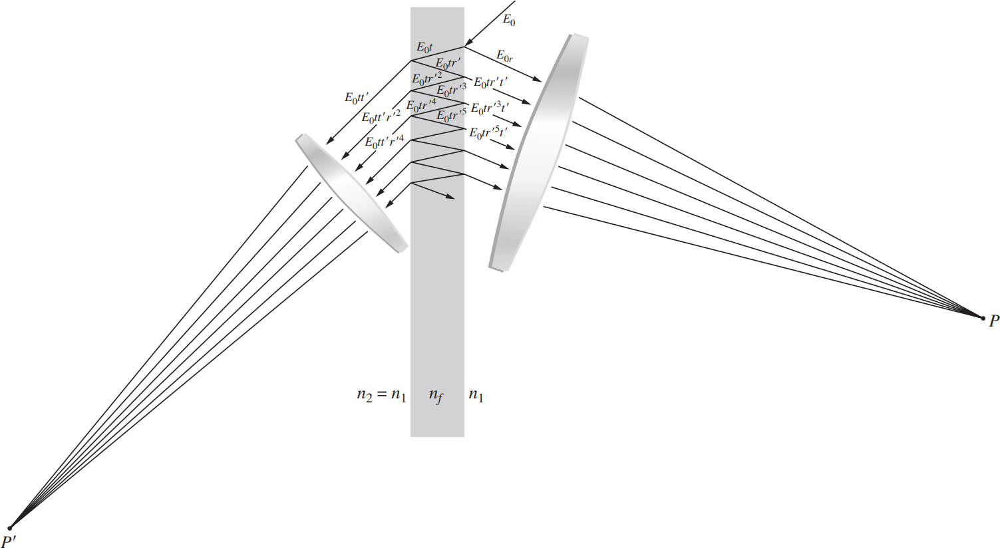

# Chapter 9 Interference

光学干涉对应于两个或更多的光波的相互作用，产生一个偏离分量辐照度之和的结果辐照度。
Optical interference corresponds to the interaction of two or more lightwaves yielding a resultant irradiance that deviates from the sum of the component irradiances.

## 9.1 General Considerations

考虑两个点源，$S_1$ 和 $S_2$，在均质介质中发射相同频率的单色波。让它们的间距 $a$ 远大于 $\lambda$。将观察点 $P$ 设在离源足够远的地方，以便在 $P$ 处的波面是平面。
Consider two point sources, $S_1$ and $S_2$, emitting monochromatic waves of the same frequency in a homogeneous medium. Let their separation $a$ be much greater than $\lambda$. Locate the point of observation $P$ far enough away from the sources so that at $P$ the wavefronts will be planes.
$$
\mathbf{E}_1(\mathbf{r},t)=\mathbf{E}_{01}\cos(\mathbf{k}_1\cdot\mathbf{r}-\omega t+\varepsilon_1)\\
\mathbf{E}_2(\mathbf{r},t)=\mathbf{E}_{02}\cos(\mathbf{k}_2\cdot\mathbf{r}-\omega t+\varepsilon_2)\tag{9.2}
$$
The irradiance:
$$
I=\epsilon v\langle\mathbf{E}^2\rangle_T=\epsilon v(\mathbf{E}_1^2+\mathbf{E}_2^2+2\mathbf{E}_1\cdot\mathbf{E}_2)_T\tag{9.3}
$$

$$
I=I_1+I_2+I_{12}\tag{9.4}
$$

其中
$$
\mathbf{E}_1\cdot\mathbf{E}_2=\mathbf{E}_{01}\cdot\mathbf{E}_{02}\cos(\mathbf{k}_1\cdot\mathbf{r}-\omega t+\varepsilon_1)\cos(\mathbf{k}_2\cdot\mathbf{r}-\omega t+\varepsilon_2)\tag{9.8}
$$
由
$$
\langle{f(t)}\rangle_T=\frac{1}{T}=\int_{t}^{t+T}f(t')\mathrm{d}t'\tag{9.10}
$$
我们有
$$
I_{12}=2\langle\mathbf{E}_1\cdot\mathbf{E}_2\rangle_T=\mathbf{E}_{01}\cdot\mathbf{E}_{02}\cos(\mathbf{k}_1\cdot\mathbf{r}+\varepsilon_1-\mathbf{k}_2\cdot\mathbf{r}-\varepsilon_2)\tag{9.11}
$$
令 $\delta=\mathbf{k}_1\cdot\mathbf{r}+\varepsilon_1-\mathbf{k}_2\cdot\mathbf{r}-\varepsilon_2$ 为相差（phase difference）。

---

如果 $\mathbf{E}_{01}$ 和 $\mathbf{E}_{02}$​ 平行，那么
$$
I=E_{01}^2+E_{02}^2+2E_{01}E_{02}\cos\delta=I_1+I_2+2\sqrt{I_1I_2}\cos\delta\tag{9.14}
$$
**相长干涉（total constructive interference）**：$\delta$ 为 $\pi$ 的偶数倍，$I=I_1+I_2+2\sqrt{I_1I_2}$。

**相消干涉（total destructive interference）**：$\delta$ 为 $\pi$ 的奇数倍，$I=I_1+I_2-2\sqrt{I_1I_2}$。

如果 $\mathbf{E}_{01}$ 和 $\mathbf{E}_{02}$ 平行且相等，那么
$$
I=2I_0(1+\cos\delta)=4I_0\cos^2\frac{\delta}{2}\tag{9.17}
$$

$\delta=2m\pi$ 时候取到最大值。

---

对于从 $S_1$ 和 $S_2$ 发出的球面波
$$
\mathbf{E}_1(r_1,t)=\mathbf{E}_{01}(r_1)\exp[i(kr_1-\omega t+\varepsilon_1)]\\
\mathbf{E}_2(r_2,t)=\mathbf{E}_{02}(r_2)\exp[i(kr_2-\omega t+\varepsilon_2)]\tag{9.18}
$$
$r_1,r_2$ 是到 $P$ 点处的半径，此时
$$
\delta=k(r_1-r_2)+(\varepsilon_1-\varepsilon_2)\tag{9.19}
$$
发射源间距 $a\ll(r_1-r_2)$ 时，可以用 $9.17$。
$$
I=4I_0\cos^2\frac{1}{2}[k(r_1-r_2)+(\varepsilon_1-\varepsilon_2)]
$$
辐照度极大极小值对应
$$
\begin{align*}
\max:(r_1-r_2)&=[2m\pi+(\epsilon_1-\epsilon_2)]/k\\
\min:(r_1-r_2)&=[(2m+1)\pi+(\epsilon_1-\epsilon_2)]/k
\end{align*}\tag{9.20}
$$
如果 $\varepsilon_1-\varepsilon_2=0$，辐照度极大极小值对应
$$
\begin{align*}
\max:(r_1-r_2)&=2m\pi/k=m\lambda\\
\min:(r_1-r_2)&=(2m+1)\pi/k=\frac{1}{2}(2m+1)\lambda
\end{align*}\tag{9.21}
$$
请注意，与两个光源等距离的中央亮带是所谓的零阶边缘（$m=0$），它被 $m=\pm0.5$ 的极小值所包围，而这些小极值又被一阶（$m=\pm1$）的极大值所包围，它被 $m=\pm1.5$ 的极小值所包围，以此类推。
Notice that the central bright band, equidistant from the two sources, is the so-called zeroth-order fringe ($m = 0$), which is straddled by the $m = \pm0.5$ minima, and these, in turn, are bounded by the first-order ($m = \pm1$) maxima, which are straddled by the $m = \pm1.5$ minima, and so forth.

---

两条窄缝会产生大量完全对齐的条纹，从而增加辐照度，使两点源图案的中心区域在其他方面基本没有变化。
Two narrow slits will generate a large number of exactly aligned fringes, thereby increasing the irradiance, leaving the central region of the two-point source pattern otherwise essentially unchanged.

### 9.1.1 Near Field/Far Field

**远场（Far field）**: 在该区域，干涉波可以被视为平面的。

**近场（Near field）**: 在该区域，两条波之间的相位和振幅差距比较大。

## 9.2 Conditions for Interference

频率相等、相位差恒定、光强相近。

### 9.2.1 Temporal and Spatial Coherence

时间相干性是光谱纯度的一种表现。如果光在理想情况下是单色的，那么这个波将是一个完美的正弦波，具有无限的相干长度。所有真正的光源都达不到这一点，而且所有的光源实际上都发出了一系列的频率，尽管有时相当狭窄。
Temporal coherence is a manifestation of spectral purity. If the light were ideally monochromatic, the wave would be a perfect sinusoid with an infinite coherence length. All real sources fall short of this, and all actually emit a range of frequencies, albeit sometimes quite narrow.

空间相干性是指在一个周期后，波的形状是相同的。
Spatial coherence means that the shape of the wave is identical after one period.

## 9.3 Wavefront-splitting Interferometers

### 9.3.1 Young's Double-Slit Experiment

当对称性存在时，到达两个狭缝的主波前段将是完全同相的，狭缝将构成两个相干的次级源。我们预计，只要来自 $S_1$ 和 $S_2$ 的两个波重叠，就会发生干涉（只要光路差小于相干长度，$c\Delta t_c$）。
When symmetry exists, the segments of the primary wavefront arriving at the two slits will be exactly in-phase, and the slits will constitute two coherent secondary sources. We expect that wherever the two waves coming from $S_1$ and $S_2$ overlap, interference will occur (provided that the optical path difference is less than the coherence length, $c\Delta t_c$).

The path difference
$$
\overline{S_1B}=\overline{S_1P}-\overline{S_2P}=r_1-r_2\tag{9.22}
$$
Continuing approximation
$$
r_1-r_2\approx a\sin\theta\approx a\theta\tag{9.23}
$$
Continuing approximation
$$
\tan\theta=\theta\approx\frac{y}{s}\tag{9.24}
$$
so
$$
r_1-r_2\approx a\frac{y}{s}\tag{9.25}
$$
对于相长干涉：
$$
r_1-r_2=m\lambda\tag{9.26}
$$
因此
$$
\theta=\frac{m\lambda}{a}\tag{9.28}
$$
对于 $m$ 阶干涉极大值，$m$ 个波长应和 $r_1-r_2$ 的距离相等。
For the $m$th-order interference maximum, $m$ whole wavelengths should fit within the distance $r_1-r_2$.
$$
a\sin\theta_m=m\lambda\tag{9.29}
$$
屏幕上条纹的间距
The spacing of the fringes on the screen
$$
y_{m+1}-y_{m}\approx\frac{s}{a}(m+1)\lambda-\frac{s}{a}m\lambda=\frac{s}{a}\lambda\tag{9.30}
$$
相位差是
$$
\delta=k(r_1-r_2)
$$
带入 $9.17$
$$
I=4I_0\cos^2\frac{k(r_1-r_2)}{2}=4I_0\cos^2\frac{yak}{2s}=4I_0\cos^2\frac{ya\pi}{s\lambda}\tag{9.31}
$$

## 9.4 Amplitude-Splitting Interferometers

### 9.4.1 Dielectric Films -- Double-Beam interference

假设薄膜是非吸收性的，并且界面处的振幅反射系数非常低，以至于只需要考虑前两个反射光束 $E_{1r}$ 和 $E_{2r}$（两者都只经历了一次反射）。在实践中，高阶反射光束（$E_{3r}$ 等）的振幅通常下降得非常快，如空气-水和空气-玻璃界面所示。目前，将 $S$ 视为单色点源。
Suppose that the film is nonabsorbing and that the amplitude-reflection coefficients at the interfaces are so low that only the first two reflected beams $E_{1r}$ and $E_{2r}$ (both having undergone only one reflection) need be considered. In practice, the amplitudes of the higher-order reflected beams ($E_{3r}$, etc.) generally decrease very rapidly, as can be shown for the air–water and air–glass interfaces. For the moment, consider $S$ to be a monochromatic point source.

光程差
$$
\Lambda=n_f[\mathrm{AB}+\mathrm{BC}]-n_1\mathrm{AD}
$$
而且
$$
\mathrm{AB}=\mathrm{BC}=\frac{d}{\cos\theta_t}\\
\mathrm{AC}=2d\tan\theta_t\\
\mathrm{AD}=\mathrm{AC}\sin\theta_i=\mathrm{AC}\frac{n_f}{n_1}\sin\theta_t=2d\frac{n_f}{n_1}\frac{\sin^2\theta_t}{\cos\theta_t}
$$
因此光程差为
$$
\Lambda=\frac{2n_fd}{\cos\theta_t}(1-\sin^2\theta_t)=2n_fd\cos\theta_t\tag{9.33}
$$
反射本身会产生额外的相移。回想一下，无论入射光的偏振如何，两个光束（一个在内部反射，一个在外部反射）将经历 $\pi$ 弧度的相对相移。**（光疏介质到光密介质半波损失）**
There will be an additional phase shift arising from the reflections themselves. Regardless of the polarization of the incoming light, the two beams, one internally and one externally reflected, will experience a relative phase shift of $\pi$ radians.

因此相位差
$$
\begin{align*}
\delta&=k_0\Lambda\pm\pi\\
&=\frac{4\pi n_f}{\lambda_0}d\cos\theta_t\pm\pi\\
&=\frac{4\pi}{\lambda_0}d\sqrt{n_f^2-n^2\sin^2\theta_t}\pm\pi\\
\end{align*}\tag{9.35}
$$
极大值出现于：
$$
d\cos\theta_t=(2m+1)\frac{\lambda_f}{4}\tag{9.36}
$$
极小值出现于：
$$
d\cos\theta_t=2m\frac{\lambda_f}{4}\tag{9.37}
$$

#### Fringes of Equal Thickness

存在一类干涉条纹，其中光学厚度 $n_fd$ 是主要参数，而不是 $\theta_i$。这些被称为等宽条纹。
A whole class of interference fringes exists for which the optical thickness, $n_fd$, is the dominant parameter rather than $\theta_i$. These are referred to as fringes of equal thickness.

当以几乎垂直的入射率观察时，由不均匀薄膜产生的轮廓称为 Fizeau 条纹。对于小角度 $\alpha$ 的细楔形，两束反射光线之间的光程长度差可以用等式 $(9.33)$ 近似，其中 $d$ 是特定点的厚度，即
When viewed at nearly normal incidence, the contours arising from a nonuniform film are called Fizeau fringes. For a thin wedge of small angle $\alpha$, the optical path length difference between two reflected rays may be approximated by Eq. $(9.33)$, where $d$ is the thickness at a particular point, that is,
$$
d=x\alpha\tag{9.38}
$$
对于 $\theta_i$ 的较小值，极大干涉条件变为
For small value of $\theta_i$ the condition for an interference maximum becomes
$$
\left(m+\frac{1}{2}\right)\lambda_0=2n_fd_m=2n_fx_m\alpha
$$
其中 $m$ 从 0 开始计数。
$$
x_m=\frac{2m+1}{4\alpha}\lambda_f\tag{9.39}
$$
相邻条纹间距
$$
\Delta x=\lambda_f/2\alpha\tag{9.40}
$$
厚度
$$
d_m=\frac{2m+1}{4}\lambda_f\tag{9.41}
$$

如果两块玻璃在一个点上被迫在一起，就像用锋利的铅笔按压它们一样，那么在该点周围会形成一系列同心的、近乎圆形的条纹。被称为牛顿环。
If the two pieces of glass are forced together at a point, as might be done by pressing on them with a sharp pencil, a series of concentric, nearly circular, fringes is formed about that point. Known as Newton's rings.
$$
x^2=R^2-(R-d)^2=2Rd-d^2\approx2Rd
$$
极大值为
$$
\left(m+\frac{1}{2}\right)\lambda_0=2n_fd_m=n_f\frac{x^2}{R}
$$
其中 $m$ 从 0 开始计数。
$$
x_m=\sqrt{\left(m+\frac{1}{2}\right)\lambda_fR}\tag{9.42}
$$

#### A Single-Layer Antireflection Coating

如今大多数镜头，从相机镜头到眼镜，都涂有一层或多层薄的透明电介质，以控制表面反射。这些薄膜通常被称为抗反射涂层。
Today most lenses, from camera lenses to eyeglasses, are coated with one or more layers of thin transparent dielectrics in order to control surface reflections. These films are commonly referred to as antireflection coatings.

考虑在折射率 $n_s$ 的基板（玻璃或其他光学材料）上分层的折射率 $n_f$ 的介电膜。假设周围的介质（通常是空气）的折射率为 $n_0$，并将处理限制在接近正常入射的常见情况下，即光线或多或少地直接进入设备。
Consider a dielectric film of index $n_f$ layered on top of a substrate (of glass or some other optical material) of index ns. Assume the surrounding medium (usually air) has an index of $n_0$, and limit the treatment to the common case of near-normal incidence, that is, light coming, more or less, straight into the device.

与空气折射率相比，基板折射率越大，从裸空气-玻璃界面反射的光量就越大。
The greater the substrate index is-compared to the index of air-the greater will be the amount of light reflected from the bare air-glass interface.

最简单的可能的安排，使 $n_s>n_f>n_0$，因此所有反射都是外部的，并且不会有任何额外的相移。我们使薄膜的波长为四分之一（$h=\lambda_f/4$），然后两个反射波将在某种程度上抵消。当然，只有当两个反射波的振幅几乎相等时，它们才会接近完全抵消。
The simplest possibility is to arrange things so that $n_s>n_f>n_0$ whereupon all the reflections are external and there will not be any additional phase shifts. We make the film a quarter of a wavelength ($h=\lambda_f/4$) thick, and the two reflected waves will then, to some extent, cancel. Of course, only if the amplitudes of the two reflected waves are nearly equal will they come close to completely canceling.

### 9.4.2 Mirrored Interferometers

#### The Michelson Interferometer

#### The Mach-Zehnder Interferometer

#### Sagnac Interferometer

## 9.6 Multiple-Beam Interference

在有些情况下，会有更多的相互相干的波发生干涉。
There are circumstances under which a much larger number of mutually coherent waves are made to interfere.

振幅传输系数用 $t$ 表示，即波进入薄膜时传输的振幅部分，以及 $t'$，即波离开薄膜时传输的部分。
The amplitude-transmission coefficients are represented by $t$, the fraction of the amplitude of a wave transmitted on entering into the film, and $t'$, the fraction transmitted when a wave leaves the film.

相邻光线之间的光程差由下式给出
The difference in optical path length between adjacent rays is given by
$$
\Lambda=2n_fd\cos\theta_t\tag{9.33}
$$
只有第一个反射波会发生半波损失，后续的反射波从薄膜处出射时候相位不变。

第一种特殊情况（first special case）：假设此时相邻光线之间的光程差 $\Lambda=m\lambda$，那么第一个反射波会和其他的反射波相消
$$
\begin{align*}
E_{0r}&=E_0r-(E_0trt'+E_0tr^3t+\cdots)\\
&=E_0r-E_0trt'(1+r^2+r^4+\cdots)\\
&=E_0r\left[1-\frac{tt'}{1-r^2}\right]
\end{align*}\tag{9.49}
$$
由于 $tt'=1-r^2$，因此 $E_{0r}=0$。

第二种特殊情况（second special case）：假设此时相邻光线之间的光程差 $\Lambda=(m+1/2)\lambda$，那么第一第二个反射波会相长，后续的两两相消：
$$
\begin{align*}
E_{0r}&=E_0r+E_0trt'-E_0tr^3t+\cdots\\
&=E_0r+E_0trt'(1-r^2+r^4-\cdots)\\
&=E_0r\left[1+\frac{tt'}{1+r^2}\right]
\end{align*}
$$
由于 $tt'=1-r^2$，因此 $E_{0r}=2r/(1+r^2)E_0$，此时辐照度为
$$
I_r=\frac{4r^2}{(1+r^2)^2}\left(\frac{E_0^2}{2}\right)\tag{9.50}
$$
考虑一般情况，设入射光为 $E_0e^{i\omega t}$，则每个反射光分别为：
$$
\begin{align*}
\tilde{E}_{1r}&=E_0re^{i\omega t}\\
\tilde{E}_{2r}&=E_0tr't'e^{i(\omega t-\delta)}\\
\tilde{E}_{3r}&=E_0tr'^3t'e^{i(\omega t-2\delta)}\\
&\vdots\\
\tilde{E}_{Nr}&=E_0tr'^{(2N-3)}t'e^{i(\omega t-(N-1)\delta)}
\end{align*}
$$
总反射光强为
$$
\begin{align*}
\tilde{E}_r&=\sum_{j=1}^{\infty}\tilde{E}_{jr}\\
&=E_0e^{i\omega t}\left[r+r'tt'e^{-i\delta}\sum_{j=0}^{\infty}(r'^2e^{-i\delta})^j\right]\\
&=E_0e^{i\omega t}\left[r+\frac{r'tt'e^{-i\delta}}{1-r'^2e^{-i\delta}}\right]
\end{align*}\tag{9.51}
$$
由于 $r=-r',tt'=1-r^2$​
$$
\tilde{E}_r=E_0e^{i\omega t}\left[r-\frac{r(1-r^2)e^{-i\delta}}{1-r^2e^{-i\delta}}\right]=E_0e^{i\omega t}\left[\frac{r(1-e^{-i\delta})}{1-r^2e^{-i\delta}}\right]
$$
则辐照度为
$$
I_r=\tilde{E}_r\tilde{E}_r^*/2=\frac{E_0^2}{2}\frac{r^2(1-e^{-i\delta})(1-e^{i\delta})}{(1-r^2e^{-i\delta})(1-r^2e^{i\delta})}
$$
即
$$
I_r=I_i\frac{2r^2(1-\cos\delta)}{(1+r^4)-2r^2\cos\delta}\tag{9.52}
$$
每个透射光为
$$
\begin{align*}
\tilde{E}_{1t}&=E_0tt'e^{i\omega t}\\
\tilde{E}_{2t}&=E_0tt'r'^2e^{i(\omega t-\delta)}\\
\tilde{E}_{3t}&=E_0tt'r'^4e^{i(\omega t-2\delta)}\\
&\vdots\\
\tilde{E}_{Nt}&=E_0tt'r'^{2N-2}e^{i(\omega t-(N-1)\delta)}
\end{align*}
$$
总透射光强为
$$
\begin{align*}
\tilde{E}_t&=\sum_{j=1}^{\infty}\tilde{E}_{jt}\\
&=E_0e^{i\omega t}\left[tt'\sum_{j=0}^{\infty}(r'^2e^{-i\delta})^j\right]\\
&=E_0e^{i\omega t}\left[\frac{tt'}{1-r'^2e^{-i\delta}}\right]
\end{align*}\tag{9.53}
$$
则辐照度为
$$
I_t=\frac{I_i(tt')^2}{(1+r^4)-2r^2\cos\delta}=\frac{I_i}{1+[2r/(1-r^2)]^2\sin^2(\delta/2)}\tag{9.56}
$$

### 9.6.1 The Fabry-Perot Interferometer

#### Fabry–Perot Spectroscopy
