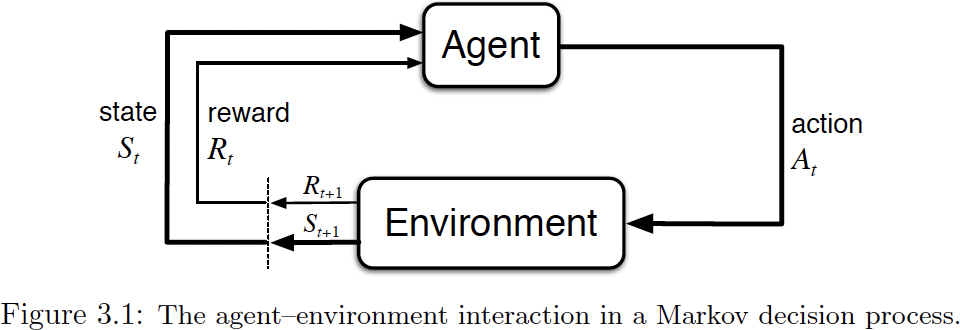

# Chapter 1 Basic Concepts

### Notation

- $k$：迭代次数。
- $t$：时间步。
- $\mathcal{X}$：集合。
- $X_{t}$：在时刻 $t$ 的随机变量。
- $x_{t}$：在时刻 $t$ 的随机变量的一个取值。

## The Agent-Environment Interface

在 MDP 中，在时刻 $t$，智能体观察环境状态 $S_{t}$，获得奖励 $R_{t}$，并根据策略 $\pi$ 选择一个动作 $A_{t}$。环境根据智能体的动作 $A_{t}$ 和当前状态 $S_{t}$ 转移到下一个状态 $S_{t + 1}$，并给智能体一个奖励 $R_{t + 1}$。

---

- **State**：在给定时间对环境的描述。可以是完全可观察的或部分可观察的，记为随机变量 $S_{t}$（具体取值为 $s_{t}$）。分为环境状态 $S_{t}^{e}$ 和智能体状态 $S_{t}^{a}$ 两部分。智能体通常无法完整获取到环境状态 $S_{t}^{e}$。
- **State Space**：所有可能状态的集合，记为 $\mathcal{S}$。
- **Action**：智能体做出的影响环境的选择，记为随机变量 $A_{t}$（具体取值为 $a_{t}$）。
- **Action Space of State**：在当前状态下，所有可能动作的集合，记为 $\mathcal{A}(s_{t})$。
- **Policy**：智能体如何选择动作，记为 $\pi(a_{t} \mid s_{t}) = \mathbb{P}(A_{t} = a_{t} \mid S_{t} = s_{t})$。
- **State Transition**：环境从一个状态转移到另一个状态的过程，记为 $S_{t} \xrightarrow{A_{t}} S_{t + 1}$。
- **State Transition Probability**：在给定状态和动作的情况下，环境转移到下一个状态的概率，记为 $p(s_{t + 1} \mid s_{t}, a_{t}) = \mathbb{P}(S_{t + 1} = s_{t + 1} \mid S_{t} = s_{t}, A_{t} = a_{t})$。
- **Reward**：智能体在状态转移过程中获得的反馈。作为随机变量记为 $R_{t + 1}$（具体取值为 $r_{t + 1} \in \mathbb{R}$）。奖励是一种人机交互，用来指导智能体的行为。
- **Trajectory**：又叫 **History**，智能体与环境交互的具体序列，记为 $\tau = (s_{0}, a_{0}, r_{1}, s_{1}, a_{1}, r_{2}, \ldots)$。
- **Return**：在给定轨迹的情况下，从某个时间步开始，智能体在未来获得的累积奖励，记为 $G_{t} = \sum_{k = 0}^{\infty} \gamma^{k} R_{t + k + 1}$。回报用来评估策略的好坏。
- **Discount Factor**：$\gamma \in [0, 1]$，用来权衡当前奖励和未来奖励的重要性。当 $\gamma$ 越接近 1 时，智能体越重视未来奖励；当 $\gamma$ 越接近 0 时，智能体越重视当前奖励。
- **Episode**：智能体与环境交互的一个完整的、有限的过程（$s_{0}, a_{0}, r_{1}, \dots, s_{T - 1}, a_{T - 1}, r_{T}$），从初始状态开始，直到达到终止状态。

## Finite Markov Decision Processes (MDPs)

在有限 MDP 中，状态和动作的数量是有限的（即 $|\mathcal{S}| < \infty$ 且 $|\mathcal{A}| < \infty$）。而且智能体能观察到环境的完整状态，有 $S_{t} = S_{t}^{e} = S_{t}^{a}$。如果智能体无法观察到环境的完整状态，则称为部分可观察 MDP（POMDP）。比如牌类游戏，智能体只能观察到自己的手牌，无法观察到其他玩家的手牌。

MDP 关键组成部分 $\langle \mathcal{S}, \mathcal{A}, p, r, \pi \rangle$：

- **State Space**：$\mathcal{S}$。
- **Action Space**：$\mathcal{A}(s)$。
- **Dynamics Function**：统一描述状态转移和奖励的联合概率分布，记为 $p(s', r \mid s, a) = \mathbb{P}(S_{t+1}=s', R_{t+1}=r \mid S_t=s, A_t=a)$。也称为 **Model**，它完全描述了环境的行为。
- **State Transition Probability**：由动力学函数可导出 $p(s' \mid s, a) = \sum_{r} p(s', r \mid s, a)$。
- **Reward Expected Function**：在状态 $s$ 采取动作 $a$ 的期望奖励 $r(s, a) = \mathbb{E}[R_{t + 1} \mid S_{t} = s, A_{t} = a]$ = $\sum_{s' \in \mathcal{S}} \sum_{r} r p(s', r \mid s, a)$。
- **Policy**：$\pi(a \mid s)$。

MDP 的核心特征是满足马尔可夫性质，即在给定当前状态和动作的情况下，未来的状态和奖励与过去的完整历史无关：
$$
p(s_{t + 1}, r_{t + 1} \mid s_{t}, a_{t}, r_{t}, s_{t-1}, a_{t-1}, \cdots, s_{0}, a_{0}) = p(s_{t + 1}, r_{t + 1} \mid s_{t}, a_{t})
$$
也可分别拆解表示为：
$$
\begin{aligned}
p(s_{t + 1} \mid s_{t}, a_{t}, r_{t}, s_{t-1}, a_{t-1}, \cdots, s_{0}, a_{0}) &= p(s_{t + 1} \mid s_{t}, a_{t}) \\
p(r_{t + 1} \mid s_{t}, a_{t}, r_{t}, s_{t-1}, a_{t-1}, \cdots, s_{0}, a_{0}) &= p(r_{t + 1} \mid s_{t}, a_{t})
\end{aligned}
$$

## Taxonomy of Markov Models

|                                 | Do have control over the state transition            | Do not have control over the state transition |
| ------------------------------- | ---------------------------------------------------- | --------------------------------------------- |
| States are fully observable     | Markov Decision Process (MDP)                        | Markov Chains                                 |
| States are partially observable | Partially Observable Markov Decision Process (POMDP) | Hidden Markov Models (HMM)                    |

## Learning and Planning

- **Planning**：在已知环境模型的情况下，计算最优策略的过程。
- **Learning**：在未知环境模型的情况下，通过与环境交互来学习最优策略的过程。
- **Prediction**：评估一个给定策略的价值。
- **Control**：寻找一个最优策略的过程。
