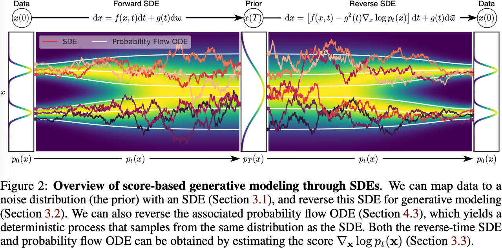

# Score-based Generative Modeling Through Stochastic Differential Equations

## Claim

> Creating noise from data is easy; creating data from noise is generative modeling.

基于分数的生成模型：
- **SMLD**：先在不同噪声水平下估计分数，然后在生成过程中用 Langevin 动力学从一系列递减的噪声水平中采样。
- **DDPM**：利用已知形式的正向过程，训练一系列概率模型来逐渐去噪声，对于连续的状态空间，DDPM 的训练目标隐式地计算了不同噪声水平下的分数。

- 对于扩散过程，即数据点扩散为噪声的过程，作者发现这个过程符合 SDE 的定义。
- 对于反向过程，作者发现该过程符合逆时 SDE 的定义。

因此，作者的贡献有三点：
1. 可以用 SDE 数值求解器来生成样本。具体来说提供了两个求解器：
    1. **Predictor-Corrector 采样器**：基于分数的 Monte Carlo Markov Chain (MCMC) 和 SDE 数值求解器。
    2. 基于概率流的 ODE 求解器。
2. **可控生成**：带条件的逆时 SDE 可以从无条件的分数中估计，并且不需要重新训练模型。
3. 一个**统一的 SDE 框架**：统一了 SMLD 和 DDPM。

## Related Work

### Score Matching with Langevin Dynamics

SMLD 通过学习数据点的分数来生成样本，训练目标为：
$$
\theta^{*} = \arg \min_{\theta} \sum_{i=1}^{N} \sigma_{i}^{2} \mathbb{E}_{p_{\text{data}}(\mathbf{x})} \mathbb{E}_{p(\tilde{\mathbf{x}} \mid \mathbf{x}; \sigma_{i})} \left[\left\|\nabla_{\tilde{\mathbf{x}}} \log p(\tilde{\mathbf{x}} \mid \mathbf{x}; \sigma_{i}) - s_{\theta}(\tilde{\mathbf{x}}, \sigma_{i})\right\|^{2}_{2}\right]
$$
其中 $\sigma_{\min} = \sigma_{1} < \cdots < \sigma_{N} = \sigma_{\max}$ 是一系列噪声水平，$p(\tilde{\mathbf{x}} \mid \mathbf{x}; \sigma_{i}) = \mathcal{N}(\tilde{\mathbf{x}} \mid \mathbf{x}, \sigma_{i}^{2} \mathbf{I})$ 是给数据点 $\mathbf{x}$ 添加噪声，$p(\tilde{\mathbf{x}}; \sigma_{i}) = \int p(\tilde{\mathbf{x}} \mid \mathbf{x}; \sigma_{i}) p_{\text{data}}(\mathbf{x}) \mathrm{d} \mathbf{x}$ 是添加噪声后的数据分布，$s_{\theta}(\tilde{\mathbf{x}}, \sigma_{i})$ 是网络估计的分数。

采样时候，可以用 $M$ 步的 Langevin MCMC。对于 $i \in \{N, N-1, \ldots, 1\}$ 的每一步，连续用以下的 Langevin 动力学更新 $M$ 次：
$$
\mathbf{x}_{i}^{m} = \mathbf{x}_{i}^{m-1} + \Delta t_{i}s_{\theta}(\mathbf{x}_{i}^{m-1}, \sigma_{i}) + \sqrt{2\Delta t_{i}}\boldsymbol{\epsilon}_{i}, \quad m = 1, \ldots, M
$$
其中 $\boldsymbol{\epsilon}_{i} \sim \mathcal{N}(\mathbf{0}, \mathbf{I})$，$\Delta t_{i}$ 是步长，$\mathbf{x}_{N}^{0} \sim \mathcal{N}(\mathbf{0}, \sigma_{\max}^{2}\mathbf{I})$，$\mathbf{x}_{i}^{0} = \mathbf{x}_{i+1}^{M}$。

### Denoising Diffusion Probabilistic Models

DDPM 通过逐渐去噪声来生成样本，训练目标为：
$$
\theta^{*} = \arg \min_{\theta} (1 - \bar{\alpha}_{i}) \mathbb{E}_{p_{\text{data}}(\mathbf{x})} \mathbb{E}_{p(\tilde{\mathbf{x}} \mid \mathbf{x}; \bar{\alpha}_{i})} \left[\left\|\nabla_{\tilde{\mathbf{x}}} \log p(\tilde{\mathbf{x}} \mid \mathbf{x}; \bar{\alpha}_{i}) - s_{\theta}(\tilde{\mathbf{x}}, i)\right\|^{2}_{2}\right]
$$
其中 $0 < \beta_{1} < \ldots < \beta_{N} < 1$ 是噪声水平，$\bar{\alpha}_{i} = \prod_{j=1}^{i} (1 - \beta_{j})$，$p(\tilde{\mathbf{x}} \mid \mathbf{x}; \bar{\alpha}_{i}) = \mathcal{N}(\tilde{\mathbf{x}} \mid \sqrt{\bar{\alpha}_{i}} \mathbf{x}, (1 - \bar{\alpha}_{i}) \mathbf{I})$ 是给数据点 $\mathbf{x}$ 添加噪声，$p(\tilde{\mathbf{x}}; \bar{\alpha}_{i}) = \int p(\tilde{\mathbf{x}} \mid \mathbf{x}; \bar{\alpha}_{i}) p_{\text{data}}(\mathbf{x}) \mathrm{d} \mathbf{x}$ 是添加噪声后的数据分布，$s_{\theta}(\tilde{\mathbf{x}}, i)$ 是网络估计的分数。

采样时候，从 $\mathbf{x}_{N} \sim \mathcal{N}(\mathbf{0}, \mathbf{I})$ 开始，用反向 MC 采样：
$$
\mathbf{x}_{i-1} = \frac{1}{\sqrt{1 - \beta_{i}}} (\mathbf{x}_{i} + \beta_{i}s_{\theta}(\mathbf{x}_{i}, i)) + \sqrt{\beta_{i}}\boldsymbol{\epsilon}_{i}, \quad i = N, \ldots, 1
$$
这种采样方式也叫 Ancestral Sampling。

## Derivation

### Perturbing Data with SDEs

设 $\mathbb{P}_{\text{data}}$ 是数据集的分布，$\mathbf{x}_{0} \sim \mathbb{P}_{\text{data}}(\mathbf{x}_{0})$。Diffusion 加噪的过程是：
$$
\mathbf{x}_{t} = s(t) \mathbf{x}_{0} + s(t) \sigma(t) \boldsymbol{\epsilon}
$$
用概率形式表达：
$$
\mathbb{P}(\mathbf{x}_{t}) = \mathcal{N}\left(\mathbf{x}_{t}; s(t)\mathbf{x}_{0}, s(t)^{2} \sigma(t)^{2} \mathbf{I}\right)
$$
其中 $t\in[0, T]$，这是一个离散的过程。现在考虑时间连续的情况，即 $t \in [0, 1]$ 的加噪过程。考虑一个时间步微元 $\Delta t$，则有：
$$
\begin{aligned}
\mathbf{x}_{t + \Delta t} - \mathbf{x}_{t} &= [s(t + \Delta t) - s(t)]\mathbf{x}_{0} + \sqrt{s(t + \Delta t)^{2}\sigma(t + \Delta t)^{2} - s(t)^{2}\sigma(t)^{2}} \boldsymbol{\epsilon} \\
&= [s(t + \Delta t) - s(t)]\left(\frac{\mathbf{x}_{t}}{s(t)} - \sigma(t)\boldsymbol{\epsilon}\right) + \sqrt{s(t + \Delta t)^{2}\sigma(t + \Delta t)^{2} - s(t)^{2}\sigma(t)^{2}} \boldsymbol{\epsilon} \\
&= \frac{s(t + \Delta t) - s(t)}{s(t)} \mathbf{x}_{t} - \sqrt{s(t + \Delta t)^{2}\sigma(t + \Delta t)^{2} - s(t)^{2}\sigma(t)^{2} - [s(t + \Delta t) - s(t)]^{2}\sigma(t)^{2}} \boldsymbol{\epsilon}
\end{aligned}
$$
当 $\Delta t \to 0$ 时，我们有：
$$
\begin{aligned}
\mathrm{d} \mathbf{x}_{t} &= \lim_{\Delta t \to 0} \mathbf{x}_{t + \Delta t} - \mathbf{x}_{t} \\
&= \lim_{\Delta t \to 0} \frac{s(t + \Delta t) - s(t)}{s(t)} \mathbf{x}_{t} - \sqrt{s(t + \Delta t)^{2}\sigma(t + \Delta t)^{2} - s(t)^{2}\sigma(t)^{2} - [s(t + \Delta t) - s(t)]^{2}\sigma(t)^{2}} \boldsymbol{\epsilon} \\
&= \lim_{\Delta t \to 0} \frac{\mathrm{d}s(\xi)}{\mathrm{d}t} \frac{1}{s(t)} \mathbf{x}_{t} \Delta t - \sqrt{\frac{\mathrm{d}s(\eta)^{2}\sigma(\eta)^{2}}{\mathrm{d}t} - \left(\frac{\mathrm{d}s(\xi)}{\mathrm{d}t}\right)^{2}\sigma(t)^{2}} \sqrt{\Delta t}\boldsymbol{\epsilon} \\
&= \frac{\dot{s}(t)}{s(t)} \mathbf{x}_{t} \mathrm{d}t - \sqrt{2 s(t)\sigma(t)[\dot{s}(t)\sigma(t) + s(t)\dot{\sigma}(t)] - 2 \dot{s}(t)s(t)\sigma(t)^{2}} \mathrm{d}\mathbf{w}_{t} \\
&= \frac{\dot{s}(t)}{s(t)} \mathbf{x}_{t} \mathrm{d}t + s(t) \sqrt{2\dot{\sigma}(t)\sigma(t)} \mathrm{d}\mathbf{w}_{t}
\end{aligned}
$$
其中 $\xi, \eta \in [t, t + \Delta t]$。因此连续的前向过程（扩散过程）可以用 Ito SDE 描述：
$$
\mathrm{d}\mathbf{x}_{t} = \underbrace{\frac{\dot{s}(t)}{s(t)}}_{f(t)} \mathbf{x}_{t} + \underbrace{s(t) \sqrt{2\dot{\sigma}(t)\sigma(t)}}_{g(t)} \mathrm{d}\mathbf{w}_{t}
$$
其中 $f:\mathbb{R} \mapsto \mathbb{R}$ 是 SDE 的漂移系数（drift coefficient），$g:\mathbb{R} \mapsto \mathbb{R}$ 是 SDE 的扩散系数（diffusion coefficient），$\mathbf{w}_{t}$ 是标准维纳过程。当系数在状态空间和时间上是 Lipschitz 连续的时候，Ito SDE 有唯一解。

### Generating Samples by Reversing SDEs

反向过程也是一个扩散过程，可以用逆时 SDE 描述。我们从正向 SDE 开始：
$$
\mathbf{x}_{t + \Delta t} = \mathbf{x}_{t} + f(t)\mathbf{x}_{t} \Delta t + g(t) \sqrt{\Delta t} \boldsymbol{\epsilon}
$$
用概率形式表达：
$$
\mathbb{P}(\mathbf{x}_{t + \Delta t} \mid \mathbf{x}_{t}) = \mathcal{N}\left(\mathbf{x}_{t + \Delta t}; \mathbf{x}_{t} + f(t)\mathbf{x}_{t} \Delta t, g(t)^{2} \Delta t \mathbf{I}\right)
$$
为了得到反向的 SDE，就要得到 $\mathbb{P}(\mathbf{x}_{t} \mid \mathbf{x}_{t + \Delta t})$。用 Bayes 公式展开：
$$
\begin{aligned}
\mathbb{P}(\mathbf{x}_{t} \mid \mathbf{x}_{t + \Delta t}) &= \frac{\mathbb{P}(\mathbf{x}_{t + \Delta t} \mid \mathbf{x}_{t}) \mathbb{P}(\mathbf{x}_{t})}{\mathbb{P}(\mathbf{x}_{t + \Delta t})} \\
&= \mathbb{P}(\mathbf{x}_{t + \Delta t} \mid \mathbf{x}_{t}) \exp\left(\log \mathbb{P}(\mathbf{x}_{t}) - \log \mathbb{P}(\mathbf{x}_{t + \Delta t})\right) \\
&\propto \exp \left( -\frac{\|\mathbf{x}_{t + \Delta t} - \mathbf{x}_{t} - f(t)\mathbf{x}_{t} \Delta t\|^{2}_{2}}{2 g(t)^{2} \Delta t} + \log \mathbb{P}(\mathbf{x}_{t}) - \log \mathbb{P}(\mathbf{x}_{t + \Delta t}) \right)
\end{aligned}
$$
用 Taylor 公式在 $\mathbf{x}_{t}$ 处展开 $\log \mathbb{P}(\mathbf{x}_{t + \Delta t})$：
$$
\log \mathbb{P}(\mathbf{x}_{t + \Delta t}) = \log \mathbb{P}(\mathbf{x}_{t}) + (\mathbf{x}_{t + \Delta t} - \mathbf{x}_{t})^{\top} \nabla_{\mathbf{x_{t}}} \log \mathbb{P}(\mathbf{x}_{t}) + \Delta t \frac{\partial}{\partial t} \log \mathbb{P}(\mathbf{x}_{t}) + \cdots
$$
带回得到：
$$
\mathbb{P}(\mathbf{x}_{t} \mid \mathbf{x}_{t + \Delta t}) \propto \exp \left( -\frac{\|\mathbf{x}_{t + \Delta t} - \mathbf{x}_{t} - [f(t)\mathbf{x}_{t} - g(t)^{2}\nabla_{\mathbf{x_{t}}} \log \mathbb{P}(\mathbf{x}_{t})] \Delta t \|^{2}_{2} }{2 g(t)^{2} \Delta t} + O(\Delta t) \right)
$$
注意到上面的式子很多都是和 $\mathbf{x}_{t}$ 有关的，但实际上已知的是 $\mathbf{x}_{t + \Delta t}$，所以要重写为 $\mathbf{x}_{t + \Delta t}$ 的形式。注意到当 $\Delta t \to 0$ 时，$O(\Delta t) \to 0$，$t \approx t + \Delta t$，所以：
$$
\mathbb{P}(\mathbf{x}_{t} \mid \mathbf{x}_{t + \Delta t}) \approx \exp \left( -\frac{\left\|\mathbf{x}_{t} - \mathbf{x}_{t + \Delta t} + \left[f(t + \Delta t)\mathbf{x}_{t + \Delta t} - g(t + \Delta t)^{2}\nabla_{\mathbf{x_{t + \Delta t}}} \log \mathbb{P}(\mathbf{x}_{t + \Delta t})\right] \Delta t \right\|^{2}_{2} }{2 g(t + \Delta t)^{2} \Delta t} \right)
$$
因此：
$$
\mathbb{P}(\mathbf{x}_{t} \mid \mathbf{x}_{t + \Delta t}) = \mathcal{N}(\mathbf{x}_{t}; \mathbf{x}_{t + \Delta t} + \left[f(t + \Delta t)\mathbf{x}_{t + \Delta t} - g(t + \Delta t)^{2}\nabla_{\mathbf{x_{t + \Delta t}}} \log \mathbb{P}(\mathbf{x}_{t + \Delta t})\right] \Delta t, g(t + \Delta t)^{2} \Delta t \mathbf{I})
$$
取 $\Delta t \to 0$，对应的 SDE 为：
$$
\begin{aligned}
\mathrm{d} \mathbf{x}_{t} &= [f(t)\mathbf{x} - g(t)^{2} \nabla_{\mathbf{x}_{t}} \log \mathbb{P}(\mathbf{x}_{t})] \mathrm{d} t + g(t) \mathrm{d} \bar{\mathbf{w}} \\
&= \left[\frac{\dot{s}(t)}{s(t)} \mathbf{x}_{t} - 2 s(t)^{2}\dot{\sigma}(t)\sigma(t) \nabla_{\mathbf{x}_{t}} \log \mathbb{P}(\mathbf{x}_{t})\right] \mathrm{d} t + s(t)\sqrt{2\dot{\sigma}(t)\sigma(t)} \mathrm{d}\bar{\mathbf{w}}
\end{aligned}
$$
其中 $\bar{\mathbf{w}}$ 也是标准维纳过程，但时间从 $1$ 到 $0$，$\mathrm{d} t$ 是负的时间微元。

### Probability Flow and Connection to Neural ODEs

这里省略 Fokker-Planck 方程的介绍。前向 SDE对应的 Fokker-Planck 方程为：
$$
\begin{aligned}
\frac{\partial \mathbb{P}(\mathbf{x}_{t})}{\partial t} &= -\nabla_{\mathbf{x}_{t}} \cdot \left[f(t)\mathbf{x}_{t}\mathbb{P}(\mathbf{x}_{t})\right] + \frac{1}{2} \nabla_{\mathbf{x}_{t}} \cdot \nabla_{\mathbf{x}_{t}} \left[g(t)^{2} \mathbb{P}(\mathbf{x}_{t})\right] \\
&= -\nabla_{\mathbf{x}_{t}} \cdot \left[f(t)\mathbf{x}_{t}\mathbb{P}(\mathbf{x}_{t}) - \frac{1}{2} g(t)^{2} \nabla_{\mathbf{x}_{t}} \mathbb{P}(\mathbf{x}_{t})\right] \\
&= -\nabla_{\mathbf{x}_{t}} \cdot \left[f(t)\mathbf{x}_{t}\mathbb{P}(\mathbf{x}_{t}) - \frac{1}{2} g(t)^{2} \mathbb{P}(\mathbf{x}_{t}) \nabla_{\mathbf{x}_{t}} \log \mathbb{P}(\mathbf{x}_{t})\right] \\
&= -\nabla_{\mathbf{x}_{t}} \cdot \left\{\left[f(t)\mathbf{x}_{t} - \frac{1}{2} g(t)^{2} \nabla_{\mathbf{x}_{t}} \log \mathbb{P}(\mathbf{x}_{t})\right] \mathbb{P}(\mathbf{x}_{t}) \right\}
\end{aligned}
$$
观察这个式子，发现它是另外一个 SDE：
$$
\begin{aligned}
\mathrm{d} \mathbf{x}_{t} &= \left[f(t) - \frac{1}{2} [g(t)^{2} - h(t)^{2}] \nabla_{\mathbf{x}_{t}} \log \mathbb{P}(\mathbf{x}_{t})\right] \mathrm{d} t + \frac{1}{2} h(t)^{2} \nabla_{\mathbf{x}_{t}} \log \mathbb{P}(\mathbf{x}_{t}) \mathrm{d} \mathbf{w}_{t} \\
&= \left[\frac{\dot{s}(t)}{s(t)} \mathbf{x}_{t} - \frac{1}{2} [2s(t)^{2}\dot{\sigma}(t)\sigma(t) - h(t)^{2}] \nabla_{\mathbf{x}_{t}} \log \mathbb{P}(\mathbf{x}_{t})\right] \mathrm{d} t + \frac{1}{2} h(t)^{2} \nabla_{\mathbf{x}_{t}} \log \mathbb{P}(\mathbf{x}_{t}) \mathrm{d} \mathbf{w}_{t}
\end{aligned}
$$
的 Fokker-Planck 方程，$h(t)$ 是任意满足 $h(t)^{2} < g(t)^{2}$ 的函数。这个 SDE 和前向 SDE 的 Fokker-Planck 方程是一样的，因此这个两个 SDE 解得的边缘概率密度 $\mathbb{P}(\mathbf{x}_{t})$ 是完全等价的。当 $h(t)\equiv0$ 的时候，就得到了概率流 ODE：
$$
\mathrm{d} \mathbf{x}_{t} = \left[\frac{\dot{s}(t)}{s(t)} \mathbf{x}_{t} - s(t)^{2}\dot{\sigma}(t)\sigma(t) \nabla_{\mathbf{x}_{t}} \log \mathbb{P}(\mathbf{x}_{t})\right] \mathrm{d} t
$$
当 $h(t)=g(t)$ 的时候，就得到了前向和反向 SDE。

### Controlable Generation

对于带条件的概率分布 $\mathbb{P}(\mathbf{x}_{t} \mid \mathbf{y})$，可以直接带入逆时 SDE 中：
$$
\begin{aligned}
\mathrm{d}\mathbf{x} &= \left[f(t) \mathbf{x} - g(t)^{2} \nabla_{\mathbf{x}} \log \mathbb{P}(\mathbf{x} \mid \mathbf{y})\right] \mathrm{d}t + g(t) \mathrm{d}\bar{\mathbf{w}}_{t} \\
&= \left[f(t) \mathbf{x} - g(t)^{2} \nabla_{\mathbf{x}} \log \frac{\mathbb{P}(\mathbf{x}) \mathbb{P}(\mathbf{y} \mid \mathbf{x})}{\mathbb{P}(\mathbf{y})}\right] \mathrm{d}t + g(t) \mathrm{d}\bar{\mathbf{w}}_{t} \\
&= \left\{f(t) \mathbf{x} - g(t)^{2} \left[\nabla_{\mathbf{x}} \log \mathbb{P}(\mathbf{x}) + \nabla_{\mathbf{x}} \log \mathbb{P}(\mathbf{y} \mid \mathbf{x})\right]\right\} \mathrm{d}t + g(t) \mathrm{d}\bar{\mathbf{w}}_{t}
\end{aligned}
$$
其中 $\mathbb{P}(\mathbf{y} \mid \mathbf{x})$ 可以用 Classifier Guidance 的方式获取。

### Variance Preserve SDE

DDPM 类型的 Diffusion：
$$
\mathrm{d}\mathbf{x} = -\frac{1}{2} \beta(t)\mathbf{x}\mathrm{d}t + \sqrt{\beta(t)}\mathrm{d}\mathbf{w}_{t}
$$
其中 $\beta(i/N) = N\beta_{i}$，$N$ 是总时间，$\beta_{i}$ 是 DDPM 预设的参数，$\beta_{\min} = 1\times10^{-4}$, $\beta_{\max} = 0.02$, $\beta_{i} = \beta_{\min} + (\beta_{\max} - \beta_{\min})i/N$。VP SDE 之所以叫 VP 是因为，如果 $\mathbb{P}_{\text{data}}$ 的方差为 1 的话，那么 $\mathbb{P}(\mathbf{x}_{t})$ 的方差也是 1。

### Variance Explode SDE

NCSN/SMLD 类型的 Diffusion：
$$
\mathrm{d}\mathbf{x} = 0\mathbf{x}\mathrm{d}t + \sqrt{\frac{\mathrm{d}[\sigma^{2}(t)]}{\mathrm{d}t}}\mathrm{d}\mathbf{w}_{t}
$$
其中 $\sigma(i/N) = \sigma_{i}$，$\sigma_{\min} = 0.01$, $\sigma_{\max} = 100$, $\sigma_{i} = \sigma_{\min}(\sigma_{\max} / \sigma_{\min})^{i/N}$。不过这会导致一个问题，当 $N \to \infty$ 时，$\sigma(0+) \to \sigma_{\min}$，但 $\sigma(0)$ 应当为 0，这会导致 $\sigma(t)$ 在 $t=0$ 处不可微。因此在实际中，解 ODE 的参数空间不是 $[0, 1]$，而是 $[\epsilon, 1]$，其中 $\epsilon = 10^{-5}$。
