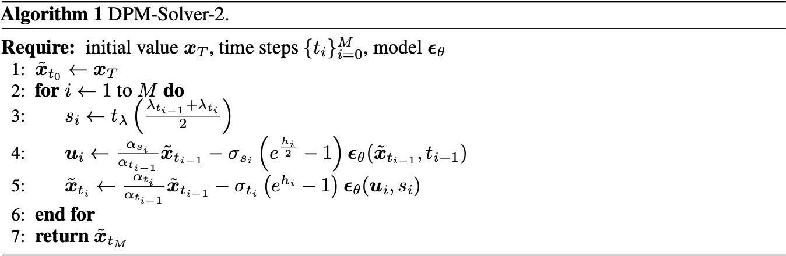
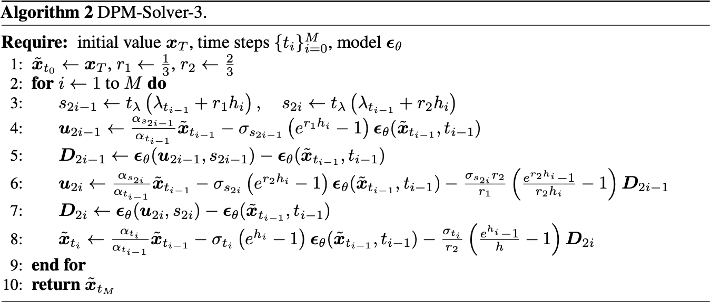

# DPM-Solver: A Fast ODE Solver for Diffusion Probabilistic Model Sampling in Around 10 Steps

## Claimation

- 将 ODE 拆分为线性部分和非线性部分，解析求解了线性部分；对非线性部分做换元，尽可能求出解析解。
- 提出了 DPM-Solver，一种具有收敛阶次保证的扩散 ODE 快速专用高阶求解器。

## Motivation

- DPM 采样速度很慢，因为通常需要对神经网络进行成百上千次的连续函数评估才能得出一个样本。
- DPM 取样也可以看作是求解相应的 ODE，但之前的工作将所有项留给 ODE 求解器，没有对解析解进行分析。

## Method

从概率流 ODE 出发：
$$
\begin{align*}
\mathrm{d} \mathbf{x}_{t} &= \left[f(t) \mathbf{x}_{t} - \frac{1}{2} g(t)^{2} \nabla_{\mathbf{x}_{t}} \log q_{t} (\mathbf{x}_{t}) \right] \mathrm{d} t \\
&= \left[f(t) \mathbf{x}_{t} + \frac{g(t)^{2}}{2 \sigma(t)} \boldsymbol{\epsilon}_{\theta} (\mathbf{x}_{t}, t) \right] \mathrm{d} t.
\end{align*}
$$
其中：
$$
f(t) = \frac{\mathrm{d} \log \alpha(t)}{\mathrm{d} t}, \quad g(t)^{2} = \frac{\mathrm{d} \sigma(t)^{2}}{\mathrm{d} t} - 2 \frac{\mathrm{d} \log \alpha(t)}{\mathrm{d} t} \sigma(t)^{2}.
$$

ODE 求解不含有随机性，而且 ODE 求解器现成就有。观察这个式子，发现加号左边是线性项，右边由于神经网络的存在是非线性项。因此，可以将 ODE 拆分为线性部分和非线性部分，用常数变易法可得：
$$
\mathbf{x}_{t} = \mathbf{x}_{s} \exp \left( \int_{s}^{t} f(u) \mathrm{d} u \right) + \int_{s}^{t} \left[ \frac{g(u)^{2}}{2 \sigma(u)} \boldsymbol{\epsilon}_{\theta} (\mathbf{x}_{u}, u) \exp \left( \int_{u}^{t} f(v) \mathrm{d} v \right) \right] \mathrm{d} u.
$$
改写一下 $g$：
$$
g(t)^{2} = 2 \sigma(t)^{2} \left[ \frac{\mathrm{d} \log \sigma(t)}{\mathrm{d} t} - \frac{\mathrm{d} \log \alpha(t)}{\mathrm{d} t} \right] = - 2 \sigma(t)^{2} \frac{\mathrm{d} \log [\alpha(t) / \sigma(t)]}{\mathrm{d} t}.
$$
定义：
$$
\lambda(t) = \log \frac{\alpha(t)}{\sigma(t)}.
$$
为对数 SNR。和 $f$ 一起带入 ODE 的解析解中得到：
$$
\mathbf{x}_{t} = \frac{\alpha(t)}{\alpha(s)} \mathbf{x}_{s} - \alpha(t) \int_{s}^{t} \exp (-\lambda(u)) \boldsymbol{\epsilon}_{\theta} (\mathbf{x}_{u}, u) \frac{\mathrm{d} \lambda(u)}{\mathrm{d} u} \mathrm{d}u
$$
这里需要假设 $\lambda = h(t)$ 是严格单调递减的（事实上训练时候也是可以满足的）。因此，有对应的反函数 $t=h^{-1}(\lambda)$。令 $u = h^{-1}(\lambda)$，则：
$$
\mathbf{x}_{t} = \frac{\alpha(t)}{\alpha(s)} \mathbf{x}_{s} - \alpha(t) \int_{\lambda(s)}^{\lambda(t)} \exp (-\lambda) \hat{\boldsymbol{\epsilon}}_{\theta} (\hat{\mathbf{x}}_{\lambda}, \lambda) \mathrm{d} \lambda,
$$
其中：$\hat{\boldsymbol{\epsilon}}_{\theta} (\hat{\mathbf{x}}_{\lambda}, \lambda) = \boldsymbol{\epsilon}_{\theta} (\mathbf{x}_{h^{-1}(\lambda)}, h^{-1}(\lambda))$，$\hat{\mathbf{x}}_{\lambda} = \mathbf{x}_{h^{-1}(\lambda)}$。

---

然后考虑采样过程，给定初值 $\mathbf{x}_{T}$，需要采样 $M + 1$ 个样本 $\{\tilde{\mathbf{x}}_{t_{m}}\}_{m=0}^{M}$，其中 $t_{m} = T - m \Delta t$，$\Delta t = T / M$。带入上面的解析解，得到：
$$
\tilde{\mathbf{x}}_{t_{m}} = \frac{\alpha(t_{m})}{\alpha(t_{m - 1})} \tilde{\mathbf{x}}_{t_{m - 1}} - \alpha(t_{m}) \int_{\lambda(t_{m - 1})}^{\lambda(t_{m})} \exp (-\lambda) \hat{\boldsymbol{\epsilon}}_{\theta} (\hat{\mathbf{x}}_{\lambda}, \lambda) \mathrm{d} \lambda.
$$
然后就需要近似这个积分，这里对 $\hat{\boldsymbol{\epsilon}}_{\theta} (\hat{\mathbf{x}}_{\lambda}, \lambda)$ 在 $\lambda(t_{m - 1})$ 处进行 K 阶 Taylor 展开：
$$
\hat{\boldsymbol{\epsilon}}_{\theta} (\hat{\mathbf{x}}_{\lambda}, \lambda) = \sum_{k = 0}^{K} \frac{(\lambda - \lambda(t_{m - 1}))^{k}}{k!} \frac{\mathrm{d}^{k}}{\mathrm{d} \lambda^{k}} \hat{\boldsymbol{\epsilon}}_{\theta} (\hat{\mathbf{x}}_{\lambda(t_{m - 1})}, \lambda(t_{m - 1})) + \mathcal{O}((\lambda - \lambda(t_{m - 1}))^{K + 1}).
$$
带入上式，令 $h_{i} = \lambda(t_{i}) - \lambda(t_{i - 1})$，得到：
$$
\begin{align*}
\tilde{\mathbf{x}}_{t_{m}} &= \frac{\alpha(t_{m})}{\alpha(t_{m - 1})} \tilde{\mathbf{x}}_{t_{m - 1}} - \alpha(t_{m}) \int_{\lambda(t_{m - 1})}^{\lambda(t_{m})} \exp (-\lambda) \left[ \sum_{k = 0}^{K} \frac{(\lambda - \lambda(t_{m - 1}))^{k}}{k!} \frac{\mathrm{d}^{k}}{\mathrm{d} \lambda^{k}} \hat{\boldsymbol{\epsilon}}_{\theta} (\hat{\mathbf{x}}_{\lambda(t_{m - 1})}, \lambda(t_{m - 1})) + \mathcal{O}((\lambda - \lambda(t_{m - 1}))^{K + 1}) \right] \mathrm{d} \lambda \\
&= \frac{\alpha(t_{m})}{\alpha(t_{m - 1})} \tilde{\mathbf{x}}_{t_{m - 1}} - \alpha(t_{m}) \sum_{k = 0}^{K} \frac{\mathrm{d}^{k}}{\mathrm{d} \lambda^{k}} \hat{\boldsymbol{\epsilon}}_{\theta} (\hat{\mathbf{x}}_{\lambda(t_{m - 1})}, \lambda(t_{m - 1})) \left[ \int_{\lambda(t_{m - 1})}^{\lambda(t_{m})} \exp (-\lambda) \frac{(\lambda - \lambda(t_{m - 1}))^{k}}{k!} \mathrm{d} \lambda \right] + \int_{\lambda(t_{m - 1})}^{\lambda(t_{m})} \exp (-\lambda) \mathcal{O}((\lambda - \lambda(t_{m - 1}))^{K + 1}) \mathrm{d} \lambda \\
&= \frac{\alpha(t_{m})}{\alpha(t_{m - 1})} \tilde{\mathbf{x}}_{t_{m - 1}} - \alpha(t_{m}) \exp (-\lambda(t_{m - 1})) \sum_{k = 0}^{K} \frac{\mathrm{d}^{k}}{\mathrm{d} \lambda^{k}} \hat{\boldsymbol{\epsilon}}_{\theta} (\hat{\mathbf{x}}_{\lambda(t_{m - 1})}, \lambda(t_{m - 1})) \left[ 1 - \exp (-h_{m}) \sum_{i = 0}^{k} \frac{h_{m}^{i}}{i!} \right] + \mathcal{O}(h_{m}^{K + 1}).
\end{align*}
$$
其中指数和多项式的积分用分部积分法得到：
$$
\begin{align*}
I_k &= \int_{\lambda(t_{m - 1})}^{\lambda(t_{m})} \exp (-\lambda) \frac{(\lambda - \lambda(t_{m - 1}))^{k}}{k!} \mathrm{d} \lambda \\
&= -\exp (-\lambda) \frac{(\lambda - \lambda(t_{m - 1}))^{k}}{k!} \Big|_{\lambda(t_{m - 1})}^{\lambda(t_{m})} + \int_{\lambda(t_{m - 1})}^{\lambda(t_{m})} \exp (-\lambda) \frac{(\lambda - \lambda(t_{m - 1}))^{k - 1}}{(k - 1)!} \mathrm{d} \lambda \\
&= -\exp (-\lambda(t_{m})) \frac{h_{m}^{k}}{k!} + I_{k - 1} \\
&= -\exp (-\lambda(t_{m})) \sum_{i = 1}^{k} \frac{h_{m}^{i}}{i!} + \underbrace{\int_{\lambda(t_{m - 1})}^{\lambda(t_{m})} \exp (-\lambda) \mathrm{d} \lambda}_{I_0} \\
&= -\exp (-\lambda(t_{m})) \sum_{i = 0}^{k} \frac{h_{m}^{i}}{i!} + \exp (-\lambda(t_{m - 1})) \\
&= \left[1 - \exp (-h_{m}) \sum_{i = 0}^{k} \frac{h_{m}^{i}}{i!}\right] \exp (-\lambda(t_{m - 1})).
\end{align*}
$$

---

取 $K = 0$，得到：
$$
\begin{align*}
\tilde{\mathbf{x}}_{t_{m}} &\approx \frac{\alpha(t_{m})}{\alpha(t_{m - 1})} \tilde{\mathbf{x}}_{t_{m - 1}} - \alpha(t_{m}) \exp (-\lambda(t_{m - 1})) \hat{\boldsymbol{\epsilon}}_{\theta} (\hat{\mathbf{x}}_{\lambda(t_{m - 1})}, \lambda(t_{m - 1})) \left[1 - \exp (-h_{m})\right] \\
&= \frac{\alpha(t_{m})}{\alpha(t_{m - 1})} \tilde{\mathbf{x}}_{t_{m - 1}} - \alpha(t_{m}) \exp (-\lambda(t_{m})) \hat{\boldsymbol{\epsilon}}_{\theta} (\hat{\mathbf{x}}_{\lambda(t_{m - 1})}, \lambda(t_{m - 1})) \left[\exp (\lambda(h_{m})) - 1\right] \\
&= \frac{\alpha(t_{m})}{\alpha(t_{m - 1})} \tilde{\mathbf{x}}_{t_{m - 1}} - \sigma(t_{m}) \hat{\boldsymbol{\epsilon}}_{\theta} (\hat{\mathbf{x}}_{\lambda(t_{m - 1})}, \lambda(t_{m - 1})) \left[\exp (\lambda(h_{m})) - 1\right].
\end{align*}
$$

作者证明等价于 DDIM。

取 $K = 1, 2$，得到：

## Results
