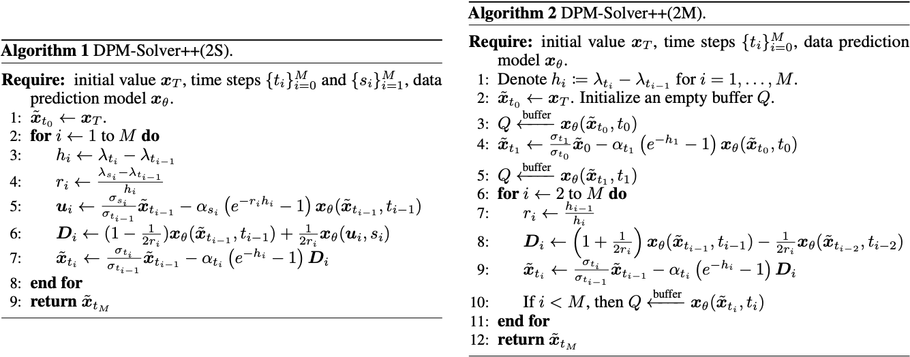

# DPM-Solver++: Fast Solver Sampling of Diffusion Probabilistic Models

## Claim

相比于 DPM-Solver，DPM-Solver++ 主要目标为有条件生成采样过程的加速，只需要 15 步左右的采样就可以得到高质量的样本，且在图像空间和潜在空间都表现优异。

## Motivation

- 之前的有条件生成采样器，例如 DDIM，需要 100 - 250 次采样。
- 无条件生成采样器在有条件生成任务上表现不佳，包括：
    1. 较大的引导因子使得高阶求解器的收敛半径变小，导致采样器不稳定。
    2. 采样得到的结果不在条件分布上，主要是因为引导因子过大，导致网络的输出偏离了原始的分布。

## Method

设 $c$ 是条件变量，Classifier Guidance 的公式为：
$$
\tilde{\boldsymbol{\epsilon}}(\mathbf{x}_{t}, t, c) := \boldsymbol{\epsilon}(\mathbf{x}_{t}, t) - s \cdot \sigma(t) \nabla_{\mathbf{x}_{t}} \log p_{\phi}(c \mid \mathbf{x}_{t}, t)
$$
其中 $p_{\phi}(c \mid \mathbf{x}_{t}, t)$ 是预训练的分类器，$s$ 是 Guidance 因子。Classifier-Free Guidance 的公式为：
$$
\tilde{\boldsymbol{\epsilon}}(\mathbf{x}_{t}, t, c) := s \cdot \boldsymbol{\epsilon}(\mathbf{x}_{t}, t, c) + (1 - s) \cdot \boldsymbol{\epsilon}(\mathbf{x}_{t}, t, \emptyset)
$$
Classifier-Free Guidance 需要模型在训练时候就具备无条件采样和有条件采样的能力。

DPM-Solver 的转移核：
$$
\mathbf{x}_{t} = \alpha({t})\mathbf{x}_{0} + \sigma({t})\boldsymbol{\epsilon}
$$
概率流 ODE：
$$
\mathrm{d}\mathbf{x}_{t} = \left[\left(f(t) + \frac{g(t)^{2}}{2\sigma(t)^{2}}\right) \mathbf{x}_{t} - \frac{\alpha(t) g(t)^{2}}{2\sigma(t)^{2}} \mathbf{x}_{\theta}(\mathbf{x}_{t}, t)\right]\mathrm{d}t
$$
套用 DPM-Solver 的解析解：
$$
\frac{\mathbf{x}_{t}}{\sigma(t)} = \frac{\mathbf{x}_{s}}{\sigma(s)} + \int_{\lambda_{s}}^{\lambda_{t}} \exp(\lambda) \hat{\mathbf{x}}_{\theta}(\mathbf{x}_{\lambda}, \lambda)\mathrm{d}\lambda
$$
其中 $\hat{\mathbf{x}}_{\theta}(\mathbf{x}_{\lambda}, \lambda)$ 是用 $\lambda$ 做输入的模型，$\lambda(t) = \log(\alpha(t)/\sigma(t))$。再套 DPM-Solver 的离散化：
$$
\tilde{\mathbf{x}}_{t_{i}} = \frac{\sigma(t_{i})}{\sigma(t_{i-1})}\tilde{\mathbf{x}}_{t_{i-1}} + \sigma(t_{i})\sum_{n=0}^{k-1} \underbrace{\hat{\mathbf{x}}_{\theta}(\tilde{\mathbf{x}}_{\lambda_{t_{i-1}}}, \lambda_{t_{i-1}})}_{\text{Estimated}} \underbrace{\int_{\lambda_{t_{i-1}}}^{\lambda_{t_{i}}} \exp(\lambda)\frac{(\lambda - \lambda_{t_{i-1}})^{n}}{n!}\mathrm{d}\lambda}_{\text{Analytically}} + O(\Delta t_{i}^{k+1})
$$
因此得到 DPM-Solver++ Second-Order Single-Step Solver 和 DPM-Solver++ Second-Order Multi-Step Solver。

