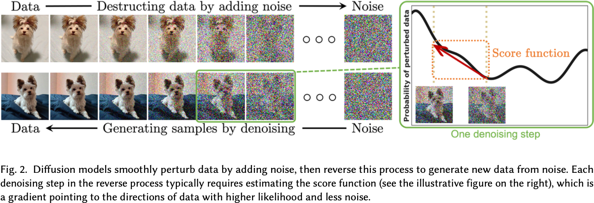

# 2022 Diffusion Models: A Comprehensive Survey of Methods and Applications

## 2 Foundations of Diffusion Models

### 2.1 Denoising Diffusion Probabilistic Models (DDPMs)

从数据分布 $q(\mathbf{x}_{0})$ 中采样一个初始样本 $\mathbf{x}_{0}$，前向 Markov 过程通过转移核 $q(\mathbf{x}_{t} \mid \mathbf{x}_{t-1})$ 生成一系列随机变量 $\mathbf{x}_{1}, \ldots, \mathbf{x}_{T}$。基于条件概率公式和 Markov 过程的性质，可以得到生成随机变量的联合概率密度函数：
$$
q(\mathbf{x}_{1:T} \mid \mathbf{x}_{0}) = \prod_{t=1}^{T} q(\mathbf{x}_{t} \mid \mathbf{x}_{t-1}).
$$

DDPM 是手动设计 $q(\mathbf{x}_{t} \mid \mathbf{x}_{t-1})$ 的：
$$
q(\mathbf{x}_{t} \mid \mathbf{x}_{t-1}) = \mathcal{N}(\mathbf{x}_{t}; \sqrt{1 - \beta_{t}} \mathbf{x}_{t-1}, \beta_{t} \mathbf{I}),
$$
其中 $\beta_{t} \in (0,1)$ 是提前设定的超参数。此外，定义 $\alpha_{t} = 1 - \beta_{t}$ 以及 $\bar{\alpha}_{t} = \prod_{s=0}^{t} \alpha_{s}$，则：
$$
q(\mathbf{x}_{t} \mid \mathbf{x}_{0}) = \mathcal{N}(\mathbf{x}_{t}; \sqrt{\bar{\alpha}_{t}} \mathbf{x}_{0}, (1 - \bar{\alpha}_{t}) \mathbf{I}).
$$

因此，给定 $\mathbf{x}_{0}$，可以直接得到 $\mathbf{x}_{t}$ 的采样：
$$
\mathbf{x}_{t} = \sqrt{\bar{\alpha}_{t}} \mathbf{x}_{0} + \sqrt{1 - \bar{\alpha}_{t}} \boldsymbol{\epsilon},
$$
其中 $\boldsymbol{\epsilon} \sim \mathcal{N}(\mathbf{0}, \mathbf{I})$。

当 $\bar{\alpha}_{T} \approx 0$ 时，$\mathbf{x}_{T}$ 的分布接近于标准正态分布，即：
$$
q(\mathbf{x}_{T} \mid \mathbf{x}_{0}) = \int q(\mathbf{x}_{T} \mid \mathbf{x}_{0}) q(\mathbf{x}_{0}) \mathrm{d} \mathbf{x}_{0} \approx \mathcal{N}(\mathbf{x}_{T}; \mathbf{0}, \mathbf{I}).
$$

反向 Markov 过程由先验分布 $p(\mathbf{x}_{T}) \sim \mathcal{N}(\mathbf{0}, \mathbf{I})$ 以及可学习的转移核 $p_{\theta}(\mathbf{x}_{t-1} \mid \mathbf{x}_{t})$ 来建模，其中 $\theta$ 是模型参数。该转移核的形式通常为：
$$
p_{\theta}(\mathbf{x}_{t-1} \mid \mathbf{x}_{t}) = \mathcal{N}(\mathbf{x}_{t-1}; \mu_{\theta}(\mathbf{x}_{t}, t), \Sigma_{\theta}(\mathbf{x}_{t}, t)).
$$

这一采样过程成功的关键在于训练了与正向 Markov 链的具体时间步反转相匹配的反向 Markov 链。即 $p_{\theta}(x_{0:T}) = p(x_{T}) \prod_{t=1}^{T} p_{\theta}(x_{t-1} \mid x_{t})$ 与 $q(x_{0:T}) = q(x_{0}) \prod_{t=1}^{T} q(x_{t} \mid x_{t-1})$ 之间的匹配。为了做到这一点，可以通过最小化二者之间的 KL 散度来训练模型：
$$
\begin{align*}
\mathrm{KL}[q(\mathbf{x}_{0:T}) \| p_{\theta}(\mathbf{x}_{0:T})] &= -\mathbb{E}_{q(\mathbf{x}_{0:T})}\left[\log p(\mathbf{x}_{0:T})\right] + \text{const} \\
&= -\mathbb{E}_{q(\mathbf{x}_{0:T})}\left[\log p(\mathbf{x}_{T}) + \sum_{t=1}^{T} \log \frac{p_{\theta}(\mathbf{x}_{t-1} \mid \mathbf{x}_{t})}{q(\mathbf{x}_{t} \mid \mathbf{x}_{t-1})}\right] + \text{const} \\
&\ge -\mathbb{E}_{q(\mathbf{x}_{0:T})}\left[\log p_{\theta}(\mathbf{x}_{0})\right] + \text{const},
\end{align*}
$$
其中 $\text{const}$ 是与 $\theta$ 无关的常数。最后一步是由于 Jensen 不等式。

### 2.2 Score-Based Generative Models (SGMs)

定义 (Stein) score 函数为 $\nabla_{\mathbf{x}} \log p_{\theta}(\mathbf{x})$，其中 $\log p_{\theta}(\mathbf{x})$ 是模型的对数概率密度函数。SGM 的核心思想是用一系列逐渐增强的 Gaussian 白噪声来扰动数据，然后用网络联合估计这些带噪声数据的 score 函数。$q(\mathbf{x}_{0})$ 还是数据分布，$0 < \sigma_{1} < \ldots < \sigma_{T}$ 是一系列标准差，$q(\mathbf{x}_{t} \mid \mathbf{x}_{0}) = \mathcal{N}(\mathbf{x}_{t}; \mathbf{x}_{0}, \sigma_{t}^{2} \mathbf{I})$ 是带噪声数据的条件分布，$q(\mathbf{x}_{t}) = \int q(\mathbf{x}_{t} \mid \mathbf{x}_{0}) q(\mathbf{x}_{0}) \mathrm{d} \mathbf{x}_{0}$ 是带噪声数据的边缘分布。因此，训练目标就是：
$$
\mathbb{E}_{t \in \mathcal{U}[1, T], \mathbf{x}_{0} \sim q(\mathbf{x}_{0}), \mathbf{x}_{t} \sim q(\mathbf{x}_{t} \mid \mathbf{x}_{0})}\left[\lambda(t) \sigma_{t}^{2} \| \nabla_{\mathbf{x}_{t}} \log q(\mathbf{x}_{t}) - \mathbf{s}_{\theta}(\mathbf{x}_{t}, t) \|^{2}\right],
$$
其中 $\mathbf{s}_{\theta}(\mathbf{x}_{t}, t)$ 是网络估计的 score 函数，$\lambda(t)$ 是权重。

在推理阶段，可以用 Langevin 动力学来模拟 score 函数的解，即获得采样。退火 Langevin 动力学。

### 2.3 Stochastic Differential Equations (Score SDEs)

DDPM 和 SGM 的生成过程都可以用随机微分方程 (SDE) 来描述。当我们考虑无限时间步长 $T$ 时，DDPM 和 SGM 的生成过程可以用以下 SDE 来描述：
$$
\mathrm{d} \mathbf{x} = \mathbf{f}(\mathbf{x}, t) \mathrm{d} t + g(t) \mathrm{d} \mathbf{w},
$$
其中 $\mathbf{f}(\mathbf{x}, t)$ 和 $g(t)$ 是 SDE 的扩散和漂移系数，$\mathbf{w}$ 是 Wiener 过程。这个 SDE 被称为 score SDE。

对于 DDPM，对应的 SDE 为：
$$
\mathrm{d} \mathbf{x} = -\frac{1}{2} \beta(t) \mathbf{x} \mathrm{d} t + \sqrt{\beta(t)} \mathrm{d} \mathbf{w},
$$
其中当 $T \to \infty$ 时 $\beta(t/T) = T \beta_{t}$。

对于 SGM，对应的 SDE 为：
$$
\mathrm{d} \mathbf{x} = \sqrt{\frac{\mathrm{d} [\sigma(t)^2]}{\mathrm{d} t}} \mathrm{d} \mathbf{w},
$$
其中当 $T \to \infty$ 时 $\sigma(t/T) = \sigma_{t}$。

对于任意的 Score SDE，可以找到对应的逆时 SDE：
$$
\mathrm{d} \mathbf{x} = \left[ \mathbf{f}(\mathbf{x}, t) - g(t)^{2} \nabla_{\mathbf{x}} \log q_{t}(\mathbf{x}) \right] \mathrm{d} t + g(t) \mathrm{d} \bar{\mathbf{w}},
$$
其中 $\bar{\mathbf{w}}$ 也是 Wiener 过程。这个逆时 SDE 的解的轨迹与正向 SDE 的解的轨迹在边缘分布上是一致的，只是在时间上是反向的。此外，宋飏证明了存在一种 ODE，叫做概率流 ODE，其解的轨迹与 Score SDE 的解的轨迹在边缘分布上是一致的：
$$
\mathrm{d} \mathbf{x} = \left[ \mathbf{f}(\mathbf{x}, t) - \frac{1}{2} g(t)^{2} \nabla_{\mathbf{x}} \log q_{t}(\mathbf{x}) \right] \mathrm{d} t.
$$

因此，在推理阶段，可以用 SDE 求解器、ODE 求解器或者 Langevin 动力学来模拟 Score SDE 的解。

## 3 Diffusion Models with Efficient Sampling

### 3.1 Learning-Free Sampling

目标是在减少采样时间的同时减少离散化误差。

#### 3.1.1 SDE Solvers

对于 DDPM，对应的逆时 SDE 为：
$$
\mathrm{d} \mathbf{x} = -\frac{1}{2} \beta(t) \left( \mathbf{x}_{t} - \nabla_{\mathbf{x}_{t}} \log q_{t}(\mathbf{x}_{t}) \right) \mathrm{d} t + \sqrt{\beta(t)} \mathrm{d} \mathbf{w}.
$$

采样方法有：Annealed Langevin Dynamics、Consistent Annealed Sampling、Critical-Damped Langevin Dynamics。

一种离散化 Score SDE 的方法是：
$$
\mathbf{x}_{t+1} = \mathbf{x}_{t} + \mathbf{f}_{t}(\mathbf{x}_{t}) + \mathbf{g}_{t}(\mathbf{x}_{t}) \boldsymbol{\epsilon}_{t},
$$
对应的逆时 SDE 的离散化是：
$$
\mathbf{x}_{t} = \mathbf{x}_{t+1} - \mathbf{f}_{t+1}(\mathbf{x}_{t+1}) - \mathbf{g}_{t+1} \mathbf{g}_{t+1}^{T} \nabla_{\mathbf{x}_{t+1}} \log q_{t+1}(\mathbf{x}_{t+1}) + \mathbf{g}_{t+1} \boldsymbol{\epsilon}_{t+1},
$$
其中 $\nabla_{\mathbf{x}_{t+1}} \log q_{t+1}(\mathbf{x}_{t+1})$ 可以用网络 $s_{\theta}(\mathbf{x}_{t+1}, t+1)$ 来估计。在 VP-SDE 上，效果比 DDPM 好。

#### 3.1.2 ODE Solvers

DDIM 用以下的 Markov 链将 DDPM 拓展到了非 Markov 情况：
$$
\begin{align*}
q(\mathbf{x}_{1:T} \mid \mathbf{x}_{0}) &= \prod_{t=1}^{T} q(\mathbf{x}_{t} \mid \mathbf{x}_{t-1}, \mathbf{x}_{0}) \\
q_{\sigma}(\mathbf{x}_{t-1} \mid \mathbf{x}_{t}, \mathbf{x}_{0}) &= \mathcal{N}(\mathbf{x}_{t-1}; \tilde{\mu}_{t}(\mathbf{x}_{t}, \mathbf{x}_{0}), \sigma_{t}^{2} \mathbf{I}) \\
\tilde{\mu}_{t}(\mathbf{x}_{t}, \mathbf{x}_{0}) &= \sqrt{\bar{\alpha}_{t-1}} \mathbf{x}_{0} + \sqrt{1 - \bar{\alpha}_{t-1} - \sigma_{t}^{2}} \cdot \frac{\mathbf{x}_{t} - \sqrt{\bar{\alpha}_{t}} \mathbf{x}_{0}}{\sqrt{1 - \bar{\alpha}_{t}}}.
\end{align*}
$$
在 DDPM 中，$\sigma_{t}^{2} = \frac{(1 - \alpha_{t})(1 - \bar{\alpha}_{t-1})}{1 - \bar{\alpha}_{t}}$；在 DDIM 中，$\sigma_{t}^{2} = 0$。

### 3.2 Learning-Based Sampling

基于学习的采样方法通过优化某种目标函数来选择采样步骤。

#### 3.2.1 Optimized Discretization

代表方法有：
1. 选择能最大化 DDPM 目标函数的 K 步，是一种动态规划方法。
2. 通过在一阶分数网络上训练一个额外的头，推导出一种二阶求解器，用于加速合成。

#### 3.2.2 Truncated Diffusion

在正向扩散过程的几步之后就停止，并以非高斯分布开始反向去噪过程。这种分布的样本可以通过扩散预先训练好的生成模型（VAE、GAN）的样本来有效获取。

#### 3.2.3 Knowledge Distillation

渐进式蒸馏：将整个采样过程蒸馏为一个更快的采样器，只需要一半的步骤。
