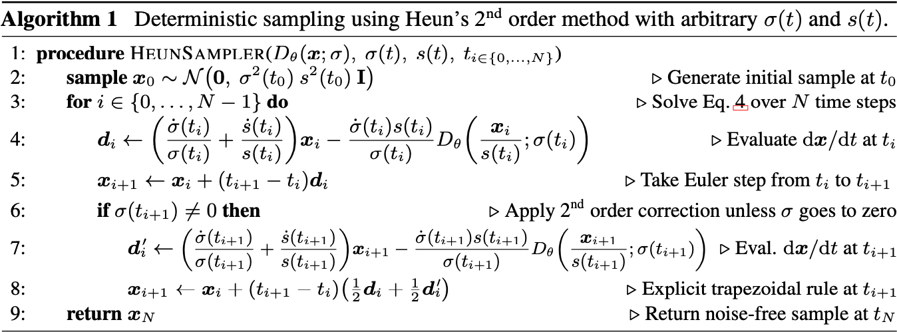
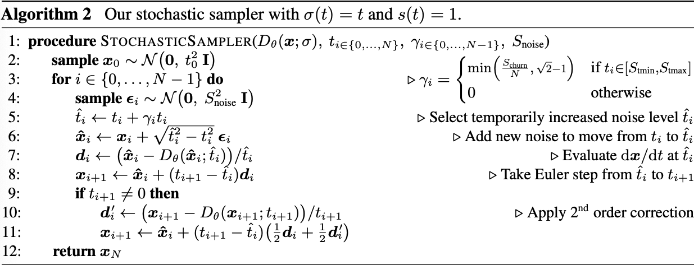
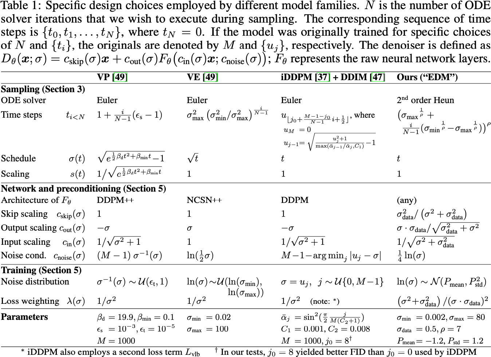

# Elucidating the Design Space of Diffusion-Based Generative Models

## Claim

对于采样、训练过程以及分数网络的前处理（pre-conditioning）进行了模块化。EDM 认为，采样步骤应当是和训练细节是分开的。

- 更加关注于 Diffusion 模型中可以拆分出来的算法和对象。
- 改进了采样过程，分析并改进了离散化、Runge-Kutta 求解器、随机性的作用等。
- 改进了训练过程，分析了改进网络输入、输出和损失函数的前提条件。

## Motivation

现有的理论和实践中，对于扩散模型的设计空间没有进行详细的探讨。具体来说，改变一种超参数可能会影响多个方面，而这些方面之间的关系并不清晰。

## Method

### Sampling

Diffusion 模型采样时的步长 $\{t_{i}\}$ 应该随着 $\sigma$ 的减小而减小，而且和模型输入无关。具体来说，EDM 让 $t_{i} = \sigma^{-1}(\sigma_{i})$，且 $\sigma_{0} = \max_{i}\{\sigma_{i}\}$, $\sigma_{N - 1} = \min_{i}\{\sigma_{i}\}$, $\sigma_{N} = 0$。为了维持反函数的存在，$\sigma_{i}$ 满足：
$$
\sigma_{i} = \left((\min_{i}\{\sigma_{i}\})^{1/\rho} + \frac{i}{N - 1}\left((\max_{i}\{\sigma_{i}\})^{1/\rho} - (\min_{i}\{\sigma_{i}\})^{1/\rho}\right)\right)^{\rho}
$$
EMD 取 $\rho = 7$。

EDM 的 ODE Solver 的算法：

EDM 的 SDE Solver 的算法：Euler-Maruyama 方法是先执行 ODE Solver，然后再加上噪声项。而 EDM 的算法是在取样点上加上噪声项，然后再执行 ODE Solver。

## Derivation

数据分布 $\mathbb{P}_{\text{data}}(\mathbf{x})$，其标准差为 $\sigma_{\text{data}}$。用一系列标准差不同的高斯分布给数据分布加噪，得到加噪后的分布为：
$$
\mathbb{P}(\mathbf{x}; \sigma) = \mathcal{N}\left(\mathbf{0}, \sigma^{2} \mathbf{I}\right) * \mathbb{P}_{\text{data}} = \int_{\mathbb{R}^{d}} \mathcal{N}\left(\mathbf{x}; \mathbf{x}_{0}, \sigma^{2} \mathbf{I}\right) \mathbb{P}_{\text{data}}(\mathbf{x}_{0}) \mathrm{d}\mathbf{x}_{0}
$$
其中 $\sigma \in \{\sigma_{i}\}_{i=1}^{n}$。定义 $\sigma_{\max} = \max_{i}\{\sigma_{i}\}$，当 $\sigma_{\max} \gg \sigma_{\text{data}}$ 时，$\mathbb{P}\left(\mathbf{x}; \sigma_{\max}\right)$ 就很接近于纯高斯分布。

Diffusion 的采样过程就是从 $\mathcal{N}\left(\mathbf{0}, \sigma_{\max}^{2} \mathbf{I}\right)$ 中获得一个采样 $\mathbf{x}_{0}$，然后将其逐步去噪，获得一系列具有 $\sigma_{\max} = \sigma_{0} > \sigma_{1} > \cdots > \sigma_{N} = 0$ 噪声水平的样本 $\mathbf{x}_{i}$。

### ODE Formulation

从加噪时的操作开始：
$$
\mathbf{x}_{t} \sim \mathcal{N}\left(\mathbf{x}_{t}; s(t)\mathbf{x}_{0}, s(t)^2 \sigma(t)^2 \mathbf{I}\right)
$$
前向 SDE 为：
$$
\mathrm{d}\mathbf{x}_{t} = \frac{\dot{s}(t)}{s(t)} \mathbf{x}_{t} \mathrm{d}t + s(t) \sqrt{2\dot{\sigma}(t)\sigma(t)} \mathrm{d}\mathbf{w}_{t}
$$
反向 SDE 为：
$$
\mathrm{d}\mathbf{x}_{t} = \left[\frac{\dot{s}(t)}{s(t)} \mathbf{x}_{t} - 2 s(t)^{2}\dot{\sigma}(t)\sigma(t) \nabla_{\mathbf{x}_{t}} \log p(\mathbf{x}_{t})\right] \mathrm{d}t + s(t)\sqrt{2\dot{\sigma}(t)\sigma(t)} \mathrm{d}\mathbf{w}_{t}
$$
其中 $p(\mathbf{x}_{t})$ 是 $\mathbf{x}_{t}$ 的边际概率分布。对应的概率流 ODE 为：
$$
\mathrm{d}\mathbf{x}_{t} = \left[\frac{\dot{s}(t)}{s(t)} \mathbf{x}_{t} - s(t)^{2}\dot{\sigma}(t)\sigma(t) \nabla_{\mathbf{x}_{t}} \log p(\mathbf{x}_{t})\right] \mathrm{d}t
$$

$p(\mathbf{x}_{t})$ 与 $\mathbb{P}(\mathbf{x}; \sigma)$ 的关系为：
$$
\begin{aligned}
p(\mathbf{x}_{t}) &= \int_{\mathbb{R}^{d}} \mathcal{N}\left(\mathbf{x}_{t}; s(t)\mathbf{x}_{0}, s(t)^{2} \sigma(t)^{2} \mathbf{I}\right) \mathbb{P}_{\text{data}}(\mathbf{x}_{0}) \mathrm{d}\mathbf{x}_{0} \\
&= \int_{\mathbb{R}^{d}} s(t)^{-d} \mathcal{N}\left(s(t)^{-1}\mathbf{x}_{t}; \mathbf{x}_{0}, \sigma(t)^{2} \mathbf{I}\right) \mathbb{P}_{\text{data}}(\mathbf{x}_{0}) \mathrm{d}\mathbf{x}_{0} \\
&= s(t)^{-d} \left[\mathcal{N}\left(\mathbf{0}, \sigma(t)^{2} \mathbf{I}\right) * \mathbb{P}_{\text{data}}\right](s(t)^{-1}\mathbf{x}_{t}) \\
&= s(t)^{-d} \mathbb{P}\left(s(t)^{-1}\mathbf{x}_{t}; \sigma(t)\right)
\end{aligned}
$$
带入到概率流 ODE 中：
$$
\begin{aligned}
\mathrm{d} \mathbf{x}_{t} &= \left[\frac{\dot{s}(t)}{s(t)} \mathbf{x}_{t} - s(t)^{2}\dot{\sigma}(t)\sigma(t) \nabla_{\mathbf{x}_{t}} \log \left\{ s(t)^{-d} \mathbb{P}\left(s(t)^{-1}\mathbf{x}_{t}; \sigma(t)\right) \right\}\right] \mathrm{d}t \\
&=\left[ \frac{\dot{s}(t)}{s(t)}\mathbf{x}_{t} - s(t)^{2}\dot{\sigma}(t)\sigma(t) \nabla_{\mathbf{x}_{t}} \log \mathbb{P}\left(s(t)^{-1}\mathbf{x}_{t}; \sigma(t)\right) \right] \mathrm{d}t \\
&=\left[ \frac{\dot{s}(t)}{s(t)}\mathbf{x}_{t} - s(t)\dot{\sigma}(t)\sigma(t) \nabla_{s(t)^{-1}\mathbf{x}_{t}} \log \mathbb{P}\left(s(t)^{-1}\mathbf{x}_{t}; \sigma(t)\right) \right] \mathrm{d}t \\
&= \left[ \frac{\dot{s}(t)}{s(t)}\mathbf{x}_{t} - s(t)\dot{\sigma}(t)\epsilon_{\theta}\left(\frac{\mathbf{x}_{t}}{s(t)}; \sigma(t)\right)\right] \mathrm{d}t \\
\end{aligned}
$$
其中：
$$
\begin{aligned}
\nabla_{\mathbf{x}_{t}} \log \mathbb{P}\left(s(t)^{-1}\mathbf{x}_{t}; \sigma(t)\right) &= \frac{\mathrm{d} }{\mathrm{d} \mathbf{x}_{t}} \log \mathbb{P}\left(s(t)^{-1}\mathbf{x}_{t}; \sigma(t)\right) \\
&= \frac{\mathrm{d} }{\mathrm{d} \mathbf{u}_{t}} \log \mathbb{P}\left(\mathbf{u}_{t}; \sigma(t)\right) \frac{\mathrm{d} \mathbf{u}_{t}}{\mathrm{d} \mathbf{x}_{t}} && \mathbf{u}_{t} = s(t)^{-1}\mathbf{x}_{t} \\
&= s(t)^{-1} \nabla_{s(t)^{-1}\mathbf{x}_{t}} \log \mathbb{P}\left(s(t)^{-1}\mathbf{x}_{t}; \sigma(t)\right)
\end{aligned}
$$

取 $s(t) = 1$，则有：
$$
\mathrm{d} \mathbf{x}_{t} = - \dot{\sigma}(t)\sigma(t) \nabla_{\mathbf{x}_{t}} \log \mathbb{P}(\mathbf{x}_{t}; \sigma(t)) \mathrm{d}t
$$

### Denoising Score Matching

设 $D_{\theta}(\mathbf{y}; \sigma)$ 训练的目标是原始数据，即它最小化了任意加噪后的数据与原始数据的 L2 loss：
$$
\begin{aligned}
\mathcal{L} &= \mathbb{E}_{\mathbf{x}_{0} \sim \mathbb{P}_{\text{data}}} \mathbb{E}_{\boldsymbol{\epsilon} \sim \mathcal{N}(\mathbf{0}, \mathbf{I})}\|D_{\theta}(\mathbf{y}; \sigma) - \mathbf{x}_{0}\|_{2}^{2} \\
&= \mathbb{E}_{\mathbf{x}_{0} \sim \mathbb{P}_{\text{data}}} \mathbb{E}_{\mathbf{y} \sim \mathcal{N}(\mathbf{x}_{0}, \sigma^{2} \mathbf{I})}\|D_{\theta}(\mathbf{y}; \sigma) - \mathbf{x}_{0}\|_{2}^{2}
\end{aligned}
$$
其中 $\mathbf{y} = \mathbf{x}_{0} + \sigma^{2} \boldsymbol{\epsilon}$，$\boldsymbol{\epsilon} \sim \mathcal{N}(\mathbf{0}, \mathbf{I})$。要让 $\mathcal{L}$ 最小，则求 $\mathcal{L}$ 关于 $D_{\theta}$ 变分的零点：
$$
\begin{aligned}
0 &= \delta_{D_{\theta}}\mathcal{L} \\
0 &= \mathbb{E}_{\mathbf{x}_{0} \sim \mathbb{P}_{\text{data}}} \mathbb{E}_{\mathbf{y} \sim \mathcal{N}(\mathbf{x}_{0}, \sigma^{2} \mathbf{I})} \delta_{D_{\theta}}\|D_{\theta}(\mathbf{y}; \sigma) - \mathbf{x}_{0}\|_{2}^{2} \\
0 &= \mathbb{E}_{\mathbf{x}_{0} \sim \mathbb{P}_{\text{data}}} \mathbb{E}_{\mathbf{y} \sim \mathcal{N}(\mathbf{x}_{0}, \sigma^{2} \mathbf{I})} \left[D_{\theta}(\mathbf{y}; \sigma) - \mathbf{x}_{0}\right] \\
0 &= \mathbb{E}_{\mathbf{y} \sim \mathcal{N}(\mathbf{x}_{0}, \sigma^{2} \mathbf{I})} \mathbb{E}_{\mathbf{x}_{0} \sim \mathbb{P}_{\text{data}}} \left[D_{\theta}(\mathbf{y}; \sigma) - \mathbf{x}_{0}\right] \\
0 &= \int_{\mathbb{R}^{d}} \mathbb{E}_{\mathbf{x}_{0} \sim \mathbb{P}_{\text{data}}} \left[\mathcal{N}(\mathbf{y}; \mathbf{x}_{0}, \sigma^{2} \mathbf{I}) \left(D_{\theta}(\mathbf{y}; \sigma) - \mathbf{x}_{0}\right)\right] \mathrm{d}\mathbf{y} \\
0 &= \mathbb{E}_{\mathbf{x}_{0} \sim \mathbb{P}_{\text{data}}} \left[\mathcal{N}(\mathbf{y}; \mathbf{x}_{0}, \sigma^{2} \mathbf{I}) \left(D_{\theta}(\mathbf{y}; \sigma) - \mathbf{x}_{0}\right)\right] \\
D_{\theta}(\mathbf{y}; \sigma) &= \frac{\mathbb{E}_{\mathbf{x}_{0} \sim \mathbb{P}_{\text{data}}} \left[\mathbf{x}_{0} \mathcal{N}(\mathbf{y}; \mathbf{x}_{0}, \sigma^{2} \mathbf{I})\right]}{\mathbb{E}_{\mathbf{x}_{0} \sim \mathbb{P}_{\text{data}}} \left[\mathcal{N}(\mathbf{y}; \mathbf{x}_{0}, \sigma^{2} \mathbf{I})\right]} \\
&= \frac{\int_{\mathbb{R}^{d}} \mathbf{x}_{0} \mathcal{N}(\mathbf{y}; \mathbf{x}_{0}, \sigma^{2} \mathbf{I}) \mathbb{P}_{\text{data}}(\mathbf{x}_{0}) \mathrm{d}\mathbf{x}_{0}}{\int_{\mathbb{R}^{d}} \mathcal{N}(\mathbf{y}; \mathbf{x}_{0}, \sigma^{2} \mathbf{I}) \mathbb{P}_{\text{data}}(\mathbf{x}_{0}) \mathrm{d}\mathbf{x}_{0}} \\
&= \frac{\mathbf{y} \int_{\mathbb{R}^{d}} \mathcal{N}(\mathbf{y}; \mathbf{x}_{0}, \sigma^{2} \mathbf{I}) \mathbb{P}_{\text{data}}(\mathbf{x}_{0}) \mathrm{d}\mathbf{x}_{0} - \int_{\mathbb{R}^{d}} (\mathbf{y} - \mathbf{x}_{0}) \mathcal{N}(\mathbf{y}; \mathbf{x}_{0}, \sigma^{2} \mathbf{I}) \mathbb{P}_{\text{data}}(\mathbf{x}_{0}) \mathrm{d}\mathbf{x}_{0}}{\mathbb{P}(\mathbf{y}; \sigma)} \\
&= \mathbf{y} + \frac{\int_{\mathbb{R}^{d}} \sigma^{2}[\nabla_{\mathbf{y}} \mathcal{N}(\mathbf{y}; \mathbf{x}_{0}, \sigma^{2} \mathbf{I})] \mathbb{P}_{\text{data}}(\mathbf{x}_{0}) \mathrm{d}\mathbf{x}_{0}}{\mathbb{P}(\mathbf{y}; \sigma)} \\
&= \mathbf{y} + \frac{\sigma^{2} \nabla_{\mathbf{y}} \int_{\mathbb{R}^{d}} \mathcal{N}(\mathbf{y}; \mathbf{x}_{0}, \sigma^{2} \mathbf{I}) \mathbb{P}_{\text{data}}(\mathbf{x}_{0}) \mathrm{d}\mathbf{x}_{0}}{\mathbb{P}(\mathbf{y}; \sigma)} \\
&= \mathbf{y} + \sigma^{2} \nabla_{\mathbf{y}} \log \mathbb{P}(\mathbf{y}; \sigma)
\end{aligned}
$$
因此，$\nabla_{\mathbf{y}} \log \mathbb{P}(\mathbf{y}; \sigma)$ 和 $D_{\theta}(\mathbf{y}; \sigma)$ 的关系为：
$$
\nabla_{\mathbf{y}} \log \mathbb{P}(\mathbf{y}; \sigma) = \frac{D_{\theta}(\mathbf{y}; \sigma) - \mathbf{y}}{\sigma^{2}}
$$
定义 $\epsilon_{\theta}(\mathbf{y}; \sigma) = \left[\mathbf{y} - D_{\theta}(\mathbf{y}; \sigma)\right] / \sigma$，则此时的优化目标是：
$$
\|D_{\theta}(\mathbf{y}; \sigma) - \mathbf{x}_{0}\|_{2}^{2} = \|D_{\theta}(\mathbf{y}; \sigma) - \mathbf{y}+ \mathbf{n}\|_{2}^{2} = \sigma^{2} \|\epsilon_{\theta}(\mathbf{y}; \sigma) - \boldsymbol{\epsilon}\|_{2}^{2}
$$
可见 $\epsilon_{\theta}(\mathbf{y}; \sigma)$ 同样最小化了 $\mathcal{L}$，且 $\nabla_{\mathbf{y}} \log \mathbb{P}(\mathbf{y}; \sigma)$ 和 $\epsilon_{\theta}(\mathbf{y}; \sigma)$ 的关系为：
$$
\nabla_{\mathbf{y}} \log \mathbb{P}(\mathbf{y}; \sigma) = -\frac{\epsilon_{\theta}(\mathbf{y}; \sigma)}{\sigma}
$$

### Time-dependent Signal Scaling

将用神经网络表达的分数带入到 ODE 中，得到：
$$
\begin{aligned}
\mathrm{d} \mathbf{x}_{t} &= \left[\frac{\dot{s}(t)}{s(t)}\mathbf{x}_{t} - s(t)\dot{\sigma}(t)\sigma(t) \nabla_{s(t)^{-1}\mathbf{x}_{t}} \log \mathbb{P}\left(s(t)^{-1}\mathbf{x}_{t}; \sigma(t)\right)\right] \mathrm{d}t \\
&= \left[ \frac{\dot{s}(t)}{s(t)}\mathbf{x}_{t} - \frac{s(t)\dot{\sigma}(t)}{\sigma(t)} \left(D_{\theta}\left(\frac{\mathbf{x}_{t}}{s(t)}; \sigma(t)\right) - \frac{\mathbf{x}_{t}}{s(t)}\right)\right] \mathrm{d}t \\
&= \left[ \left(\frac{\dot{s}(t)}{s(t)} + \frac{\dot{\sigma}(t)}{\sigma(t)}\right)\mathbf{x}_{t} - \frac{s(t)\dot{\sigma}(t)}{\sigma(t)}D_{\theta}\left(\frac{\mathbf{x}_{t}}{s(t)}; \sigma(t)\right)\right] \mathrm{d}t
\end{aligned}
$$
可以通过数值求解，如 Euler 法或 Runge-Kutta 等方法，EDM 采用的是 2 阶 Heun 方法，即梯形方法。见最前面的伪代码。

### Improvements to Deterministic Sampling

对 ODE 做离散求积，其截断误差和 $\mathrm{d}\mathbf{x}_{t}/\mathrm{d}t$ 的曲率成正比。EDM 认为，在噪声水平较低和较高的情况下，$\mathrm{d}\mathbf{x}_{t}/\mathrm{d}t$ 的曲率比较小，可以用较大的步长。而在中间的情况下，$\mathrm{d}\mathbf{x}_{t}/\mathrm{d}t$ 的曲率比较大，需要用较小的步长。此外，ODE 的累计误差与步数成正比，而每一步产生的误差与步长成超线性关系，因此步数越多，误差越小。

在 RTX3090 上，用 EDM 提供的模型，每秒钟生成 16 张图像。

### Stochastic Sampling

考虑一个描述从 $\mathbb{P}_{\text{data}}$ 演化到 $\mathbb{P}(\mathbf{x}_{t}; \sigma(t))$ 的 Heat Equation：
$$
\frac{\partial q(\mathbf{x}_{t})}{\partial t} = \kappa(t)\Delta_{\mathbf{x}_t} q(\mathbf{x}_{t})
$$
其中 $\kappa(t)$ 是扩散系数。我们的目标是让 $q(\mathbf{x}_{0}) = \mathbb{P}_{\text{data}}(\mathbf{x}_{0})$ 以及 $q(\mathbf{x}_{t}) = \mathbb{P}(\mathbf{x}_{t}; \sigma(t))$。为了获取 $\kappa(t)$，我们可以用 Fourier 变换：
$$
\frac{\partial \hat{q}(\boldsymbol{\omega}, t)}{\partial t} = -\kappa(t)\|\boldsymbol{\omega}\|^{2}\hat{q}(\boldsymbol{\omega}, t)
$$
其中：
$$
\begin{aligned}
\hat{q}(\boldsymbol{\omega}, t) &= \mathcal{F}\{q(\mathbf{x}_{t})\} \\
&= \mathcal{F}\{\mathbb{P}(\mathbf{x}_{t}; \sigma(t))\} \\
&= \mathcal{F}\left\{\mathcal{N}\left(\mathbf{x}_{t}; \mathbf{0}, \sigma(t)^{2}\mathbf{I}\right) * \mathbb{P}_{\text{data}}\right\} \\
&= \exp\left(-\frac{1}{2}\sigma(t)^{2}\|\boldsymbol{\omega}\|^{2}\right)\hat{\mathbb{P}}_{\text{data}}(\boldsymbol{\omega})
\end{aligned}
$$
对 $\hat{q}(\boldsymbol{\omega}, t)$ 求关于 $t$ 的偏导数：
$$
\begin{aligned}
\frac{\partial \hat{q}(\boldsymbol{\omega}, t)}{\partial t} &= -\dot{\sigma}(t)\sigma(t)\|\boldsymbol{\omega}\|^{2}\exp\left(-\frac{1}{2}s(t)^{2}\sigma(t)^{2}\|\boldsymbol{\omega}\|^{2}\right)\hat{\mathbb{P}}_{\text{data}}(\boldsymbol{\omega}) \\
&= -\dot{\sigma}(t)\sigma(t) \|\boldsymbol{\omega}\|^{2}\ \hat{q}(\boldsymbol{\omega}, t)
\end{aligned}
$$
比较两式，得到：
$$
\kappa(t) = \dot{\sigma}(t)\sigma(t)
$$
因此我们所需要的 Heat Equation 为：
$$
\frac{\partial q(\mathbf{x}_{t})}{\partial t} = \dot{\sigma}(t)\sigma(t) \Delta_{\mathbf{x}} q(\mathbf{x}_{t})
$$
初值条件为 $q(\mathbf{x}_{0}) = \mathbb{P}_{\text{data}}(\mathbf{x}_{0})$。

给定 SDE：
$$
\mathrm{d}\mathbf{x}_{t} = u(t)\mathbf{x}_{t} \mathrm{d}t + v(t) \mathrm{d}\mathbf{w}_{t}
$$
其 Fokker-Planck 方程为：
$$
\frac{\partial q(\mathbf{x}_{t})}{\partial t} = -\nabla_{\mathbf{x}_{t}} \cdot \left[u(t)\mathbf{x}_{t} q(\mathbf{x}_{t})\right] + \frac{1}{2} \Delta_{\mathbf{x}_{t}} \left[v(t)^{2} q(\mathbf{x}_{t})\right]
$$
可以得到：
$$
u(t)\mathbf{x}_{t} = \left(\frac{1}{2} v(t)^{2} - \dot{\sigma}(t)\sigma(t) \right) \nabla_{\mathbf{x}_{t}} \log q(\mathbf{x}_{t})
$$
带回到前向 SDE 中，有：
$$
\mathrm{d}\mathbf{x} = \left(\frac{1}{2} v(t)^{2} - \dot{\sigma}(t)\sigma(t) \right) \nabla_{\mathbf{x}} \log \mathbb{P}(\mathbf{x}) \mathrm{d}t + v(t) \mathrm{d}\mathbf{w}_{t}
$$
令 $v(t) = \sqrt{2\beta(t)}\sigma(t)$，则有：
$$
\begin{aligned}
\mathrm{d}\mathbf{x}_{\pm} &= \left(\pm\beta(t) - \dot{\sigma}(t)\sigma(t) \right) \nabla_{\mathbf{x}} \log \mathbb{P}(\mathbf{x}) \mathrm{d}t + \sqrt{2\beta(t)}\sigma(t) \mathrm{d}\mathbf{w}_{t} \\
&= \underbrace{-\dot{\sigma}(t)\sigma(t) \nabla_{\mathbf{x}} \log \mathbb{P}(\mathbf{x}) \mathrm{d}t}_{\text{Probability Flow ODE}} \pm \underbrace{\beta(t) \nabla_{\mathbf{x}} \log \mathbb{P}(\mathbf{x}) \mathrm{d}t + \sqrt{2\beta(t)}\sigma(t) \mathrm{d}\mathbf{w}_{t}}_{\text{Langevin Diffusion SDE}}
\end{aligned}
$$
于是 $\beta(t)$ 就是控制采样时候噪声注入的超参数。因此，SDE 求解器就是在 ODE 求解器的基础上加上了噪声项，见最前面的伪代码。隐含的 Langevin 扩散会在给定时间内将样本推向所需的边际分布，积极纠正先前采样步骤中的任何误差。

### Preconditioning and Training

如果直接用网络表达分数，那数值就会特别大，不利于网络训练。因此 EDM 将网络改写为：
$$
D_{\theta}(\mathbf{x}; \sigma) = c_{\text{skip}}(\sigma)\mathbf{x} + c_{\text{out}}(\sigma) F_{\theta}(c_{\text{in}}(\sigma)\mathbf{x}; c_{\text{noise}}(\sigma))
$$
其中 $F_{\theta}$ 是网络，$c_{\text{skip}}$ 是跳跃连接，$c_{\text{in}}, c_{\text{out}}$ 是输入和输出的缩放，$c_{\text{noise}}$ 是噪声注入。带入到训练目标中，有：
$$
\begin{aligned}
\mathcal{L} &= \mathbb{E}_{\mathbf{x}_{0} \sim \mathbb{P}_{\text{data}}} \mathbb{E}_{\sigma \sim \mathbb{P}_{\text{train}}} \mathbb{E}_{\boldsymbol{\epsilon} \sim \mathcal{N}(\mathbf{0}, \mathbf{I})} \left[\lambda(\sigma) \|D_{\theta}(\mathbf{x}_{0} + \sigma\boldsymbol{\epsilon}; \sigma) - \mathbf{x}_{0}\|_{2}^{2}\right] \\
&= \mathbb{E}_{\mathbf{x}_{0}, \sigma, \boldsymbol{\epsilon}} \left[\lambda(\sigma) \|c_{\text{skip}}(\sigma)(\mathbf{x}_{0} + \sigma\boldsymbol{\epsilon}) + c_{\text{out}}(\sigma) F_{\theta}(c_{\text{in}}(\sigma)(\mathbf{x}_{0} + \sigma\boldsymbol{\epsilon}); c_{\text{noise}}(\sigma)) - \mathbf{x}_{0}\|_{2}^{2}\right] \\
&= \mathbb{E}_{\mathbf{x}_{0}, \sigma, \boldsymbol{\epsilon}} \left[\lambda(\sigma) c_{\text{out}}(\sigma)^{2} \left\|F_{\theta}(c_{\text{in}}(\sigma)(\mathbf{x}_{0} + \sigma\boldsymbol{\epsilon}); c_{\text{noise}}(\sigma)) - \frac{1}{c_{\text{out}}(\sigma)}(\mathbf{x}_{0} - c_{\text{skip}}(\sigma)(\mathbf{x}_{0} + \sigma\boldsymbol{\epsilon}))\right\|_{2}^{2}\right]
\end{aligned}
$$
其中 $\lambda(\sigma)$ 是一项权重项，用于调整不同噪声水平的重要性。在训练时，$\lambda(\sigma) = 1 / c_{\text{out}}(\sigma)^{2}$。$p_{\text{train}}(\sigma)$ 也需要经验性地选择，在中等噪声水平下才能显著降低损失；在极低的噪声水平下，很难辨别出极小的噪声成分；而在高噪声水平下，训练目标总是与接近数据集平均值的正确答案相差甚远。因此，$p_{\text{train}}(\sigma)$ 就经验性地设置为 $\log\sigma \sim \mathcal{U}(P_{\text{mean}}, P_{\text{std}})$。

一般来说，网络的输入满足方差为 1 会比较好，因此：
$$
\begin{aligned}
1 & =\mathbb{Var}_{\mathbf{x}_{0}, \boldsymbol{\epsilon}}[c_{\text{in}}(\sigma)(\mathbf{x}_{0} + \sigma\boldsymbol{\epsilon})] \\
&= c_{\text{in}}(\sigma)^{2} \mathbb{Var}_{\mathbf{x}_{0}, \boldsymbol{\epsilon}}[\mathbf{x}_{0} + \sigma\boldsymbol{\epsilon}] \\
&= c_{\text{in}}(\sigma)^{2} (\sigma_{\text{data}}^{2} + \sigma^{2}) \\
c_{\text{in}}(\sigma) &= \frac{1}{\sqrt{\sigma_{\text{data}}^{2} + \sigma^{2}}}
\end{aligned}
$$
同时，目标也满足方差为 1 会比较好，因此：
$$
\begin{aligned}
1 & = \mathbb{Var}_{\mathbf{x}_{0}, \boldsymbol{\epsilon}} \left[\frac{1}{c_{\text{out}}(\sigma)}(\mathbf{x}_{0} - c_{\text{skip}}(\sigma)(\mathbf{x}_{0} + \sigma\boldsymbol{\epsilon}))\right] \\
&= \frac{1}{c_{\text{out}}(\sigma)^{2}} \mathbb{Var}_{\mathbf{x}_{0}, \boldsymbol{\epsilon}} \left[\mathbf{x}_{0} - c_{\text{skip}}(\sigma)(\mathbf{x}_{0} + \sigma\boldsymbol{\epsilon})\right] \\
c_{\text{out}}(\sigma)^{2} &= \mathbb{Var}_{\mathbf{x}_{0}, \boldsymbol{\epsilon}} \left[(1 - c_{\text{skip}}(\sigma))\mathbf{x}_{0} - c_{\text{skip}}(\sigma)\sigma\boldsymbol{\epsilon}\right] \\
&= (1 - c_{\text{skip}}(\sigma))^{2} \sigma_{\text{data}}^{2} + c_{\text{skip}}(\sigma)^{2} \sigma^{2} \\
\end{aligned}
$$
需要选择能让 $c_{\text{out}}(\sigma)$ 最小的那个 $c_{\text{skip}}(\sigma)$：
$$
\begin{aligned}
0 &= \frac{\partial c_{\text{out}}(\sigma)^{2}}{\partial c_{\text{skip}}(\sigma)} \\
0 &= 2(1 - c_{\text{skip}}(\sigma))\sigma_{\text{data}}^{2} - 2c_{\text{skip}}(\sigma)\sigma^{2} \\
c_{\text{skip}}(\sigma) &= \frac{\sigma_{\text{data}}^{2}}{\sigma_{\text{data}}^{2} + \sigma^{2}}
\end{aligned}
$$
对应的 $c_{\text{out}}(\sigma)$ 为：
$$
\begin{aligned}
c_{\text{out}}(\sigma)^{2} &= (1 - c_{\text{skip}}(\sigma))^{2} \sigma_{\text{data}}^{2} + c_{\text{skip}}(\sigma)^{2} \sigma^{2} \\
&= \left(1 - \frac{\sigma_{\text{data}}^{2}}{\sigma_{\text{data}}^{2} + \sigma^{2}}\right)^{2} \sigma_{\text{data}}^{2} + \left(\frac{\sigma_{\text{data}}^{2}}{\sigma_{\text{data}}^{2} + \sigma^{2}}\right)^{2} \sigma^{2} \\
&= \frac{(\sigma^{4} \sigma_{\text{data}}^{2} + \sigma^{2} \sigma_{\text{data}}^{4})}{(\sigma^{2} + \sigma_{\text{data}}^{2})^{2}} \\
c_{\text{out}}(\sigma) &= \frac{\sigma \sigma_{\text{data}}}{\sqrt{\sigma^{2} + \sigma_{\text{data}}^{2}}}
\end{aligned}
$$
此时：
$$
\lambda(\sigma) = \frac{1}{c_{\text{out}}(\sigma)^{2}} = \frac{\sigma^{2} + \sigma_{\text{data}}^{2}}{(\sigma \sigma_{\text{data}})^{2}}
$$
假如我们零初始化网络 $F_{\theta}$，那么对于某个固定的 $\sigma$，有：
$$
\begin{aligned}
&\quad\ \ \mathbb{E}_{\mathbf{x}_{0}, \boldsymbol{\epsilon}} \left[\lambda(\sigma) c_{\text{out}}(\sigma)^{2} \left\|F_{\theta}(c_{\text{in}}(\sigma)(\mathbf{x}_{0} + \sigma\boldsymbol{\epsilon}); c_{\text{noise}}(\sigma)) - \frac{1}{c_{\text{out}}(\sigma)}(\mathbf{x}_{0} - c_{\text{skip}}(\sigma)(\mathbf{x}_{0} + \sigma\boldsymbol{\epsilon}))\right\|_{2}^{2}\right] \\
&= \mathbb{E}_{\mathbf{x}_{0}, \boldsymbol{\epsilon}} \left[\frac{\sigma^{2} + \sigma_{\text{data}}^{2}}{(\sigma \sigma_{\text{data}})^{2}} \left\|\mathbf{x}_{0} - \frac{\sigma_{\text{data}}^{2}}{\sigma_{\text{data}}^{2} + \sigma^{2}}(\mathbf{x}_{0} + \sigma\boldsymbol{\epsilon})\right\|_{2}^{2}\right] \\
&= \mathbb{E}_{\mathbf{x}_{0}, \boldsymbol{\epsilon}} \left[\frac{\sigma^{2} + \sigma_{\text{data}}^{2}}{(\sigma \sigma_{\text{data}})^{2}} \left\|\frac{\sigma^{2}}{\sigma_{\text{data}}^{2} + \sigma^{2}}\mathbf{x}_{0} - \frac{\sigma_{\text{data}}^{2}}{\sigma_{\text{data}}^{2} + \sigma^{2}}\sigma\boldsymbol{\epsilon}\right\|_{2}^{2}\right] \\
&= \mathbb{E}_{\mathbf{x}_{0}, \boldsymbol{\epsilon}} \left[\frac{1}{\sigma^{2} + \sigma_{\text{data}}^{2}} \left\|\frac{\sigma}{\sigma_{\text{data}}}\mathbf{x}_{0} - \sigma_{\text{data}}\boldsymbol{\epsilon}\right\|_{2}^{2}\right] \\
&= \frac{1}{\sigma^{2} + \sigma_{\text{data}}^{2}} \left[\left(\frac{\sigma}{\sigma_{\text{data}}}\right)^{2} \sigma_{\text{data}}^{2} + \sigma_{\text{data}}^{2}\right] \\
&= 1
\end{aligned}
$$

总的来说，这些操作不是改善 FID 本身，而是使训练更加稳健。

### Variance Perserving Formulation

VP (DDPM) SDE 是：
$$
\mathrm{d}\mathbf{x} = -\frac{1}{2}\left(\beta_{\min} + t(\beta_{\max} - \beta_{\min})\right)\mathbf{x} \mathrm{d}t + \sqrt{\beta_{\min} + t(\beta_{\max} - \beta_{\min})} \mathrm{d}\mathbf{w}_{t}
$$
一般选择 $\beta_{\min} = 0.1$，$\beta_{\max} = 20$。定义 $\beta(t) = \beta_{\min} + t(\beta_{\max} - \beta_{\min})$，则有：
$$
\begin{aligned}
s(t) &= \exp\left(-\frac{1}{2}\int_{0}^{t} \beta(u) \mathrm{d}u\right) \\
\sigma(t) &= \sqrt{\int_{0}^{t} \frac{\beta(u)}{s(u)^2} \mathrm{d}u} \\
&= \sqrt{\int_{0}^{t} \beta(u)\exp\left(\int_{0}^{u} \beta(v) \mathrm{d}v\right)} \mathrm{d}u \\
&= \sqrt{\int_{0}^{t} \frac{\mathrm{d}}{\mathrm{d}u}\exp\left(\int_{0}^{u} \beta(v) \mathrm{d}v\right) \mathrm{d}u} \\
&= \sqrt{\exp\left(\int_{0}^{t} \beta(u) \mathrm{d}u\right) - 1}
\end{aligned}
$$
其中：
$$
\begin{aligned}
\int_{0}^{t} \beta(u) \mathrm{d}u &= \int_{0}^{t} \left(\beta_{\min} + u(\beta_{\max} - \beta_{\min})\right) \mathrm{d}u \\
&= \beta_{\min}t + \frac{1}{2}t^{2}(\beta_{\max} - \beta_{\min})
\end{aligned}
$$
此外还有：
$$
s(t) = \frac{1}{\sqrt{\sigma(t)^2 + 1}}
$$

### Variance Exploding Formulation

VE (NCSN) SDE 是：
$$
\mathrm{d}\mathbf{x} = \sigma_{\min}\left(\frac{\sigma_{\max}}{\sigma_{\min}}\right)^{t} \sqrt{2\log\frac{\sigma_{\max}}{\sigma_{\min}}} \mathrm{d}\mathbf{w}_{t}
$$
则有：
$$
\begin{aligned}
s(t) &= \exp(0) = 1 \\
\sigma(t) &= \sqrt{\sigma_{\min}^{2} 2\log\frac{\sigma_{\max}}{\sigma_{\min}} \int_{0}^{t} \left(\frac{\sigma_{\max}}{\sigma_{\min}}\right)^{2u} \mathrm{d}u} \\
&= \sigma_{\min} \sqrt{2\log\frac{\sigma_{\max}}{\sigma_{\min}} \frac{1}{2\log\frac{\sigma_{\max}}{\sigma_{\min}}} \left(\left(\frac{\sigma_{\max}}{\sigma_{\min}}\right)^{2t} - 1\right)} \\
&= \sqrt{\left(\frac{\sigma_{\max}}{\sigma_{\min}}\right)^{2t} - 1}
\end{aligned}
$$
