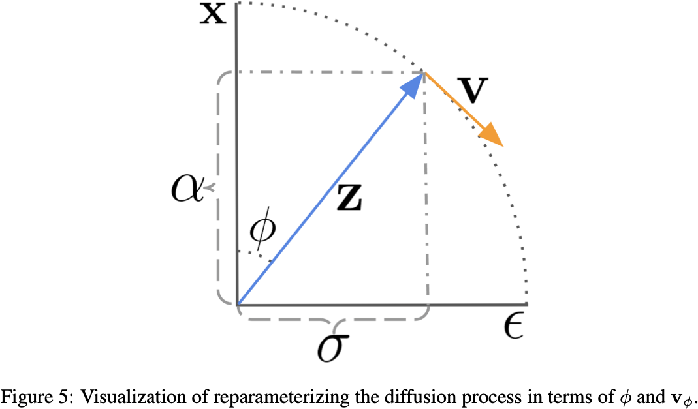

# Common Diffusion Noise Schedules and Sample Steps are Flawed

## Claim

1. 调整了 Noise Schedule，强制最后一步的 SNR 为 0
2. 用 v-prediction 训练网络
3. 采样时始终从最后一步开始
4. 调整了 CFG 的数值，防止产生过曝

## Motivation

训练和采样时候存在不一致：
- 部分 Diffusion 模型的 Noise Schedule 没有强制最后一步的 SNR 为 0
- 部分 Diffusion 模型采样不从最后一步开始，但 Diffusion 模型默认是从纯 Gaussian 噪声开始采样

体现在 Stable Diffusion 上是无法产生很亮或者很暗的图像，只能产生中等亮度的图像，就算提示词给了也没用。在训练时，最后一个时间步并不能完全清除所有信号信息。泄露的信号包含一些最低频率的信息，如每个通道的平均值，模型学会读取这些信息并将其用于预测去噪输出。在推理时，模型会在最后一个时间步得到纯高斯噪声，其均值总是以零为中心。这错误地限制了模型生成中等亮度的最终图像。

## Method

### Enforce Zero Terminal SNR

针对 VP SDE 类型的 Diffusion，对于原版的 DDPM Noise Schedule：
$$
x_t = \sqrt{\bar{\alpha}_t} x_0 + \sqrt{1 - \bar{\alpha}_t} \epsilon
$$
按照如下代码强制最后一步的 SNR 为 0：

```python
def enforce_zero_terminal_snr(betas: torch.Tensor) -> torch.Tensor:
    # betas -> alphas
    alphas = 1 - betas
    alphas_bar = alphas.cumprod(dim=0)
    alphas_bar_sqrt = alphas_bar.sqrt()

    # alphas_old -> alphas_new
    alphas_bar_sqrt_1 = alphas_bar_sqrt[0].clone()
    alphas_bar_sqrt_T = alphas_bar_sqrt[-1].clone()
    alphas_bar_sqrt -= alphas_bar_sqrt_T
    alphas_bar_sqrt *= alphas_bar_sqrt_1 / (alphas_bar_sqrt_1 - alphas_bar_sqrt_T)

    # alphas -> betas
    alphas_bar = alphas_bar_sqrt.square()
    alphas = alphas_bar[1:] - alphas_bar[:-1]
    alphas = torch.cat([alphas_bar[:1], alphas], dim=0)
    betas = 1 - alphas
    return betas
```

这样保证了 $\bar{\alpha}_1$ 不变，$\bar{\alpha}_T = 0$。

### Train with V-Prediction and V-Loss

SNR 为 0 时，模型无法从最后一个时间步中学到任何信号信息。为了解决这个问题，作者使用了 v-prediction：
$$
v_t = \sqrt{\bar{\alpha}_t} \epsilon - \sqrt{1 - \bar{\alpha}_t} x_0
$$
和 v-loss：
$$
\mathcal{L}_{\text{v-loss}} = \lambda_t \|v_t - \hat{v}_t(x_t)\|_2^2
$$
其中 $\hat{v}_t(x_t)$ 是模型。特点是 $t = 1$ 时噪声很大，$t = T$ 时 $v_t = x_0$。

定义 $\alpha_t = \sqrt{\bar{\alpha}_t}$, $\sigma_t = \sqrt{1 - \bar{\alpha}_t}$，则有 $\alpha_t^2 + \sigma_t^2 = 1$，二者在单位圆上。因此可以用参数 $\phi_t$ 来表示 $\alpha_t$ 和 $\sigma_t$：
$$
\begin{cases}
\alpha_t = \cos(\phi_t) \\
\sigma_t = \sin(\phi_t)
\end{cases}
$$
$x_t$ 可以表示为：
$$
x_t = \alpha_t x_0 + \sigma_t \epsilon = \cos(\phi_t) x_0 + \sin(\phi_t) \epsilon
$$
对 $x_t$ 求关于 $\phi$ 的导数：
$$
v_t = \frac{\mathrm{d}x_t}{\mathrm{d}\phi_t} = -\sin(\phi_t) x_0 + \cos(\phi_t) \epsilon
$$
这就是 v-prediction 的来历。$x_0$, $\epsilon$, $x_t$ 和 $v_t$ 之间的关系如下图所示：



### Sample from the Last Timestep

推荐使用 Trailing 的时间步：

```python
def get_trailing_steps(num_training_steps: int, num_inference_steps: int) -> int:
    gap = num_training_steps // num_inference_steps
    return torch.arange(gap, num_training_steps + 1, gap)
```

这种采样方式可以保证最后一个时间步的 SNR 为 0，而且第一个时间步距离 0 比较远，不会发生改变较小的情况。

### Rescale CFG

```python
def apply_cfg(positive: torch.Tensor, negative: torch.Tensor, weight: float = 7.5, rescale: float = 0.7) -> torch.Tensor:
    # Apply regular CFG
    cfg = negative + weight * (positive - negative)

    std_positive = positive.std()
    std_negative = negative.std()

    factor = std_positive / std_negative
    factor = factor * rescale + (1 - rescale)

    return cfg * factor
```
