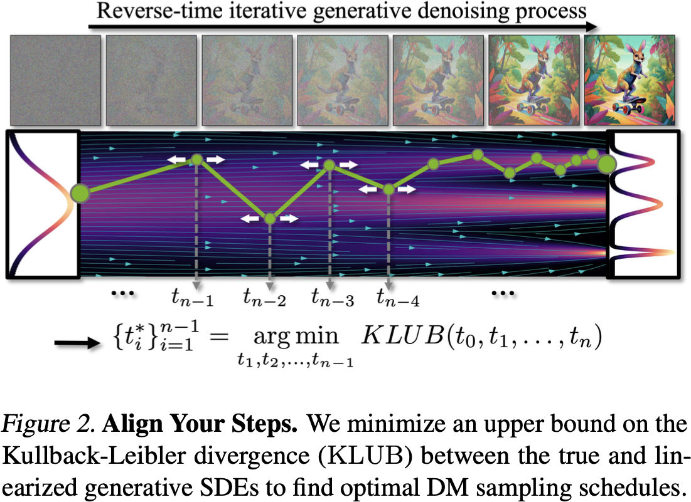
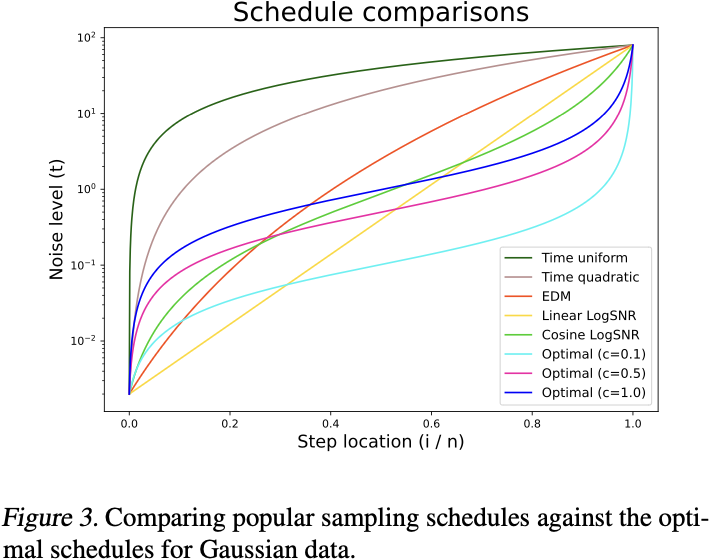
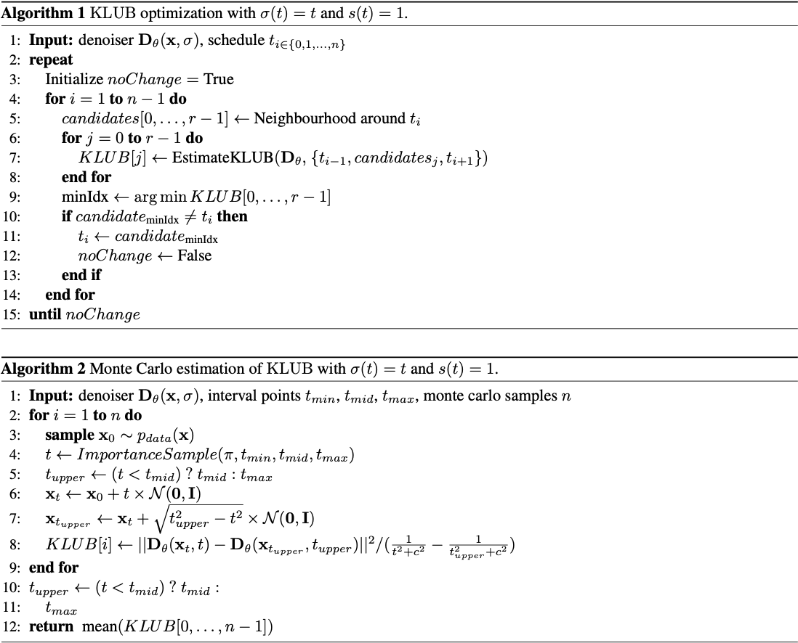
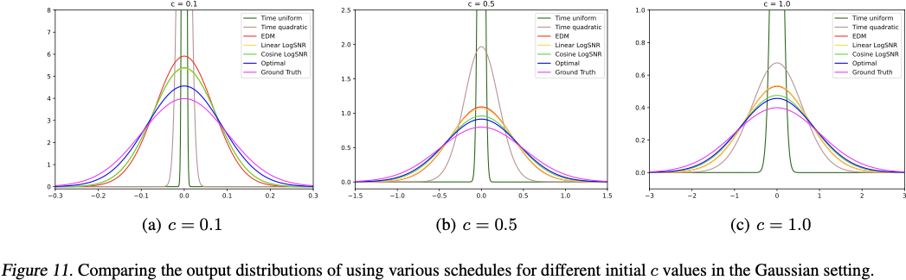
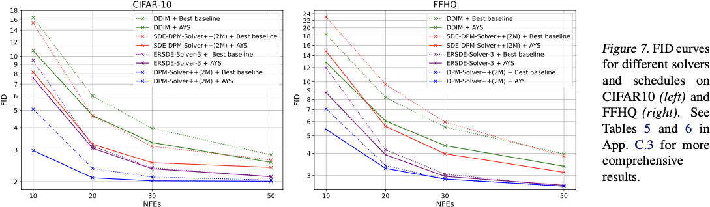
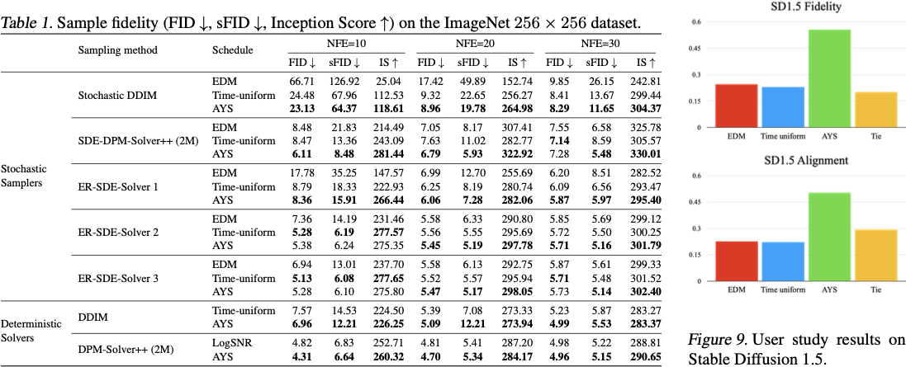

# Align Your Steps: Optimizing Sampling Schedules in Diffusion Models

## Claim

通过调整 SDE 求解器的采样时间表可以提高采样效率。AYS 特别是针对于用前向 Euler 法的求解器。前向 Euler 法的公式为：
$$
x_{t + \Delta t} = x_{t} + f(x_{t}, t)\Delta t
$$
能够控制的就是 $\Delta t$ 的选取。对于给定的 NFE，AYS 的作用就是找到最优的采样时间表，使得采样结果的分布与真实数据分布的 KL 散度最小。

贡献：
1. 分析了最优采样时间表与真实数据分布的关系。
2. 提出了 Align Your Steps (AYS) 框架，这是一个适用于任何数据集、模型和 SDE 求解器的采样时间表的优化的通用和原则性框架。
3. 针对多种流行的随机和确定性求解器改进了之前的启发式采样时间表，尤其在限制 NFE 情况下表现优异。

## Motivation

- 过多的 Diffusion 采样会导致速度慢。
- 当前数值求解 SDE 的方法仍然基于 Ito 积分，之前的方法主要是通过优化 SDE 数值求解器来提高效率。
- 所有的 SDE 求解器都可以重新解释为在短时间间隔内精确求解近似线性 SDE。

通过最小化近似线性 SDE 求解与实际生成 SDE 求解之间的不匹配问题，可以将其视为一个采样调度优化问题。

## Method

<table>
    
    
</table>

从一个 Case Study 开始。假设数据分布为 $\mathbb{P}_{\text{data}}(\mathbf{x}_{0}) \sim \mathcal{N}(\mathbf{0}, c^{2}\mathbf{I})$，定义前向 SDE 和反向 ODE 分别是：
$$
\begin{cases}
\text{Noise Schedule:} & \mathbf{x}_{t} = \mathbf{x}_{0} + t\boldsymbol{\epsilon} \in \mathbb{R}^{d} \\
\text{Forward SDE:} & \mathrm{d}\mathbf{x}_{t} = \sqrt{2t}\mathrm{d}\mathbf{w} \\
\text{Reverse ODE:} & \mathrm{d}\mathbf{x}_{t} = -t\nabla_{\mathbf{x}}\log p_{t}(\mathbf{x}_{t})\mathrm{d}t
\end{cases}
$$
取 $[t_{\min}, t_{\max}]$ 为采样范围，将其分成 $n$ 个区间 $t_{\min} = t_{0} < t_{1} < \cdots < t_{n} = t_{\max}$，并使用前向 Euler 法得到采样结果 $\hat{\mathbf{x}}_{t_{\min}}$。$\hat{\mathbf{x}}_{t_{\min}}$ 的分布应与真实结果分布 $p_{t_{\min}}(\mathbf{x}_{t_{\min}})$ 之间的 KL 散度最小。在这个 Case 中，最优采样时间表满足 $\{\alpha_{i} = \arctan(t_{i}/c)\}_{i=0}^{n}$ 为等差数列，其中 $\alpha_{\min} = \arctan(t_{\min}/c), \alpha_{\max} = \arctan(t_{\max}/c)$。可以发现，**采样点的选取与数据分布有关**。

---

KL-Divergence Upper Bound (KLUB) 使用来分析两个 SDE 在某一个时刻结果的分布之间的差异：
$$
\begin{cases}
\text{SDE 1:} & \mathrm{d}\mathbf{x}_{t} = \mathbf{f}_{1}(\mathbf{x}_{0\to t}, t)\mathrm{d}t + g(t)\mathrm{d}\mathbf{w}_{t} \\
\text{SDE 2:} & \mathrm{d}\mathbf{x}_{t} = \mathbf{f}_{2}(\mathbf{x}_{0\to t}, t)\mathrm{d}t + g(t)\mathrm{d}\mathbf{w}_{t}
\end{cases}
$$
$\mathbf{x}_{0\to t}$ 表示从时刻 $0$ 到时刻 $t$ 的轨迹。令 $\mathbb{P}_{1}$ 和 $\mathbb{P}_{2}$ 分别为在 $T$ 时刻的两个 SDE 的分布，二者的 KL 散度为：
$$
\text{KL}[\mathbb{P}_{1} \parallel \mathbb{P}_{2}] \le \text{KLUB}[0, T] := \frac{1}{2} \mathbb{E}_{\mathbb{P}_{1}^{\text{paths}}} \left[\int_{0}^{T} \frac{\left\|\mathbf{f}_{1}(\mathbf{x}_{0\to t}, t) - \mathbf{f}_{2}(\mathbf{x}_{0\to t}, t)\right\|^{2}}{g(t)^2} \mathrm{d}t\right]
$$
其中 $\mathbb{P}_{1}^{\text{paths}}$ 是 SDE 1 生成出来全体路径的分布。

---

令 $\mathbf{D}_{\theta}(\mathbf{x}, s, \sigma)$ 是一个神经网络去噪器，和分数的关系为
$$
\nabla_{\mathbf{x}_{t}} \log p_{t}(\mathbf{x}_{t}) = \frac{\mathbf{D}_{\theta}(\mathbf{x}, s(t), \sigma(t)) - \mathbf{x}_{t}/s(t)}{s(t)\sigma(t)^2}
$$
则反向 SDE 可以写成：
$$
\mathrm{d}\mathbf{x}_{t} = \left[\left(\frac{\dot{s}(t)}{s(t)} + 2\frac{\dot{\sigma}(t)}{\sigma(t)}\right)\mathbf{x}_{t} - 2\frac{s(t)\dot{\sigma}(t)}{\sigma(t)}\mathbf{D}_{\theta}(\mathbf{x}_{t}, s(t), \sigma(t))\right]\mathrm{d}t + s(t)\sqrt{2\dot{\sigma}(t)\sigma(t)}\mathrm{d}\mathbf{w}
$$
分段近似的话，就是让 $t_{i}$ 带入 $\mathbf{D}_{\theta}(\mathbf{x}, t)$，让这个 SDE 变成一个线性 SDE：
$$
\mathrm{d}\mathbf{x}_{t} = \left[\left(\frac{\dot{s}(t)}{s(t)} + 2\frac{\dot{\sigma}(t)}{\sigma(t)}\right)\mathbf{x}_{t} - 2\frac{s(t)\dot{\sigma}(t)}{\sigma(t)}\mathbf{D}_{\theta}(\mathbf{x}_{t_{i}}, s(t_{i}), \sigma(t_{i}))\right]\mathrm{d}t + s(t)\sqrt{2\dot{\sigma}(t)\sigma(t)}\mathrm{d}\mathbf{w}
$$
这个 SDE 在小区间 $t_{i}\to t_{i-1}$ 上有解析解。

第一个公式是真实的 SDE，第二个是离散化后的近似的 SDE，在 $t_{i}\to t_{i-1}$ 上应用 KLUB 可以得到：
$$
\text{KL}[\mathbb{P}^{\text{True}}_{t_{i}\to t_{i-1}} \parallel \mathbb{P}^{\text{Approx}}_{t_{i}\to t_{i-1}}] \le \mathbb{E}_{\mathbb{P}_{t_{i}\to t_{i-1}}^{\text{True paths}}} \left[\int_{t_{i}}^{t_{i-1}} \frac{\dot{\sigma}(t)}{\sigma(t)^3}\left\|\mathbf{D}_{\theta}(\mathbf{x}_{t}, s(t), \sigma(t)) - \mathbf{D}_{\theta}(\mathbf{x}_{t_{i}}, s(t_{i}), \sigma(t_{i}))\right\|^{2} \mathrm{d}t\right]
$$
如果网络拟合地足够好，那么 $\mathbb{P}_{t_{i}\to t_{i-1}}^{\text{True paths}}$ 就是真实的 SDE 生成的路径的分布，且 $\mathbb{P}^{\text{True}}_{t_{i}\to t_{i-1}} = \mathbb{P}(\mathbf{x}_{t_{i}}, t_{i})$。因此假设网络拟合得足够好，那么采样近似：
$$
\text{KL}[\mathbb{P}^{\text{True}}_{t_{i}\to t_{i-1}} \parallel \mathbb{P}^{\text{Approx}}_{t_{i}\to t_{i-1}}] \le \int_{t_{i}}^{t_{i-1}} \frac{\dot{\sigma}(t)}{\sigma(t)^3} \mathbb{E}_{\mathbf{x}_{t}\sim\mathbb{P}(\mathbf{x}_{t}, t), \mathbf{x}_{t_{i}}\sim\mathbb{P}(\mathbf{x}_{t_{i}} \mid \mathbf{x}_{t})} \left\|\mathbf{D}_{\theta}(\mathbf{x}_{t}, s(t), \sigma(t)) - \mathbf{D}_{\theta}(\mathbf{x}_{t_{i}}, s(t_{i}), \sigma(t_{i}))\right\|^{2} \mathrm{d}t
$$
在整个 $[t_{\min}, t_{\max}]$ 上的 KL 散度可以看作是分段 KL 散度的和。所以最优采样时间表的优化目标就是找到 $t_{1}, \dots, t_{n-1}$ 使得 KL 散度最小。

---

既然要 Monte Carlo 估计 KL 散度，那么就要有一个关于 $t$ 的重要性采样器。这里假设数据满足 $\mathbb{P}_{\text{data}}(\mathbf{x}) = \mathcal{N}(\mathbf{0}, c^2\mathbf{I})$，假设网络拟合得足够好，则对于每一个 $t < t_{i}$，有：
$$
\mathbb{E}_{\mathbf{x}_{t}\sim\mathbb{P}(\mathbf{x}_{t}, t), \mathbf{x}_{t_{i}}\sim\mathbb{P}(\mathbf{x}_{t_{i}} \mid \mathbf{x}_{t})} \left\|\mathbf{D}_{\theta}(\mathbf{x}_{t}, s(t), \sigma(t)) - \mathbf{D}_{\theta}(\mathbf{x}_{t_{i}}, s(t_{i}), \sigma(t_{i}))\right\|^{2} = c^{4} \left(\frac{1}{\sigma(t)^2 + c^2} - \frac{1}{\sigma(t_{i})^2 + c^2}\right)
$$
因此：
$$
\text{KLUB} \propto \sum_{i=1}^{n} \int_{t_{i}}^{t_{i-1}} \frac{\dot{\sigma}(t)}{\sigma(t)^3} \left(\frac{1}{\sigma(t)^2 + c^2} - \frac{1}{\sigma(t_{i})^2 + c^2}\right) \mathrm{d}t
$$

---

首先优化 $n=10$，需要早停，因为 KLUB 是一个上界，而不是 loss 本身。然后稳定了就优化 $n=20, 40$，细分区间也有要求。

## Result

## Derivation

先从一个 Case Study 出发。假设数据分布是 $\mathbb{P}_{\text{data}}(\mathbf{x})\sim\mathcal{N}(\mathbf{0}, c^2\mathbf{I})$、$s(t) = 1, \sigma(t) = t$，则前向 SDE 和反向 ODE 分别是：
$$
\begin{cases}
\text{Noise Schedule:} & \mathbf{x}_{t} = \mathbf{x}_{0} + t\boldsymbol{\epsilon} \in \mathbb{R}^{d} \\
\text{Forward SDE:} & \mathrm{d}\mathbf{x} = \sqrt{2t}\mathrm{d}\mathbf{w} \\
\text{Reverse ODE:} & \mathrm{d}\mathbf{x} = -t\nabla_{\mathbf{x}}\log p(\mathbf{x}, t)\mathrm{d}t
\end{cases}
$$
由此可得：
$$
\begin{align*}
\mathbb{P}(\mathbf{x}_{t}) &= \int p(\mathbf{x}_{t} \mid \mathbf{x}_{0})\mathbb{P}_{\text{data}}(\mathbf{x}_{0})\mathrm{d}\mathbf{x}_{0} \\
&= \int \mathcal{N}(\mathbf{x}_{t} \mid \mathbf{x}_{0}, t^2\mathbf{I})\mathcal{N}(\mathbf{x}_{0} \mid \mathbf{0}, c^2\mathbf{I})\mathrm{d}\mathbf{x}_{0} \\
&= \mathcal{N}(\mathbf{x}_{t} \mid \mathbf{0}, (t^2 + c^2)\mathbf{I})
\end{align*}
$$
因此 $\mathbb{P}(\mathbf{x}_{t})$ 的 score 为：
$$
\nabla_{\mathbf{x}_{t}}\log\mathbb{P}(\mathbf{x}_{t}) = -\frac{\mathbf{x}_{t}}{t^2 + c^2}
$$
因此在逆向 ODE 的时候，用 Euler 方法求解的话，从时刻 $b$ 到时刻 $a$ 估计得到的采样点为：
$$
\hat{\mathbf{x}}_{a} = \mathbf{x}_{b} + (a - b)\nabla_{\mathbf{x}_{b}}\log\mathbb{P}(\mathbf{x}_{b}) = \mathbf{x}_{b} + \frac{b(a - b)}{b^2 + c^2}\mathbf{x}_{b} = \frac{ab + c^2}{b^2 + c^2}\mathbf{x}_{b}
$$
将 $[a, b]$ 分成 $n$ 个区间 $a = t_0 < t_1 < \cdots < t_n = b$，则有：
$$
\hat{\mathbf{x}}_{a} = \left(\prod_{i=1}^{n}\frac{t_i t_{i-1} + c^2}{t_{i}^2 + c^2}\right)\mathbf{x}_{b}
$$
已知 $\mathbf{x}_{b} \sim \mathcal{N}(\mathbf{0}, (b^2 + c^2)\mathbf{I})$，则：
$$
\hat{\mathbf{x}}_{a} \sim \mathcal{N}\left(\mathbf{0}, \prod_{i=1}^{n}\left(\frac{t_i t_{i-1} + c^2}{t_{i}^2 + c^2}\right)^2(b^2 + c^2)\mathbf{I}\right)
$$
那么就是要最小化与解析解 $\mathcal{N}(\mathbf{0}, (a^2 + c^2)\mathbf{I})$ 之间的 KL 散度：
$$
\begin{align*}
\text{KL}[\mathbb{P}(\mathbf{x}_{a}) \parallel \mathbb{P}(\hat{\mathbf{x}}_{a})] &= \text{KL}\left[\mathcal{N}(\mathbf{0}, (a^2 + c^2)\mathbf{I}) \parallel \mathcal{N}\left(\mathbf{0}, \prod_{i=1}^{n}\left(\frac{t_i t_{i-1} + c^2}{t_{i}^2 + c^2}\right)^2(b^2 + c^2)\mathbf{I}\right)\right] \\
&\propto - \log f(t_{0}, \dots, t_{n}) - 1 + f(t_{0}, \dots, t_{n})
\end{align*}
$$
其中：
$$
\begin{align*}
f(t_{0}, \dots, t_{n}) &= \prod_{i=1}^{n}\left(\frac{t_{i}^2 + c^2}{t_i t_{i-1} + c^2}\right)^2 \frac{t_{0}^2 + c^2}{t_{n}^2 + c^2} \\
&= \prod_{i=1}^{n}\frac{\left(t_{i-1}^2 + c^2\right)\left(t_{i}^2 + c^2\right)}{\left(t_i t_{i-1} + c^2\right)^{2}} \\
\end{align*}
$$
用 Lagrange 乘子法求解极值，也就是让关于 $t_i\ (1\le i \le n)$ 的导数为 $0$：
$$
\frac{\partial}{\partial t_i}\text{KL}[\mathbb{P}(\mathbf{x}_{a}) \parallel \mathbb{P}(\hat{\mathbf{x}}_{a})] = \frac{\partial}{\partial t_i}f(t_{0}, \dots, t_{n}) \left[1 - \frac{1}{f(t_{0}, \dots, t_{n})}\right] = 0
$$
由 Cauchy-Schwarz 不等式可得：
$$
(t_{i}^2 + c^2)(t_{i-1}^2 + c^2) > (t_{i}t_{i-1} + c^2)^2
$$
因为 $t_{i}$ 是不等的，所以不等式严格成立。因此 $f(t_{0}, \dots, t_{n}) > 1$，仅当 $\partial f(t_{0}, \dots, t_{n})/\partial t_i = 0$ 时取得极值：
$$
\begin{align*}
\frac{\partial}{\partial t_i}f(t_{0}, \dots, t_{n}) &= \frac{\partial}{\partial t_i}\prod_{i=1}^{n}\frac{\left(t_{i-1}^2 + c^2\right)\left(t_{i}^2 + c^2\right)}{\left(t_i t_{i-1} + c^2\right)^{2}} = 0 \\
&\Rightarrow \frac{\partial}{\partial t_i}\frac{\left(t_{i}^2 + c^2\right)^{2}}{\left(t_{i-1}t_{i} + c^2\right)^{2}\left(t_{i}t_{i+1} + c^2\right)^{2}} = 0 \\
&\Rightarrow \frac{\partial}{\partial t_i}\frac{\left(t_{i}^2 + c^2\right)}{\left(t_{i-1}t_{i} + c^2\right)\left(t_{i}t_{i+1} + c^2\right)} = 0
\end{align*}
$$
$$
\begin{align*}
2 t_{i}\left(t_{i-1}t_{i} + c^2\right)\left(t_{i}t_{i+1} + c^2\right) &= \left(t_{i}^2 + c^2\right)\left[2t_{i-1}t_{i}t_{i+1} + \left(t_{i-1} + t_{i+1}\right)c^2\right] \\
0 &= (t_{i-1} + t_{i+1})t_{i}^2 + 2(c^2 - t_{i-1}t_{i+1})t_{i} - c^2(t_{i-1} + t_{i+1}) \\
t_{i} &= \frac{\left(t_{i-1}t_{i+1} - c^2\right) + \sqrt{\left(c^2 + t_{i-1}^2\right)\left(c^2 + t_{i+1}^2\right)}}{t_{i-1} + t_{i+1}}
\end{align*}
$$
用反三角函数重写：
$$
\alpha_{i} := \arctan\left(\frac{t_{i}}{c}\right) \Rightarrow 2\alpha_{i} = \alpha_{i-1} + \alpha_{i+1} \Rightarrow t_{i} = c\tan\left(\frac{\alpha_{i-1} + \alpha_{i+1}}{2}\right)
$$
因此 $\arctan(t_{i}/c)$ 需要是一个等差数列。

---
