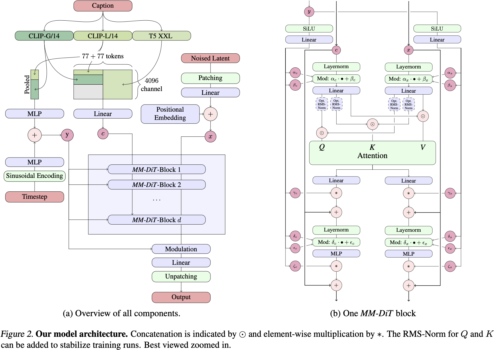

# Scaling Rectified Flow Transformers for High-Resolution Image Synthesis

## Claim

Flow 是一种生成模型，在原始数据和噪声之间做线性插值。Stable Diffusion 3 就是基于这个生成模型，具体是 Rectified Flow。

- 本文提出了一种新的将文字和图像 token 双向融合的方法，用于生成高分辨率图像。
- 这个模型具有 Scaling 的特性。

## Motivation

- 现有的 Rectified Flow 模型还是在小型数据集上进行训练的。

## Method

### Tailored SNR Samplers for RF models

SD3、EDM 都认为 $t$ 在中间时候比在两端难训练，因此训练时候对于 $t$ 的采样可以不用均匀分布，这也等价于给不同的 $t$ 加不同的训练权重。

因此 SD3 选择使用 Logit-Normal 分布：
$$
\pi_{\ln}(t; m, s) = \frac{1}{s\sqrt{2\pi}}\frac{1}{t(1 - t)}\exp\left(-\frac{[\text{logit}(t) - m]^{2}}{2s^2}\right)
$$
其中：
$$
\text{logit}(t) = \log\frac{t}{1 - t}
$$

### Text-to-Image Architecture

## Result
