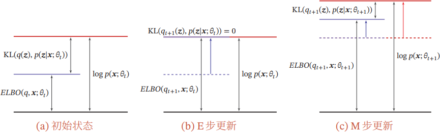

# Expectation-Maximization

记号同 [Maximum Likelihood Estimation](1%20maximum%20likelihood%20estimation.md)。

---

## Why Expectation Maximization Algorithm

在实际问题中，我们常常遇到**数据不完整**的情况：
- 医学诊断：知道症状（显变量），但不知病因（隐变量）
- 自然语言处理：看到文本（显变量），但不知语义结构（隐变量）
- 金融分析：观察交易（显变量），但不知用户意图（隐变量）

**经典案例（硬币实验）**（来源 [What is the Expectation Maximization Algorithm](https://www.nature.com/articles/nbt1406)）：

> 有两枚未知参数的硬币 A 和 B（$\theta_{A}$ 和 $\theta_{B}$），每次随机选择一枚硬币抛掷，但不知道选择了哪枚。已知抛掷结果序列。EM 算法能够同时估计：
> 1. 每枚硬币的参数
> 2. 每次选择的硬币概率

## Core Ideas of Expectation Maximization

### Evidence

对于含隐变量 $\mathbf{z}$ 的模型，观测数据的**边际似然**（又称**证据**）为：
$$
p(\mathbf{x}; \theta) = \int p(\mathbf{x}, \mathbf{z}; \theta) \mathrm{d}\mathbf{z} = \mathbb{E}_{\mathbf{z} \sim p(\mathbf{z}; \theta)} \left[p(\mathbf{x} \mid \mathbf{z}; \theta)\right]
$$

仿照极大似然估计的方法，我们希望找到使边际似然最大的参数 $\theta^{*}$：
$$
\theta^{*} = \mathop{\arg\max}_{\theta} \sum_{n=1}^N \log \int p(\mathbf{x}^{(n)}, \mathbf{z}; \theta) \mathrm{d}\mathbf{z}
$$
由于积分的存在，对参数 $\theta$ 的求导形式复杂。

### Evidence Lower Bound (ELBO)

为了解决上述问题，我们引入**证据下界（ELBO）**，它是边际似然的一个下界。利用 Jensen 不等式：
$$
\begin{aligned}
\log p(\mathbf{x}; \theta) &= \log \int q(\mathbf{z}) \frac{p(\mathbf{x}, \mathbf{z}; \theta)}{q(\mathbf{z})} \mathrm{d}\mathbf{z} \\
&= \log \mathbb{E}_{\mathbf{z} \sim q(\mathbf{z})} \left[\frac{p(\mathbf{x}, \mathbf{z}; \theta)}{q(\mathbf{z})}\right] \\
&\geq \mathbb{E}_{\mathbf{z} \sim q(\mathbf{z})} \left[ \log \frac{p(\mathbf{x}, \mathbf{z}; \theta)}{q(\mathbf{z})} \right] \equiv \mathrm{ELBO}(q, \mathbf{x}; \theta)
\end{aligned}
$$

### ELBO v.s. Evidence

我们可以这样分解边际似然：
$$
\begin{aligned}
\log p(\mathbf{x}; \theta) &= \mathbb{E}_{\mathbf{z} \sim q(\mathbf{z})} \left[ \log p(\mathbf{x}; \theta) \right] \\
&= \mathbb{E}_{\mathbf{z} \sim q(\mathbf{z})} \left[ \log \frac{p(\mathbf{x}, \mathbf{z}; \theta)}{q(\mathbf{z})} \frac{q(\mathbf{z})}{p(\mathbf{z} \mid \mathbf{x}; \theta)} \right] \\
&= \mathbb{E}_{\mathbf{z} \sim q(\mathbf{z})} \left[ \log \frac{p(\mathbf{x}, \mathbf{z}; \theta)}{q(\mathbf{z})} \right] + \mathbb{E}_{\mathbf{z} \sim q(\mathbf{z})} \left[ \log \frac{q(\mathbf{z})}{p(\mathbf{z} \mid \mathbf{x}; \theta)} \right] \\
&= \mathrm{ELBO}(q, \mathbf{x}; \theta) + \mathrm{KL}\left[q(\mathbf{z}) \parallel p(\mathbf{z} \mid \mathbf{x}; \theta)\right]
\end{aligned}
$$
由于 KL 散度始终非负，因此可以比较直观的理解为何 ELBO 是边际似然的下界。我们把这个重要结论单独列出：
$$
\boxed{
\log p(\mathbf{x}; \theta) = \mathrm{ELBO}(q, \mathbf{x}; \theta) + \mathrm{KL}\left[q(\mathbf{z}) \parallel p(\mathbf{z} \mid \mathbf{x}; \theta)\right]
}
$$

## Expectation Maximization Algorithm

EM 算法通过交替优化实现最大化 ELBO。

### Expectation Step

固定参数 $\theta_{t}$，优化变分分布：
$$
q_{t + 1}(\mathbf{z}) = \mathop{\arg\min}_q \mathrm{KL}\left[q(\mathbf{z}) \parallel p(\mathbf{z} \mid \mathbf{x}; \theta_{t})\right]
$$
显然，最优解就是 $q_{t + 1}(\mathbf{z}) = p(\mathbf{z} \mid \mathbf{x}; \theta_{t})$。

### Maximization Step

固定变分分布 $q_{t + 1}$，优化参数：
$$
\theta_{t + 1} = \mathop{\arg\max}_{\theta} \mathrm{ELBO}(q_{t + 1}, \mathbf{x}; \theta)
$$
这一步与极大似然估计类似，都是去优化参数。

## Proof of Convergence

EM 算法的收敛性可以通过以下步骤证明：

1. 在 E 步后：$\mathrm{ELBO}(q_{t + 1}, \mathbf{x}; \theta_{t}) = \log p(\mathbf{x}; \theta_{t})$
2. 在 M 步后：$\mathrm{ELBO}(q_{t + 1}, \mathbf{x}; \theta_{t + 1}) \geq \mathrm{ELBO}(q_{t + 1}, \mathbf{x}; \theta_{t})$
3. 因此：
   $$
   \log p(\mathbf{x}; \theta_{t + 1}) \geq \mathrm{ELBO}(q_{t + 1}, \mathbf{x}; \theta_{t + 1}) \geq \log p(\mathbf{x}; \theta_{t})
   $$
4. 由此可得 $\log p(\mathbf{x}; \theta_{t})$ 是单调非减的，并且存在上界（0），因此 EM 算法收敛。

## Variational Inference

对于复杂模型，后验 $p(\mathbf{z}\mid\mathbf{x}; \theta)$ 常难以计算。**变分推断**通过限制 $q$ 的函数形式来近似：

$$
q^* = \mathop{\arg\min}_{q \in \mathcal{Q}} \mathrm{KL}\left[q(\mathbf{z}) \parallel p(\mathbf{z}\mid\mathbf{x}; \theta)\right]
$$
等价于：
$$
q^* = \mathop{\arg\max}_{q \in \mathcal{Q}} \mathrm{ELBO}(q, \mathbf{x}; \theta)
$$
其中 $\mathcal{Q}$ 是一个函数空间，包含所有可能的 $q$。

- 传统方法：平均场近似
- 深度学习方法：用神经网络拟合 $q$

## Examples of EM Algorithm

### Gaussian Mixture Model

> 数据由 $K$ 个高斯分布生成：
> - 隐变量 $z \in \{1, \dots, K\}$：指示数据来源的分布；
> - 参数：$\boldsymbol{\pi} = \{\pi_k\}_{k = 1}^{K}$（混合权重），$\boldsymbol{\mu} = \{\mu_k\}_{k = 1}^{K}$，$\boldsymbol{\sigma} = \{\sigma_k\}_{k = 1}^{K}$

**E 步**：计算后验分布
$$
\begin{aligned}
\gamma_k^{(n)} &\equiv p(z = k \mid x^{(n)}; \boldsymbol{\pi}, \boldsymbol{\mu}, \boldsymbol{\sigma}) \\
&= \frac{p(x^{(n)} \mid z = k; \boldsymbol{\pi}, \boldsymbol{\mu}, \boldsymbol{\sigma}) p(z = k; \boldsymbol{\pi}, \boldsymbol{\mu}, \boldsymbol{\sigma})}{p(x^{(n)}; \boldsymbol{\pi}, \boldsymbol{\mu}, \boldsymbol{\sigma})} \\
&= \frac{\mathcal{N}(x^{(n)}; \mu_k, \sigma_k)\pi_k}{\sum_{j=1}^K \mathcal{N}(x^{(n)}; \mu_j, \sigma_j)\pi_j}
\end{aligned}
$$

**M 步**：计算 ELBO
$$
\begin{aligned}
\mathop{\mathrm{ELBO}}\left(q, \mathcal{D}; \boldsymbol{\pi}, \boldsymbol{\mu}, \boldsymbol{\sigma}\right) &= \sum_{n = 1}^{N}\sum_{k = 1}^K \gamma_k^{(n)}\log\frac{p\left(x^{(n)}, z = k; \boldsymbol{\pi}, \boldsymbol{\mu}, \boldsymbol{\sigma}\right)}{\gamma_k^{(n)}} \\
&= \sum_{n = 1}^{N}\sum_{k = 1}^K \gamma_k^{(n)}\log\frac{\mathcal{N}\left(x^{(n)}; \mu_k, \sigma_k\right) \pi_k}{\gamma_k^{(n)}} \\
&= \sum_{n = 1}^{N}\sum_{k = 1}^K \gamma_k^{(n)}\left[-\frac{(x^{(n)} - \mu_k)^2}{2\sigma_k^2} - \log\sigma_k + \log\pi_k\right] + \text{Constant}
\end{aligned}
$$

利用 Lagrange 乘数法，求解参数，得到
$$
\begin{aligned}
\mu_k^* &= \frac{\sum_{n = 1}^{N} \gamma_k^{(n)} x^{(n)}}{\sum_{n = 1}^{N} \gamma_k^{(n)}} \\
\sigma_k^* &= \frac{\sum_{n = 1}^{N} \gamma_k^{(n)} (x^{(n)} - \mu_k^*)^2}{\sum_{n = 1}^{N} \gamma_k^{(n)}} \\
\pi_k^* &= \frac{\sum_{n = 1}^{N} \gamma_k^{(n)}}{N}
\end{aligned}
$$

### Story Telling

假设某地区人群身高由男性和女性两个子群体组成：
- 男性身高分布：$\mathcal{N}(\mu_1, \sigma_1^2)$
- 女性身高分布：$\mathcal{N}(\mu_2, \sigma_2^2)$

在不知道收集到的身高数据属于哪个子群体的情况下，我们可以使用 EM 算法来估计男性和女性的身高分布参数。

### K-Means Clustering

K-Means 是 GMM 的特例：
- 假设每个簇的分布都是参数相同的 Isotropic 高斯分布；
- 混合权重只有两种可能：1 或 0，即数据点完全属于某个簇。
