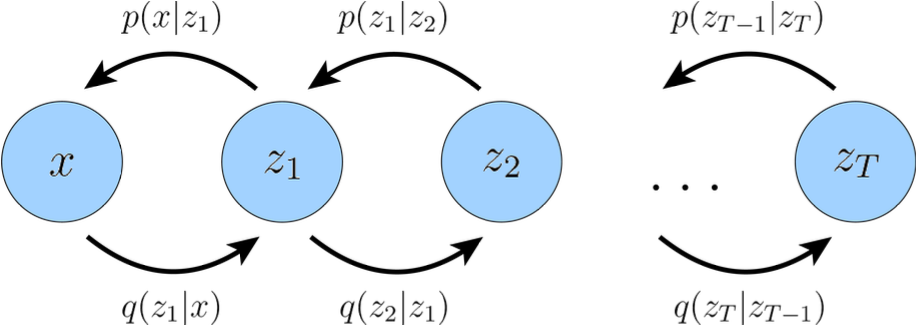

# Hierarchical Variational Autoencoder

记号同 [3 Variational Auto-encoder](../3%20Variational%20Autoencoder.md)。

---

Hierarchical Variational Autoencoder (HVAE)，特别是 Markovian Hierarchical Variational Autoencoder (MHVAE)，将多个 VAE 串联起来。除了第一个 VAE 的潜空间是从数据空间编码而来，其他每个 VAE 的潜空间都是从之前一个 VAE 的潜空间编码而来。因此，联合分布写成：
$$
\begin{align*}
p(\mathbf{x} \mid \mathbf{z}_{1:T}; \theta) &= p(\mathbf{z}_T; \theta) p(\mathbf{x} \mid \mathbf{z}_1; \theta) \prod_{t=2}^{T} p(\mathbf{z}_{t-1} \mid \mathbf{z}_{t}; \theta) \\
q(\mathbf{z}_{1:T} \mid \mathbf{x}; \phi) &= q(\mathbf{z}_1 \mid \mathbf{x}; \phi) \prod_{t=2}^{T} q(\mathbf{z}_t \mid \mathbf{z}_{t-1}; \phi)
\end{align*}
$$
对应的 ELBO 为：
$$
\begin{align*}
\log p(\mathbf{x}; \theta) &= \log \int p(\mathbf{x}, \mathbf{z}_{1:T}; \theta) \mathrm{d} \mathbf{z}_{1:T} \\
&= \log \int \frac{p(\mathbf{x}, \mathbf{z}_{1:T}; \theta) q(\mathbf{z}_{1:T} \mid \mathbf{x}; \phi)}{q(\mathbf{z}_{1:T} \mid \mathbf{x}; \phi)} \mathrm{d} \mathbf{z}_{1:T} \\
&= \log \mathbb{E}_{q(\mathbf{z}_{1:T} \mid \mathbf{x}; \phi)} \left[\frac{p(\mathbf{x}, \mathbf{z}_{1:T}; \theta)}{q(\mathbf{z}_{1:T} \mid \mathbf{x}; \phi)} \right] \\
&\geq \mathbb{E}_{q(\mathbf{z}_{1:T} \mid \mathbf{x}; \phi)} \log \left[\frac{p(\mathbf{x}, \mathbf{z}_{1:T}; \theta)}{q(\mathbf{z}_{1:T} \mid \mathbf{x}; \phi)} \right]
\end{align*}
$$
其中：
$$
\begin{align*}
\mathrm{ELBO}(q, \mathbf{x}; \theta, \phi) &= \mathbb{E}_{q(\mathbf{z}_{1:T} \mid \mathbf{x}; \phi)} \log \left[\frac{p(\mathbf{x}, \mathbf{z}_{1:T}; \theta)}{q(\mathbf{z}_{1:T} \mid \mathbf{x}; \phi)} \right] \\
&= \mathbb{E}_{q(\mathbf{z}_{1:T} \mid \mathbf{x}; \phi)} \log \left[\frac{p(\mathbf{z}_T; \theta) p(\mathbf{x} \mid \mathbf{z}_1; \theta) \prod_{t=2}^{T} p(\mathbf{z}_{t-1} \mid \mathbf{z}_{t}; \theta)}{q(\mathbf{z}_1 \mid \mathbf{x}; \phi) \prod_{t=2}^{T} q(\mathbf{z}_t \mid \mathbf{z}_{t-1}; \phi)} \right]
\end{align*}
$$

## VAE Automatic Classification (Optional)

我们可以在隐空间上对数据进行分类。将 $\mathbf{z}$ 拆分为连续特征表征 $\mathbf{z}$ 和离散聚类标签 $y$，则联合分布表示为：
$$
\begin{align*}
&\quad\ \ \mathrm{KL}\left[q(\mathbf{x}, \mathbf{z}, y; \phi) \parallel p(\mathbf{x}, \mathbf{z}, y; \theta)\right] \\
&= \mathbb{E}_{\mathbf{x}, \mathbf{z}, y \sim q(\mathbf{x}, \mathbf{z}, y; \phi)} \left[\log \frac{q(\mathbf{x}, \mathbf{z}, y; \phi)}{p(\mathbf{x}, \mathbf{z}, y; \theta)} \\
&= \iint \sum_{y} q(\mathbf{x}, \mathbf{z}, y; \phi) \log \frac{q(\mathbf{x}, \mathbf{z}, y; \phi)}{p(\mathbf{x}, \mathbf{z}, y; \theta)} \mathrm{d} \mathbf{x} \mathrm{d} \mathbf{z} \\
&= \iint \sum_{y} q(\mathbf{z}, y \mid \mathbf{x}; \phi) p(\mathbf{x}) \log \frac{q(\mathbf{z}, y \mid \mathbf{x}; \phi) p(\mathbf{x})}{p(\mathbf{x} \mid \mathbf{z}, y; \theta) p(\mathbf{z}, y)} \mathrm{d} \mathbf{x} \mathrm{d} \mathbf{z}
\end{align*}
$$
为了进一步细化损失函数计算，我们需要假设一些变量关系。这里按照 MHVAE 的方案，假设 $\mathbf{z}$ 只与 $\mathbf{x}$ 有关，$y$ 只与 $\mathbf{z}$ 有关。因此有：
$$
\begin{align*}
q(\mathbf{z}, y \mid \mathbf{x}; \phi) &= q(y \mid \mathbf{z}; \phi) q(\mathbf{z} \mid \mathbf{x}; \phi) \\
p(\mathbf{x} \mid \mathbf{z}, y; \theta) &= p(\mathbf{x} \mid \mathbf{z}; \theta) \\
p(\mathbf{z}, y; \theta) &= p(\mathbf{z} \mid y; \theta) p(y)
\end{align*}
$$
带入得到：
$$
\begin{align*}
&\quad\ \ \mathrm{KL}\left[q(\mathbf{x}, \mathbf{z}, y; \phi) \parallel p(\mathbf{x}, \mathbf{z}, y; \theta)\right] \\
&= \iint \sum_{y} q(\mathbf{z}, y \mid \mathbf{x}; \phi) p(\mathbf{x}) \log \frac{q(\mathbf{z}, y \mid \mathbf{x}; \phi) p(\mathbf{x})}{p(\mathbf{x} \mid \mathbf{z}, y; \theta) p(\mathbf{z}, y; \theta)} \mathrm{d} \mathbf{x} \mathrm{d} \mathbf{z} \\
&= \iint \sum_{y} q(y \mid \mathbf{z}; \phi) q(\mathbf{z} \mid \mathbf{x}; \phi) p(\mathbf{x}) \log \frac{q(y \mid \mathbf{z}; \phi) q(\mathbf{z} \mid \mathbf{x}; \phi) p(\mathbf{x})}{p(\mathbf{x} \mid \mathbf{z}; \theta) p(\mathbf{z} \mid y; \theta) p(y)} \mathrm{d} \mathbf{x} \mathrm{d} \mathbf{z} \\
&= \underbrace{\iint \sum_{y} q(y \mid \mathbf{z}; \phi) q(\mathbf{z} \mid \mathbf{x}; \phi) p(\mathbf{x}) \log p(\mathbf{x}) \mathrm{d} \mathbf{x} \mathrm{d} \mathbf{z}}_{\text{Constant}} \\
&+ \iint \sum_{y} q(y \mid \mathbf{z}; \phi) q(\mathbf{z} \mid \mathbf{x}; \phi) p(\mathbf{x}) \log \frac{q(y \mid \mathbf{z}; \phi) q(\mathbf{z} \mid \mathbf{x}; \phi)}{p(\mathbf{x} \mid \mathbf{z}; \theta) p(\mathbf{z} \mid y; \theta) p(y)} \mathrm{d} \mathbf{x} \mathrm{d} \mathbf{z} \\
&= \text{Constant} + \int \sum_{y} q(y \mid \mathbf{z}; \phi) q(\mathbf{z} \mid \mathbf{x}; \phi) \log \frac{q(y \mid \mathbf{z}; \phi) q(\mathbf{z} \mid \mathbf{x}; \phi)}{p(\mathbf{x} \mid \mathbf{z}; \theta) p(\mathbf{z} \mid y; \theta) p(y)} \mathrm{d} \mathbf{z} \\
\end{align*}
$$
对于第二项，我们有两种损失函数的计算方式。第一种是从 Diffusion 方法中借鉴的：
$$
\begin{align*}
&\quad\ \ \int \sum_{y} q(y \mid \mathbf{z}; \phi) q(\mathbf{z} \mid \mathbf{x}; \phi) \log \frac{q(y \mid \mathbf{z}; \phi) q(\mathbf{z} \mid \mathbf{x}; \phi)}{p(\mathbf{x} \mid \mathbf{z}; \theta) p(\mathbf{z} \mid y; \theta) p(y)} \mathrm{d} \mathbf{z} \\
&= \int \sum_{y} q(y \mid \mathbf{z}; \phi) q(\mathbf{z} \mid \mathbf{x}; \phi) \log \frac{q(y \mid \mathbf{z}, \mathbf{x}; \phi) q(\mathbf{z} \mid \mathbf{x}; \phi)}{p(\mathbf{x} \mid \mathbf{z}; \theta) p(\mathbf{z} \mid y; \theta) p(y)} \mathrm{d} \mathbf{z} \\
&= \int \sum_{y} q(y \mid \mathbf{z}; \phi) q(\mathbf{z} \mid \mathbf{x}; \phi) \log \frac{q(\mathbf{z} \mid \mathbf{x}; \phi)}{p(\mathbf{x} \mid \mathbf{z}; \theta) p(y)} \frac{q(y \mid \mathbf{z}, \mathbf{x}; \phi)}{p(\mathbf{z} \mid y; \theta)} \mathrm{d} \mathbf{z} \\
&= \int \sum_{y} q(y \mid \mathbf{z}; \phi) q(\mathbf{z} \mid \mathbf{x}; \phi) \log \frac{\cancel{q(\mathbf{z} \mid \mathbf{x}; \phi)}}{p(\mathbf{x} \mid \mathbf{z}; \theta) p(y)} \frac{q(\mathbf{z} \mid y, \mathbf{x}; \phi) q(y \mid \mathbf{x}; \phi)}{p(\mathbf{z} \mid y; \theta) \cancel{q(\mathbf{z} \mid \mathbf{x}; \phi)}} \mathrm{d} \mathbf{z} \\
&= \int \sum_{y} q(\mathbf{z} \mid y, \mathbf{x}; \phi) q(y \mid \mathbf{x}; \phi) \log \frac{q(\mathbf{z} \mid y, \mathbf{x}; \phi)}{p(\mathbf{z} \mid y; \theta)} \mathrm{d} \mathbf{z} \\
&\quad + \sum_{y} q(y \mid \mathbf{x}; \phi) \log \frac{q(y \mid \mathbf{x}; \phi)}{p(y)} \\
&\quad - \int q(\mathbf{z} \mid \mathbf{x}; \phi) \log p(\mathbf{x} \mid \mathbf{z}; \theta) \mathrm{d} \mathbf{z} \\
&= \mathbb{E}_{y \sim q(y \mid \mathbf{x}; \phi)} \left[\mathrm{KL}[q(\mathbf{z} \mid y, \mathbf{x}; \phi) \parallel p(\mathbf{z} \mid y; \theta)] \right] \\
&\quad + \mathrm{KL}[q(y \mid \mathbf{x}; \phi) \parallel p(y)] \\
&\quad - \mathbb{E}_{\mathbf{z} \sim q(\mathbf{z} \mid \mathbf{x}; \phi)} \left[\log p(\mathbf{x} \mid \mathbf{z}; \theta) \right]
\end{align*}
$$
虽然 Diffusion 方法非常有效，但它的先验是已知的，在我们的情况下无法做到。因此，第一种形式无法像 Diffusion 方法那样进一步进行解析计算。第二种方法如下：
$$
\begin{align*}
&\quad\ \ \int \sum_{y} q(y \mid \mathbf{z}; \phi) q(\mathbf{z} \mid \mathbf{x}; \phi) \log \frac{q(y \mid \mathbf{z}; \phi) q(\mathbf{z} \mid \mathbf{x}; \phi)}{p(\mathbf{x} \mid \mathbf{z}; \theta) p(\mathbf{z} \mid y; \theta) p(y)} \mathrm{d} \mathbf{z} \\
&= \int \sum_{y} q(y \mid \mathbf{z}; \phi) q(\mathbf{z} \mid \mathbf{x}; \phi) \log \frac{q(\mathbf{z} \mid \mathbf{x}; \phi)}{p(\mathbf{z} \mid y; \theta)} \mathrm{d} \mathbf{z} \\
&\quad + \int q(\mathbf{z} \mid \mathbf{x}; \phi) \mathrm{KL}[q(y \mid \mathbf{z}; \phi) \parallel p(y)] \mathrm{d} \mathbf{z} \\
&\quad - \int q(\mathbf{z} \mid \mathbf{x}; \phi) \log p(\mathbf{x} \mid \mathbf{z}; \theta) \mathrm{d} \mathbf{z} \\
&= \mathbb{E}_{\mathbf{z} \sim q(\mathbf{z} \mid \mathbf{x}; \phi)} \left[\mathbb{E}_{y \sim q(y \mid \mathbf{z}; \phi)} \left[\log \frac{q(\mathbf{z} \mid \mathbf{x}; \phi)}{p(\mathbf{z} \mid y; \theta)} + \mathrm{KL}[q(y \mid \mathbf{z}; \phi) \parallel p(y)] - \log p(\mathbf{x} \mid \mathbf{z}; \theta) \right] \right]
\end{align*}
$$
为了方便计算，我们需要规定分布的形式。我们假设 $q(\mathbf{z} \mid \mathbf{x}; \phi)$ 是 $D$ 维多元标准 Gaussian 分布，$q(y \mid \mathbf{z}; \phi)$ 是定义在 $N$ 个取值上的任意离散分布，$p(y)$ 是定义在 $N$ 个取值上的均匀分布，$p(\mathbf{z} \mid y; \theta)$ 是 $D$ 维多元标准 Gaussian 分布，$p(\mathbf{x} \mid \mathbf{z}; \theta)$ 是与输入相同维度的多元标准 Gaussian 分布。因此解析计算相关项，注意第一个和第二个等式是等价的：
$$
\begin{align*}
&\quad\ \ \mathbb{E}_{\mathbf{z} \sim q(\mathbf{z} \mid \mathbf{x}; \phi)} \left[\mathbb{E}_{y \sim q(y \mid \mathbf{z}; \phi)} \left[\log \frac{q(\mathbf{z} \mid \mathbf{x}; \phi)}{p(\mathbf{z} \mid y; \theta)} \right] \right] \\
&= \frac{1}{2} \mathbb{E}_{\mathbf{z} \sim q(\mathbf{z} \mid \mathbf{x}; \phi)} \left[\mathbb{E}_{y \sim q(y \mid \mathbf{z}; \phi)} \left[\sum_{i=1}^{D} \log \boldsymbol{\sigma}^{2}_{i}(y) - \sum_{i=1}^{D} \log \boldsymbol{\sigma}^{2}_{i}(\mathbf{x}) + \left\|\frac{\mathbf{z} - \boldsymbol{\mu}(y)}{\boldsymbol{\sigma}(y)} \right\|^{2} - \left\|\frac{\mathbf{z} - \boldsymbol{\mu}(\mathbf{x})}{\boldsymbol{\sigma}(\mathbf{x})} \right\|^{2} \right] \right]
\end{align*}
$$
$$
\begin{align*}
&\quad\ \ \mathbb{E}_{y \sim q(y \mid \mathbf{z}; \phi)} \left[\mathrm{KL}[q(\mathbf{z} \mid \mathbf{x}; \phi) \parallel p(\mathbf{z} \mid y; \theta)] \right] \\
&= \frac{1}{2} \mathbb{E}_{y \sim q(y \mid \mathbf{z}; \phi)} \left[\sum_{i=1}^{D} \left(\log \boldsymbol{\sigma}^{2}_{i}(y) - \log \boldsymbol{\sigma}^{2}_{i}(\mathbf{x}) + \frac{\boldsymbol{\sigma}^{2}_{i}(\mathbf{x})}{\boldsymbol{\sigma}^{2}_{i}(y)} + \frac{(\boldsymbol{\mu}_{i}(\mathbf{x}) - \boldsymbol{\mu}_{i}(y))^2}{\boldsymbol{\sigma}_{i}^2(y)} - 1 \right) \right]
\end{align*}
$$
$$
\begin{align*}
\mathrm{KL}[q(y \mid \mathbf{z}; \phi) \parallel p(y)] &= \sum_{k=1}^{N} a_{k}(\mathbf{z}) \log a_{k}(\mathbf{z}) + N \log N \\
\log p(\mathbf{x} \mid \mathbf{z}; \theta) &= -\frac{1}{2} \left\|\frac{\mathbf{x} - \mu(\mathbf{z})}{\sigma^2(\mathbf{z})} \right\| - \frac{n}{2} \log 2\pi - \frac{1}{2} \log \sigma^2(\mathbf{z})
\end{align*}
$$
网络结构为：$q(\mathbf{z} \mid \mathbf{x}; \phi)$ 生成 $D$ 维多元标准 Gaussian 分布的均值和方差，通过重参数化得到采样 $\mathbf{z} = \boldsymbol{\epsilon} \otimes \boldsymbol{\sigma}(\mathbf{x}) + \boldsymbol{\mu}(\mathbf{x})$。$q(y \mid \mathbf{z}; \phi)$ 基于采样得到的 $\mathbf{z}$ 得到分类结果 $y$，并与先验分布 $p(y)$ 做 KL 散度。采样一个 $y$，计算 $p(\mathbf{z} \mid y; \theta)$ 的均值和方差，计算对应的 KL 散度。最后用新采样的 $\mathbf{z}$ 计算 $p(\mathbf{x} \mid \mathbf{z}; \theta)$ 进行重构。
