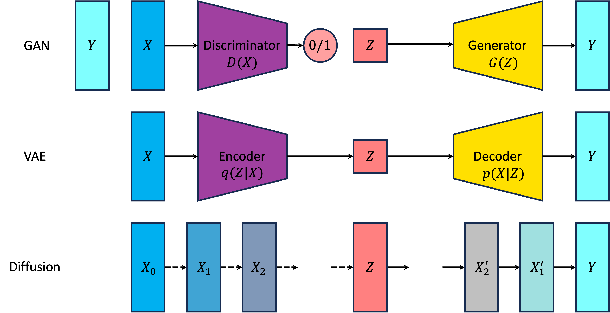

# Generative Model

生成模型是 2020 年代初深度学习的最主流研究的算法。生成模型旨在学习给定数据集的分布，并且能够从该分布采样生成新数据点。目前，生成模型在文本、语音、图像、3D 模型生成等方面展示了强大的能力，还可以用于数据增强。

以图像生成任务为例，计算机图形学的渲染模型可以被视为一种广义的生成模型：给定一组场景的参数（相机参数、物体参数等），即先验知识，渲染模型能够确定性地生成图片。统计生成模型作为主流的生成模型则不依赖于强先验知识，而是通过拟合数据的分布，从拟合好的模型中采样生成图片。

主流的生成模型有两个特点，一是建模为分布的变换器，二是基于极大似然估计的。具体来说，生成模型在生成的过程中，首先会从某个先验分布中采样一个随机输入，然后通过一个模型将这个输入转化为生成的数据作为输出。而在训练的过程中，生成模型会尝试最大化数据的似然，也就是对于一组给定的数据，我们希望找到模型参数，使得模型生成这组数据的概率最大。

以抛硬币为例，假如我们不知道硬币的模型参数（即正面的概率），我们会先建立一个二项分布的模型，然后多次抛硬币，用结果来估计模型参数。在生成阶段，根据参数，我们可以用 $[0, 1]$ 均匀分布的随机数发生器生成一个随机输入，然后通过简单的映射（比如判断输入是否小于正面的概率）将输入转化为抛硬币的结果。

我们可以看到，生成模型中存在有两种先验知识：一种是模型的设计，即模型参数是如何让输入转化为输出的；另一种是输入的先验分布，即输入是如何生成的。显然，模型的设计、先验分布的选择对生成模型的性能有很大的影响。

在这个系列中，我们主要介绍生成模型的基本概念和常见方法。我们首先介绍极大似然估计和期望最大化算法来估计数据分布的方法，随后讨论常见的深度生成模型：对抗生成网络（GAN）、变分自编码器（VAE）和扩散模型（Diffusion）。

我们推荐读者按以下顺序阅读：

## [Maximum Likelihood Estimation](1%20Maximum%20Likelihood%20Estimation.md)

## [Expectation Maximization](2%20Expectation%20Maximization.md)

## [Variational Autoencoder](3%20Variational%20Autoencoder.md)

## [Diffusion Model](4%20Diffusion.md)

## [Generative Adversarial Network](5%20Generative%20Adversarial%20Network.md)

---

我们还提供了某些[概率分布相关性质](appendix/Fancy%20Distribution.md)的总结。

## References

1. [Tutorial on Variational Autoencoders](https://arxiv.org/abs/1606.05908)
2. [Understanding Diffusion Models: A Unified Perspective](https://arxiv.org/abs/2208.11970)
3. [Neural Networks and Deep Learning](https://nndl.github.io/)
